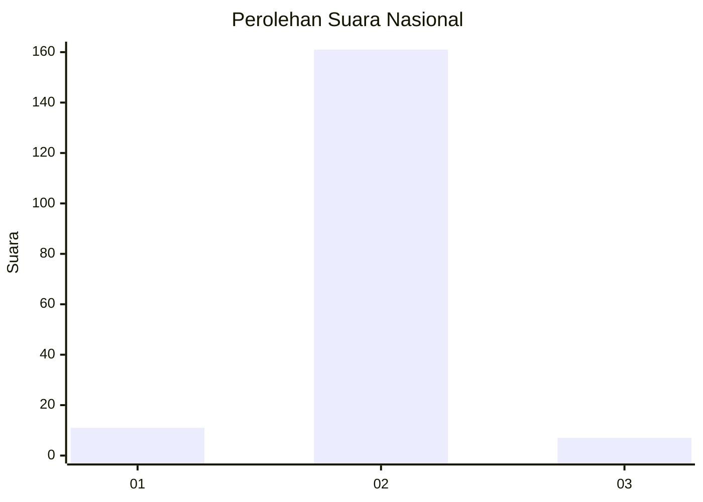
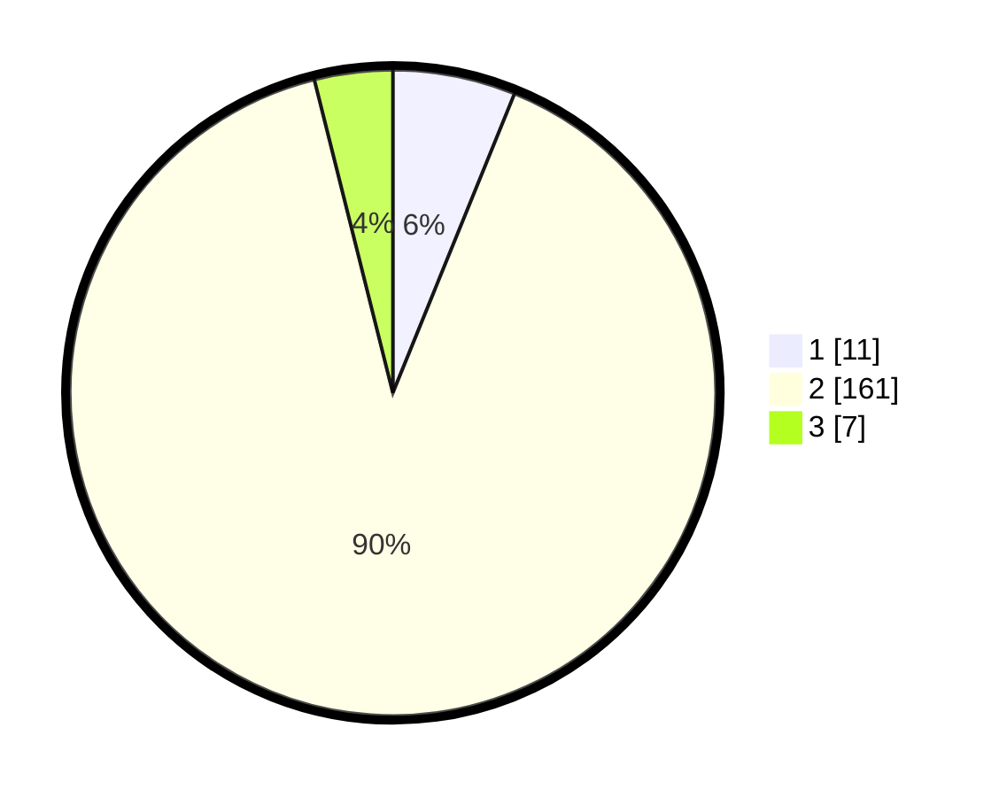

# Hasil

## Grafik

## Tabel

| No. | Nama Paslon    | Suara | Suara (raw) | Persentase |
|:--- |:-------------- | -----:| -----------:| ----------:|
| 1   | ANIES MUHAIMIN | 11    | [11][p-1]   | 6,15       |
| 2   | PRABOWO GIBRAN | 161   | [161][p-2]  | 89,94      |
| 3   | GANJAR MAHFUD  | 7     | [7][p-3]    | 3,91       |

[p-1]: https://github.com/gigit-pemilu/pemilu-2024/blob/main/pilpres/hitung-suara/sub/16-sumatera-selatan/sub/03-muara-enim/sub/01-tanjung-agung/sub/2011-embawang/sub/001-tps/sub/paslon-1.txt
[p-2]: https://github.com/gigit-pemilu/pemilu-2024/blob/main/pilpres/hitung-suara/sub/16-sumatera-selatan/sub/03-muara-enim/sub/01-tanjung-agung/sub/2011-embawang/sub/001-tps/sub/paslon-2.txt
[p-3]: https://github.com/gigit-pemilu/pemilu-2024/blob/main/pilpres/hitung-suara/sub/16-sumatera-selatan/sub/03-muara-enim/sub/01-tanjung-agung/sub/2011-embawang/sub/001-tps/sub/paslon-3.txt

## Foto C Plano

https://sirekap-obj-formc.kpu.go.id/41e5/pemilu/ppwp/16/03/01/20/11/1603012011001-20240215-071956--d4c95ce4-ee13-4dbe-8945-020faf63e62f.jpg

https://sirekap-obj-formc.kpu.go.id/41e5/pemilu/ppwp/16/03/01/20/11/1603012011001-20240215-072000--1106346e-e057-456c-bb57-d8198b75253e.jpg

https://sirekap-obj-formc.kpu.go.id/41e5/pemilu/ppwp/16/03/01/20/11/1603012011001-20240214-234606--765a73fd-58d5-4b64-80f1-2874ed51492e.jpg

## Metadata

| Key        | Value               |
| ---------- | ------------------- |
| Time Stamp | 2024-02-15 22:40:13 |

