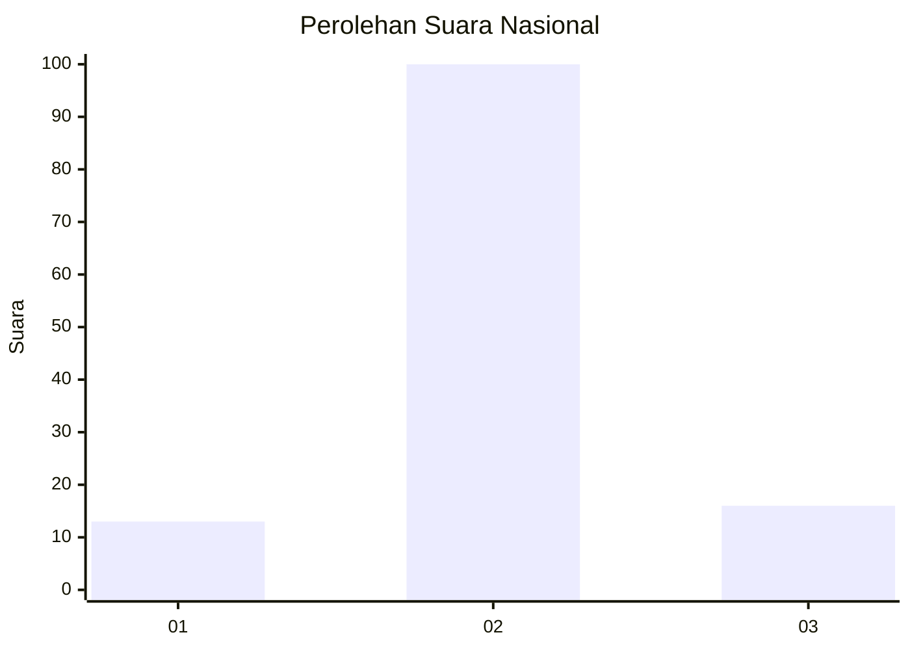
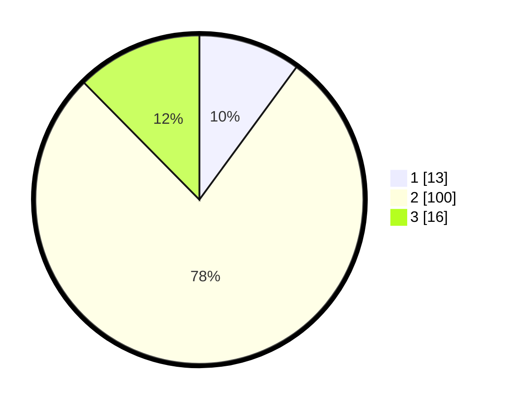

# Hasil

## Grafik

## Tabel

| No. | Nama Paslon    | Suara | Suara (raw) | Persentase |
|:--- |:-------------- | -----:| -----------:| ----------:|
| 1   | ANIES MUHAIMIN | 13    | [13][p-1]   | 10,08      |
| 2   | PRABOWO GIBRAN | 100   | [100][p-2]  | 77,52      |
| 3   | GANJAR MAHFUD  | 16    | [16][p-3]   | 12,40      |

[p-1]: https://github.com/gigit-pemilu/pemilu-2024/blob/main/pilpres/hitung-suara/sub/16-sumatera-selatan/sub/03-muara-enim/sub/01-tanjung-agung/sub/2016-paduraksa/sub/006-tps/sub/paslon-1.txt
[p-2]: https://github.com/gigit-pemilu/pemilu-2024/blob/main/pilpres/hitung-suara/sub/16-sumatera-selatan/sub/03-muara-enim/sub/01-tanjung-agung/sub/2016-paduraksa/sub/006-tps/sub/paslon-2.txt
[p-3]: https://github.com/gigit-pemilu/pemilu-2024/blob/main/pilpres/hitung-suara/sub/16-sumatera-selatan/sub/03-muara-enim/sub/01-tanjung-agung/sub/2016-paduraksa/sub/006-tps/sub/paslon-3.txt

## Foto C Plano

https://sirekap-obj-formc.kpu.go.id/9c1c/pemilu/ppwp/16/03/01/20/16/1603012016006-20240214-192128--9a50709b-c9ec-4993-aa65-18ca6d63f297.jpg

https://sirekap-obj-formc.kpu.go.id/9c1c/pemilu/ppwp/16/03/01/20/16/1603012016006-20240214-192417--74e0d9fd-de72-4f63-8e2b-1baa8883a464.jpg

https://sirekap-obj-formc.kpu.go.id/9c1c/pemilu/ppwp/16/03/01/20/16/1603012016006-20240214-192436--fae67676-c877-4905-96ad-e48a0017ac2b.jpg

## Metadata

| Key        | Value               |
| ---------- | ------------------- |
| Time Stamp | 2024-02-25 18:00:00 |

