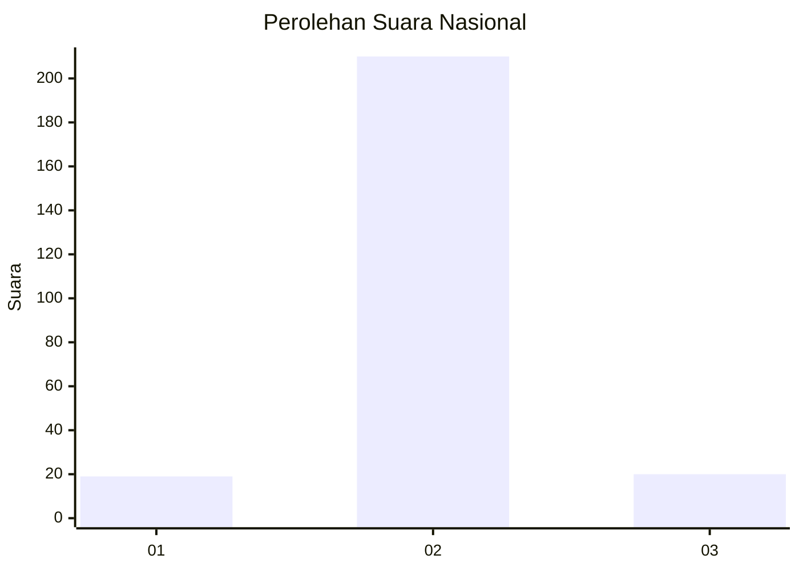
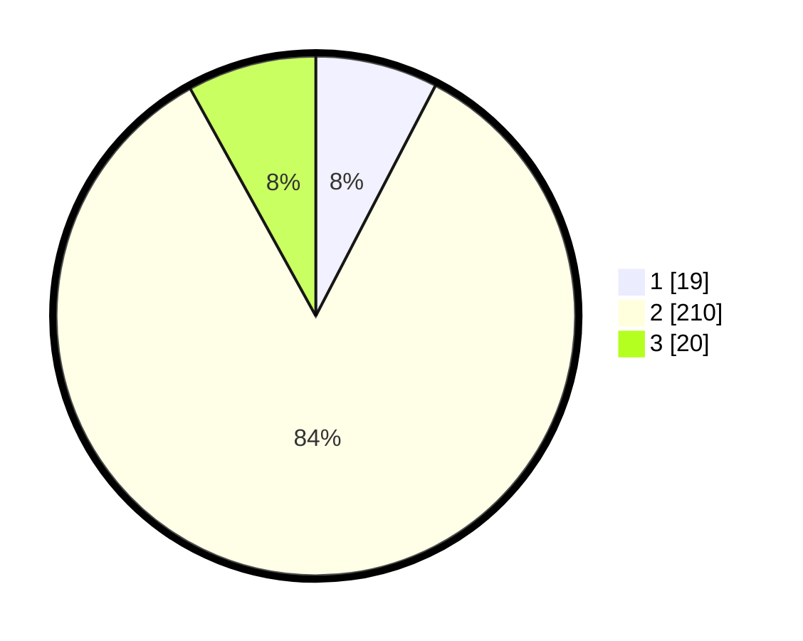

# Hasil

## Grafik

## Tabel

| No. | Nama Paslon    | Suara | Suara (raw) | Persentase |
|:--- |:-------------- | -----:| -----------:| ----------:|
| 1   | ANIES MUHAIMIN | 19    | [19][p-1]   | 7,63       |
| 2   | PRABOWO GIBRAN | 210   | [210][p-2]  | 84,34      |
| 3   | GANJAR MAHFUD  | 20    | [20][p-3]   | 8,03       |

[p-1]: https://github.com/gigit-pemilu/pemilu-2024/blob/main/pilpres/hitung-suara/sub/16-sumatera-selatan/sub/03-muara-enim/sub/01-tanjung-agung/sub/2020-tanjung-karangan/sub/001-tps/sub/paslon-1.txt
[p-2]: https://github.com/gigit-pemilu/pemilu-2024/blob/main/pilpres/hitung-suara/sub/16-sumatera-selatan/sub/03-muara-enim/sub/01-tanjung-agung/sub/2020-tanjung-karangan/sub/001-tps/sub/paslon-2.txt
[p-3]: https://github.com/gigit-pemilu/pemilu-2024/blob/main/pilpres/hitung-suara/sub/16-sumatera-selatan/sub/03-muara-enim/sub/01-tanjung-agung/sub/2020-tanjung-karangan/sub/001-tps/sub/paslon-3.txt

## Foto C Plano

https://sirekap-obj-formc.kpu.go.id/d1bd/pemilu/ppwp/16/03/01/20/20/1603012020001-20240215-012919--5fe968c0-e0d7-47e9-9350-1d7160ff190e.jpg

https://sirekap-obj-formc.kpu.go.id/d1bd/pemilu/ppwp/16/03/01/20/20/1603012020001-20240214-193632--e5eb467c-bb3c-4777-afed-da8cb671d0e4.jpg

https://sirekap-obj-formc.kpu.go.id/d1bd/pemilu/ppwp/16/03/01/20/20/1603012020001-20240214-190106--25b87edd-0b88-44e0-84cf-f5341105b574.jpg

## Metadata

| Key        | Value               |
| ---------- | ------------------- |
| Time Stamp | 2024-02-22 14:00:00 |

