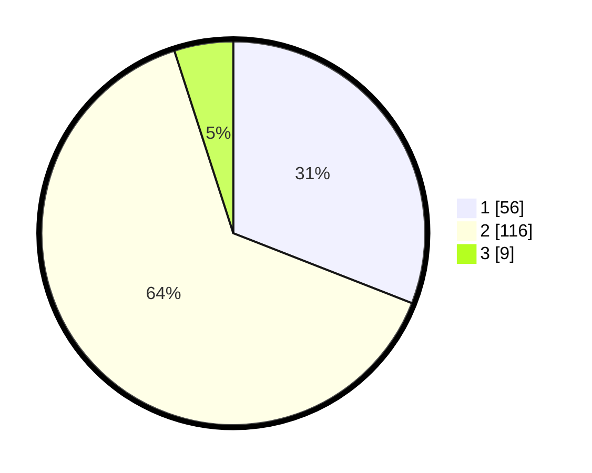

# Hasil

## Grafik

## Tabel

| No. | Nama Paslon    | Suara | Suara (raw) | Persentase |
|:--- |:-------------- | -----:| -----------:| ----------:|
| 1   | ANIES MUHAIMIN | 56    | [56][p-1]   | 30,94      |
| 2   | PRABOWO GIBRAN | 116   | [116][p-2]  | 64,09      |
| 3   | GANJAR MAHFUD  | 9     | [9][p-3]    | 4,97       |

[p-1]: https://github.com/gigit-pemilu/pemilu-2024-16-sumatera-selatan/blob/main/pilpres/hitung-suara/sub/16-sumatera-selatan/sub/03-muara-enim/sub/02-muara-enim/sub/1006-tungkal/sub/005-tps/sub/paslon-1.txt
[p-2]: https://github.com/gigit-pemilu/pemilu-2024-16-sumatera-selatan/blob/main/pilpres/hitung-suara/sub/16-sumatera-selatan/sub/03-muara-enim/sub/02-muara-enim/sub/1006-tungkal/sub/005-tps/sub/paslon-2.txt
[p-3]: https://github.com/gigit-pemilu/pemilu-2024-16-sumatera-selatan/blob/main/pilpres/hitung-suara/sub/16-sumatera-selatan/sub/03-muara-enim/sub/02-muara-enim/sub/1006-tungkal/sub/005-tps/sub/paslon-3.txt

## Foto C Plano

https://sirekap-obj-formc.kpu.go.id/e6b5/pemilu/ppwp/16/03/02/10/06/1603021006005-20240214-202953--37396036-2a20-4bf8-a7ae-5a828dccb7a5.jpg

https://sirekap-obj-formc.kpu.go.id/e6b5/pemilu/ppwp/16/03/02/10/06/1603021006005-20240214-203008--908c3ea0-aa12-461c-aeaf-2cfac3598560.jpg

https://sirekap-obj-formc.kpu.go.id/e6b5/pemilu/ppwp/16/03/02/10/06/1603021006005-20240214-203022--31fbbf4b-fa1b-45de-8aa6-d2bb70f1b02c.jpg

## Metadata

| Key        | Value               |
| ---------- | ------------------- |
| Time Stamp | 2024-02-24 22:31:28 |

