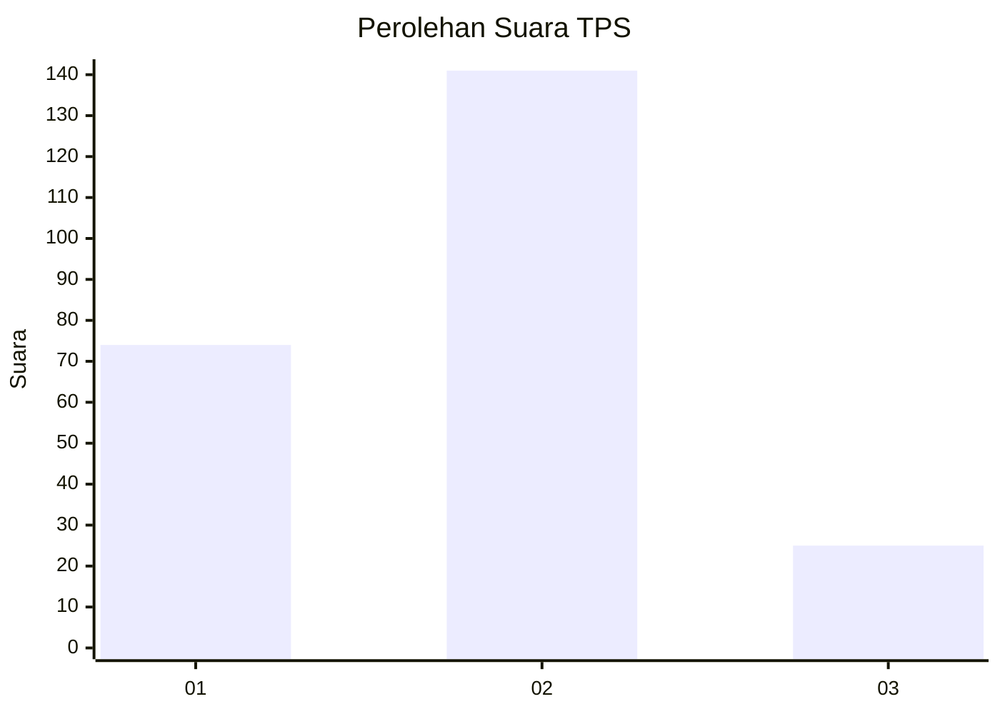
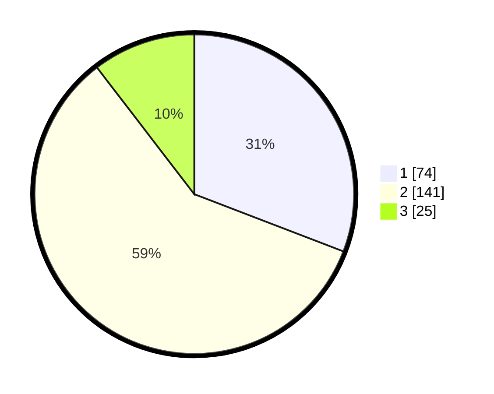

# Hasil

## Grafik

## Tabel

| No. | Nama Paslon    | Suara | Suara (raw) | Persentase |
|:--- |:-------------- | -----:| -----------:| ----------:|
| 1   | ANIES MUHAIMIN | 74    | [74][p-1]   | 30,83      |
| 2   | PRABOWO GIBRAN | 141   | [141][p-2]  | 58,75      |
| 3   | GANJAR MAHFUD  | 25    | [25][p-3]   | 10,42      |

[p-1]: https://github.com/gigit-pemilu/pemilu-2024-16-sumatera-selatan/blob/main/pilpres/hitung-suara/sub/16-sumatera-selatan/sub/03-muara-enim/sub/02-muara-enim/sub/1007-pasar-ii-muara-enim/sub/008-tps/sub/paslon-1.txt
[p-2]: https://github.com/gigit-pemilu/pemilu-2024-16-sumatera-selatan/blob/main/pilpres/hitung-suara/sub/16-sumatera-selatan/sub/03-muara-enim/sub/02-muara-enim/sub/1007-pasar-ii-muara-enim/sub/008-tps/sub/paslon-2.txt
[p-3]: https://github.com/gigit-pemilu/pemilu-2024-16-sumatera-selatan/blob/main/pilpres/hitung-suara/sub/16-sumatera-selatan/sub/03-muara-enim/sub/02-muara-enim/sub/1007-pasar-ii-muara-enim/sub/008-tps/sub/paslon-3.txt

## Foto C Plano

https://sirekap-obj-formc.kpu.go.id/c4e2/pemilu/ppwp/16/03/02/10/07/1603021007008-20240215-154630--9b3a3bd2-569d-413e-bd40-8a90ba633a93.jpg

https://sirekap-obj-formc.kpu.go.id/c4e2/pemilu/ppwp/16/03/02/10/07/1603021007008-20240215-155102--942bcd81-94ab-40dc-b67a-02d2977ba159.jpg

https://sirekap-obj-formc.kpu.go.id/c4e2/pemilu/ppwp/16/03/02/10/07/1603021007008-20240215-154929--4fdef2ee-2e63-4f23-82bf-e16bac4ec3ac.jpg

## Metadata

| Key        | Value               |
| ---------- | ------------------- |
| Time Stamp | 2024-02-25 14:00:00 |

