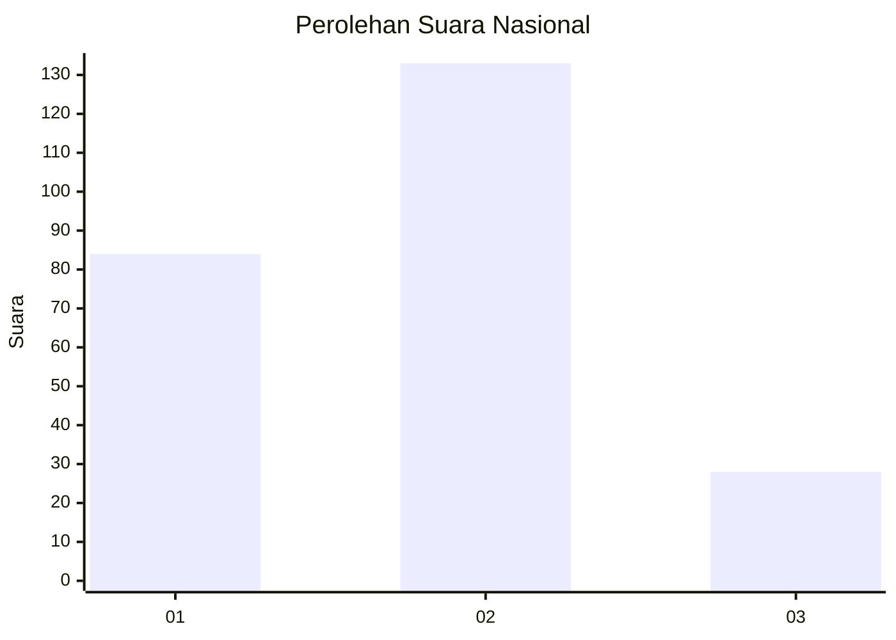
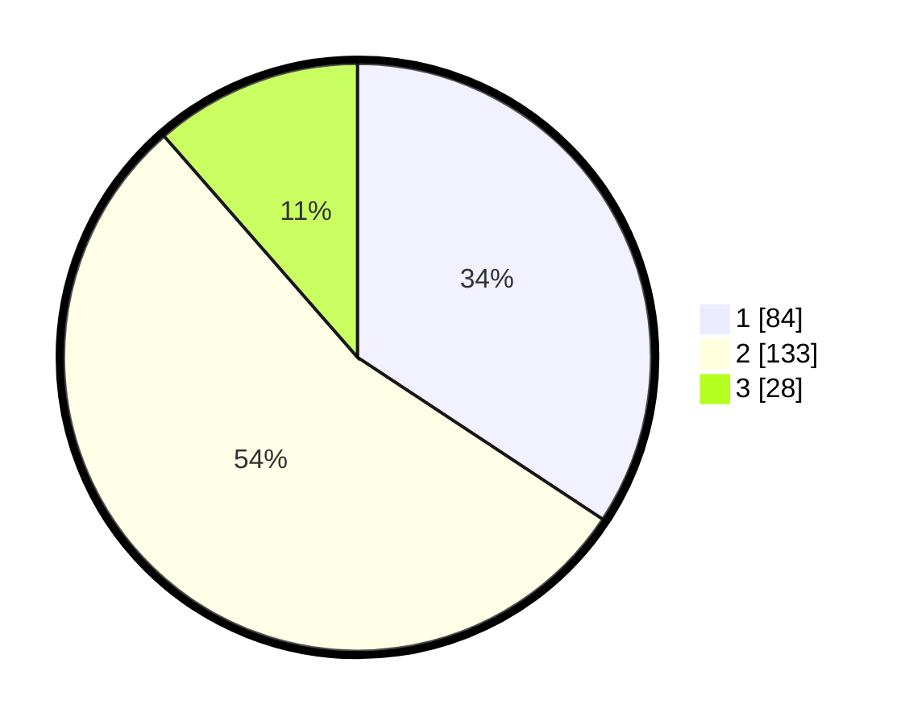

# Hasil

## Grafik

## Tabel

| No. | Nama Paslon    | Suara | Suara (raw) | Persentase |
|:--- |:-------------- | -----:| -----------:| ----------:|
| 1   | ANIES MUHAIMIN | 84    | [84][p-1]   | 34,29      |
| 2   | PRABOWO GIBRAN | 133   | [133][p-2]  | 54,29      |
| 3   | GANJAR MAHFUD  | 28    | [28][p-3]   | 11,43      |

[p-1]: https://github.com/gigit-pemilu/pemilu-2024/blob/main/pilpres/hitung-suara/sub/16-sumatera-selatan/sub/03-muara-enim/sub/02-muara-enim/sub/1008-pasar-iii-muara-enim/sub/006-tps/sub/paslon-1.txt
[p-2]: https://github.com/gigit-pemilu/pemilu-2024/blob/main/pilpres/hitung-suara/sub/16-sumatera-selatan/sub/03-muara-enim/sub/02-muara-enim/sub/1008-pasar-iii-muara-enim/sub/006-tps/sub/paslon-2.txt
[p-3]: https://github.com/gigit-pemilu/pemilu-2024/blob/main/pilpres/hitung-suara/sub/16-sumatera-selatan/sub/03-muara-enim/sub/02-muara-enim/sub/1008-pasar-iii-muara-enim/sub/006-tps/sub/paslon-3.txt

## Foto C Plano

https://sirekap-obj-formc.kpu.go.id/82a4/pemilu/ppwp/16/03/02/10/08/1603021008006-20240214-213911--3f7c58f7-d3a0-428d-8381-b1711266109f.jpg

https://sirekap-obj-formc.kpu.go.id/82a4/pemilu/ppwp/16/03/02/10/08/1603021008006-20240214-202532--2630ab05-17c7-4cfc-8267-fa7c2be7ca82.jpg

https://sirekap-obj-formc.kpu.go.id/82a4/pemilu/ppwp/16/03/02/10/08/1603021008006-20240214-202639--cf8e543e-acc0-4a4f-af20-deb9f74aa21e.jpg

## Metadata

| Key        | Value               |
| ---------- | ------------------- |
| Time Stamp | 2024-02-25 14:00:00 |

