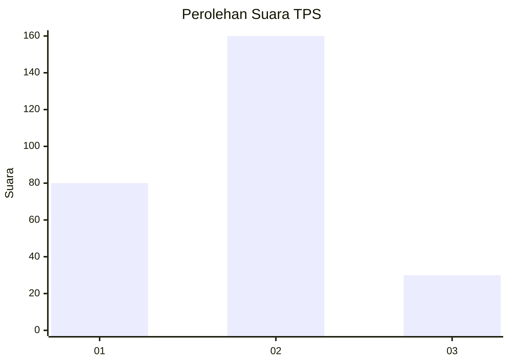
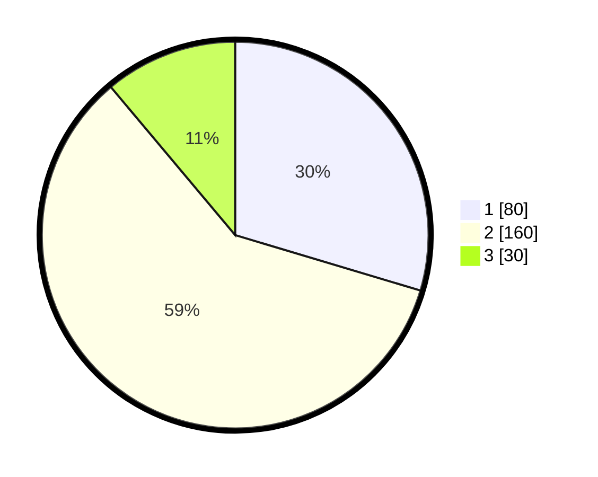

# Hasil

## Grafik

## Tabel

| No. | Nama Paslon    | Suara | Suara (raw) | Persentase |
|:--- |:-------------- | -----:| -----------:| ----------:|
| 1   | ANIES MUHAIMIN | 80    | [80][p-1]   | 29,63      |
| 2   | PRABOWO GIBRAN | 160   | [160][p-2]  | 59,26      |
| 3   | GANJAR MAHFUD  | 30    | [30][p-3]   | 11,11      |

[p-1]: https://github.com/gigit-pemilu/pemilu-2024-16-sumatera-selatan/blob/main/pilpres/hitung-suara/sub/16-sumatera-selatan/sub/03-muara-enim/sub/02-muara-enim/sub/1009-pasar-i-muara-enim/sub/014-tps/sub/paslon-1.txt
[p-2]: https://github.com/gigit-pemilu/pemilu-2024-16-sumatera-selatan/blob/main/pilpres/hitung-suara/sub/16-sumatera-selatan/sub/03-muara-enim/sub/02-muara-enim/sub/1009-pasar-i-muara-enim/sub/014-tps/sub/paslon-2.txt
[p-3]: https://github.com/gigit-pemilu/pemilu-2024-16-sumatera-selatan/blob/main/pilpres/hitung-suara/sub/16-sumatera-selatan/sub/03-muara-enim/sub/02-muara-enim/sub/1009-pasar-i-muara-enim/sub/014-tps/sub/paslon-3.txt

## Foto C Plano

https://sirekap-obj-formc.kpu.go.id/a8e3/pemilu/ppwp/16/03/02/10/09/1603021009014-20240214-234458--c96a6080-035a-4f12-a832-d81bb1bc61d7.jpg

https://sirekap-obj-formc.kpu.go.id/a8e3/pemilu/ppwp/16/03/02/10/09/1603021009014-20240214-233256--fb294807-bff6-4784-af9c-487d707d8aec.jpg

https://sirekap-obj-formc.kpu.go.id/a8e3/pemilu/ppwp/16/03/02/10/09/1603021009014-20240214-234247--33ec6000-1d3e-4c6c-a93f-4e8631692241.jpg

## Metadata

| Key        | Value               |
| ---------- | ------------------- |
| Time Stamp | 2024-02-15 12:00:28 |

