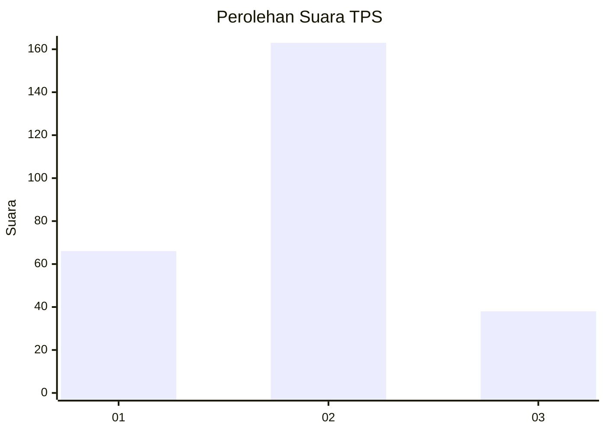
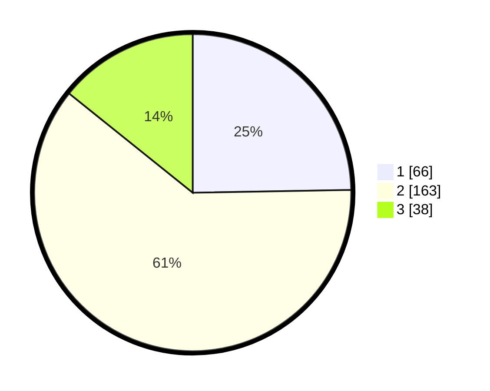

# Hasil

## Grafik

## Tabel

| No. | Nama Paslon    | Suara | Suara (raw) | Persentase |
|:--- |:-------------- | -----:| -----------:| ----------:|
| 1   | ANIES MUHAIMIN | 66    | [66][p-1]   | 24,72      |
| 2   | PRABOWO GIBRAN | 163   | [163][p-2]  | 61,05      |
| 3   | GANJAR MAHFUD  | 38    | [38][p-3]   | 14,23      |

[p-1]: https://github.com/gigit-pemilu/pemilu-2024-16-sumatera-selatan/blob/main/pilpres/hitung-suara/sub/16-sumatera-selatan/sub/03-muara-enim/sub/02-muara-enim/sub/1010-muara-enim/sub/012-tps/sub/paslon-1.txt
[p-2]: https://github.com/gigit-pemilu/pemilu-2024-16-sumatera-selatan/blob/main/pilpres/hitung-suara/sub/16-sumatera-selatan/sub/03-muara-enim/sub/02-muara-enim/sub/1010-muara-enim/sub/012-tps/sub/paslon-2.txt
[p-3]: https://github.com/gigit-pemilu/pemilu-2024-16-sumatera-selatan/blob/main/pilpres/hitung-suara/sub/16-sumatera-selatan/sub/03-muara-enim/sub/02-muara-enim/sub/1010-muara-enim/sub/012-tps/sub/paslon-3.txt

## Foto C Plano

https://sirekap-obj-formc.kpu.go.id/4cfe/pemilu/ppwp/16/03/02/10/10/1603021010012-20240215-013846--d3542123-9ff5-464e-9c13-83db523064f0.jpg

https://sirekap-obj-formc.kpu.go.id/4cfe/pemilu/ppwp/16/03/02/10/10/1603021010012-20240215-013907--0e6c3b61-7440-4cc2-be86-a82c01e60481.jpg

https://sirekap-obj-formc.kpu.go.id/4cfe/pemilu/ppwp/16/03/02/10/10/1603021010012-20240215-013926--11fba915-461f-46ec-9710-9c0585f20d07.jpg

## Metadata

| Key        | Value               |
| ---------- | ------------------- |
| Time Stamp | 2024-02-26 14:00:00 |

