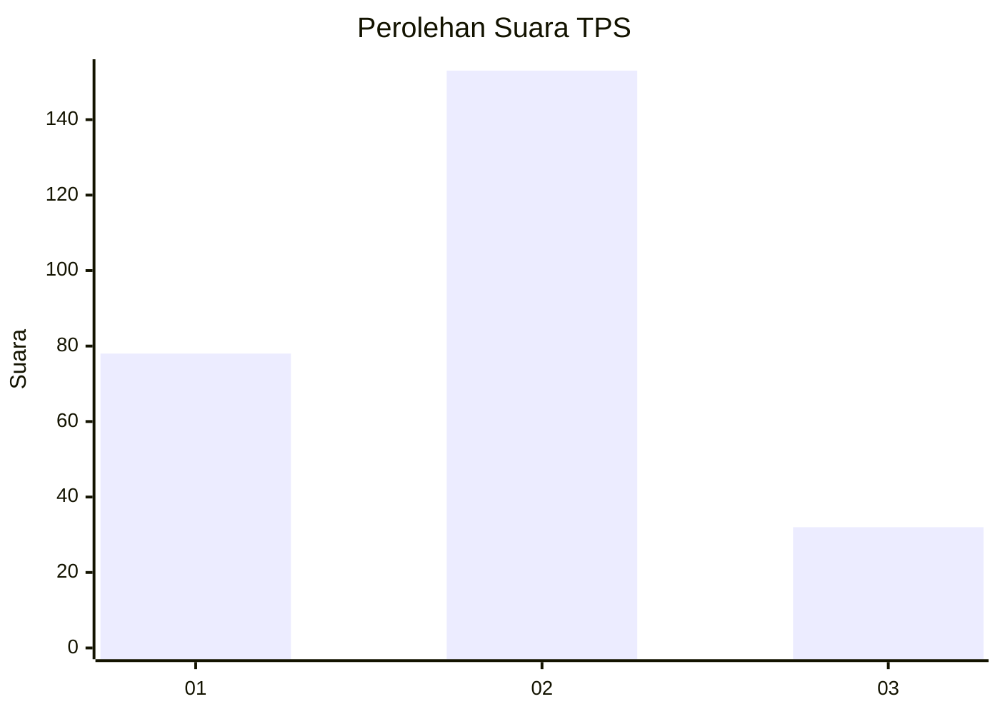
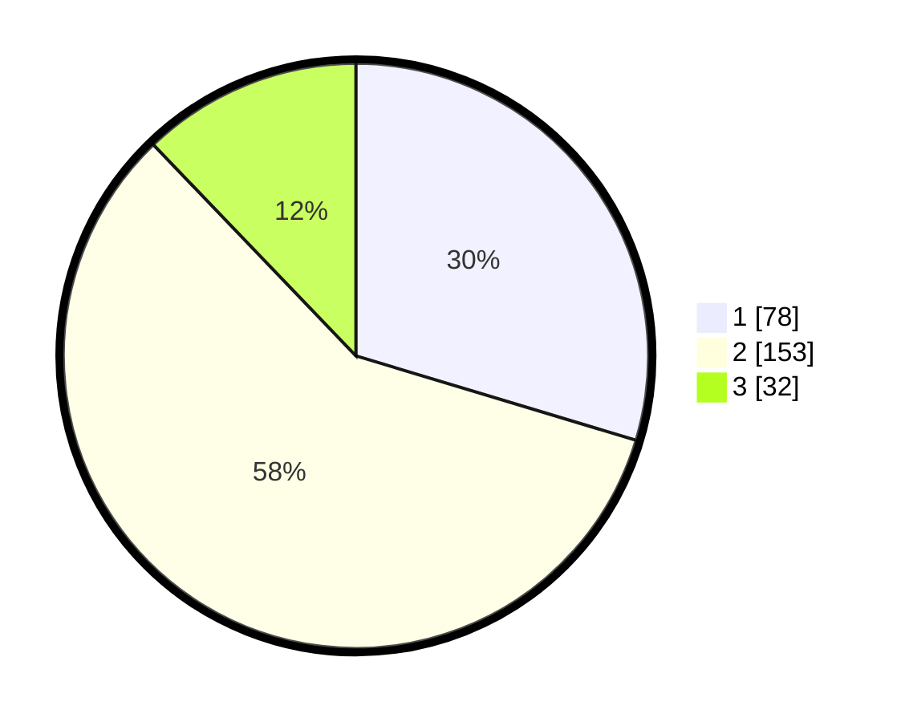

# Hasil

## Grafik

## Tabel

| No. | Nama Paslon    | Suara | Suara (raw) | Persentase |
|:--- |:-------------- | -----:| -----------:| ----------:|
| 1   | ANIES MUHAIMIN | 78    | [78][p-1]   | 29,66      |
| 2   | PRABOWO GIBRAN | 153   | [153][p-2]  | 58,17      |
| 3   | GANJAR MAHFUD  | 32    | [32][p-3]   | 12,17      |

[p-1]: https://github.com/gigit-pemilu/pemilu-2024-16-sumatera-selatan/blob/main/pilpres/hitung-suara/sub/16-sumatera-selatan/sub/03-muara-enim/sub/02-muara-enim/sub/1010-muara-enim/sub/024-tps/sub/paslon-1.txt
[p-2]: https://github.com/gigit-pemilu/pemilu-2024-16-sumatera-selatan/blob/main/pilpres/hitung-suara/sub/16-sumatera-selatan/sub/03-muara-enim/sub/02-muara-enim/sub/1010-muara-enim/sub/024-tps/sub/paslon-2.txt
[p-3]: https://github.com/gigit-pemilu/pemilu-2024-16-sumatera-selatan/blob/main/pilpres/hitung-suara/sub/16-sumatera-selatan/sub/03-muara-enim/sub/02-muara-enim/sub/1010-muara-enim/sub/024-tps/sub/paslon-3.txt

## Foto C Plano

https://sirekap-obj-formc.kpu.go.id/fbf2/pemilu/ppwp/16/03/02/10/10/1603021010024-20240214-230513--4f5c5401-e883-4ac0-a50b-7bc80d529465.jpg

https://sirekap-obj-formc.kpu.go.id/fbf2/pemilu/ppwp/16/03/02/10/10/1603021010024-20240214-230620--6370ac91-37d9-4da7-85d5-cf24c35a1a59.jpg

https://sirekap-obj-formc.kpu.go.id/fbf2/pemilu/ppwp/16/03/02/10/10/1603021010024-20240214-230732--c589c43d-dfcc-425f-a676-0e466a2f6f66.jpg

## Metadata

| Key        | Value               |
| ---------- | ------------------- |
| Time Stamp | 2024-02-25 12:00:00 |

