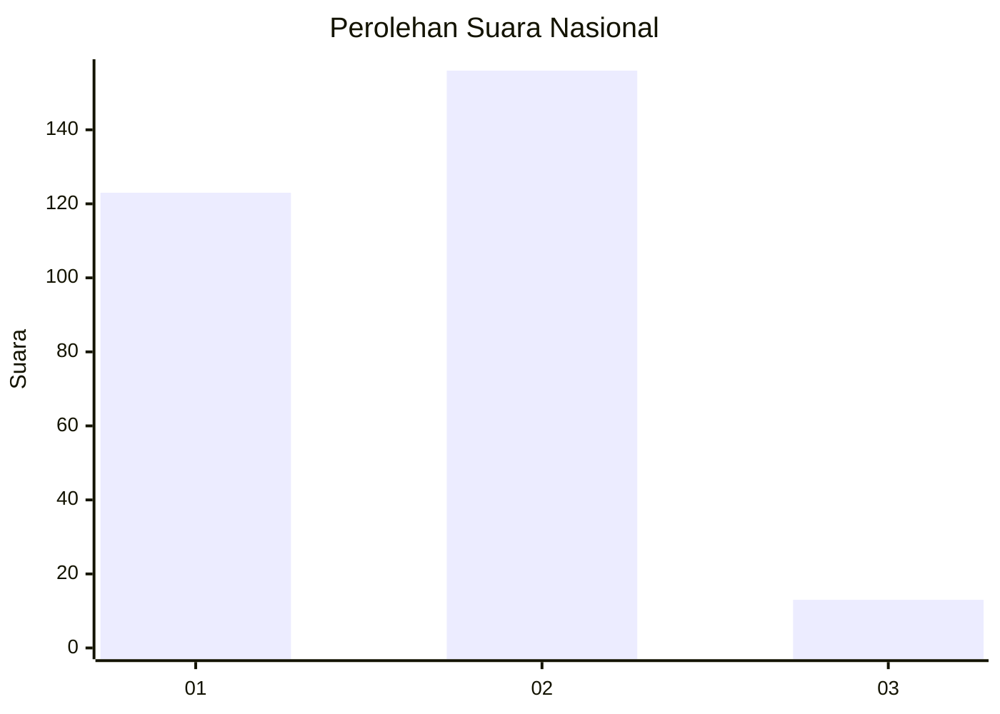
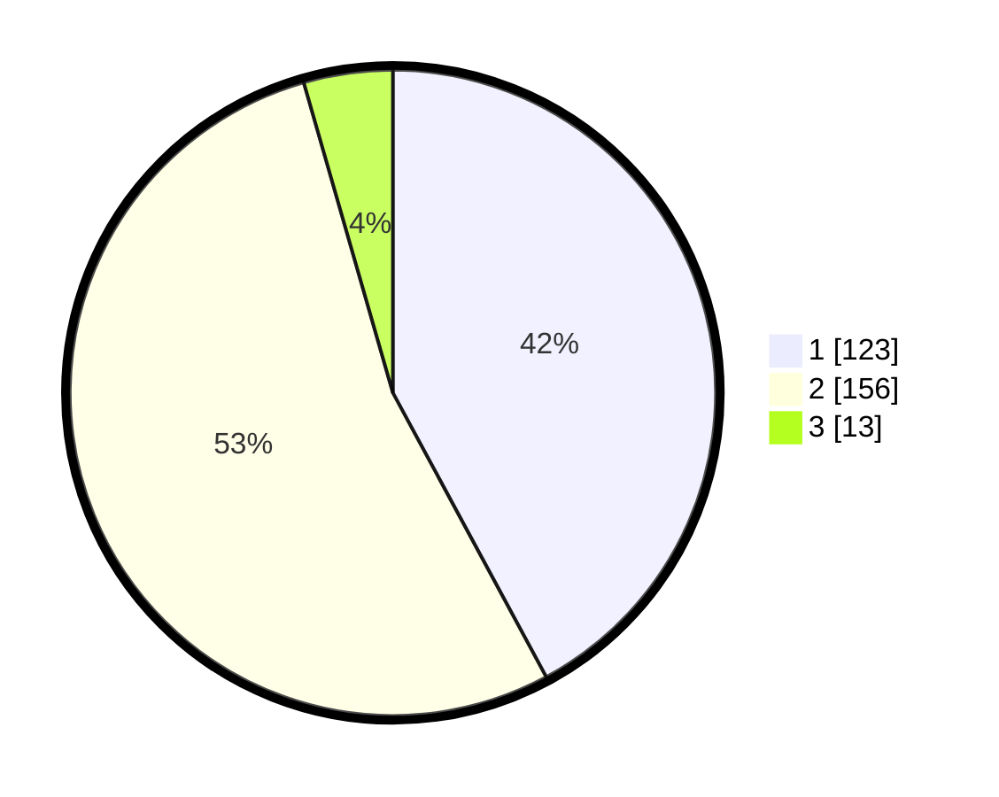

# Hasil

## Grafik

## Tabel

| No. | Nama Paslon    | Suara | Suara (raw) | Persentase |
|:--- |:-------------- | -----:| -----------:| ----------:|
| 1   | ANIES MUHAIMIN | 123   | [123][p-1]  | 42,12      |
| 2   | PRABOWO GIBRAN | 156   | [156][p-2]  | 53,42      |
| 3   | GANJAR MAHFUD  | 13    | [13][p-3]   | 4,45       |

[p-1]: https://github.com/gigit-pemilu/pemilu-2024/blob/main/pilpres/hitung-suara/sub/16-sumatera-selatan/sub/03-muara-enim/sub/02-muara-enim/sub/1010-muara-enim/sub/029-tps/sub/paslon-1.txt
[p-2]: https://github.com/gigit-pemilu/pemilu-2024/blob/main/pilpres/hitung-suara/sub/16-sumatera-selatan/sub/03-muara-enim/sub/02-muara-enim/sub/1010-muara-enim/sub/029-tps/sub/paslon-2.txt
[p-3]: https://github.com/gigit-pemilu/pemilu-2024/blob/main/pilpres/hitung-suara/sub/16-sumatera-selatan/sub/03-muara-enim/sub/02-muara-enim/sub/1010-muara-enim/sub/029-tps/sub/paslon-3.txt

## Foto C Plano

https://sirekap-obj-formc.kpu.go.id/f003/pemilu/ppwp/16/03/02/10/10/1603021010029-20240215-044027--1c9c87b6-081f-4fe7-969c-bf3ef9bbe7ad.jpg

https://sirekap-obj-formc.kpu.go.id/f003/pemilu/ppwp/16/03/02/10/10/1603021010029-20240215-044150--ea7c22d6-285e-48dc-874e-320a8de248b8.jpg

https://sirekap-obj-formc.kpu.go.id/f003/pemilu/ppwp/16/03/02/10/10/1603021010029-20240215-044247--d8629f52-2699-4055-880f-b06773af9e26.jpg

## Metadata

| Key        | Value               |
| ---------- | ------------------- |
| Time Stamp | 2024-02-25 17:00:00 |

