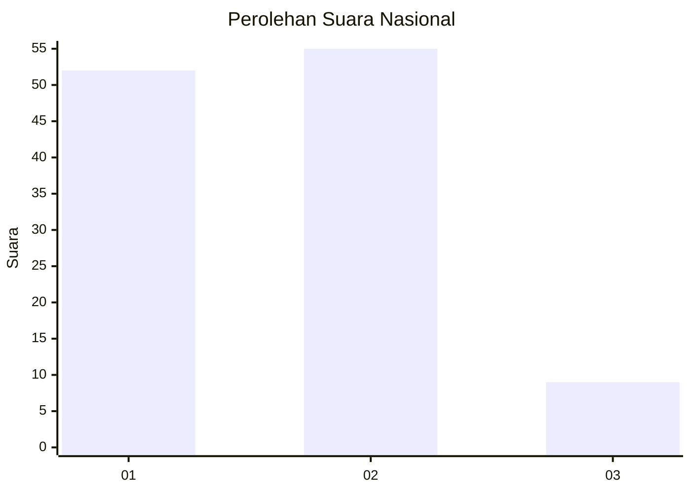
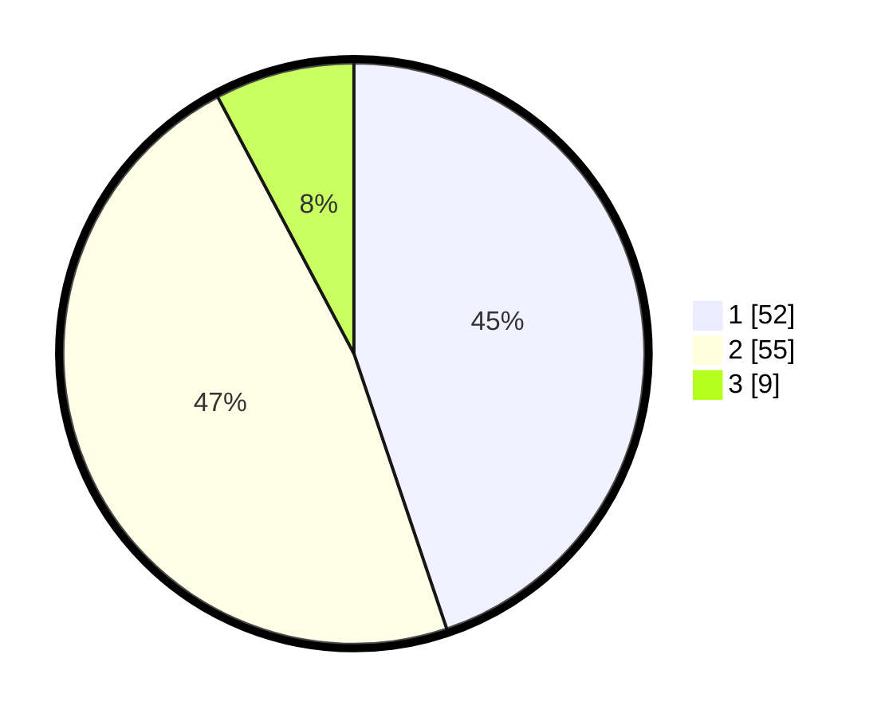

# Hasil

## Grafik

## Tabel

| No. | Nama Paslon    | Suara | Suara (raw) | Persentase |
|:--- |:-------------- | -----:| -----------:| ----------:|
| 1   | ANIES MUHAIMIN | 52    | [52][p-1]   | 44,83      |
| 2   | PRABOWO GIBRAN | 55    | [55][p-2]   | 47,41      |
| 3   | GANJAR MAHFUD  | 9     | [9][p-3]    | 7,76       |

[p-1]: https://github.com/gigit-pemilu/pemilu-2024/blob/main/pilpres/hitung-suara/sub/16-sumatera-selatan/sub/03-muara-enim/sub/02-muara-enim/sub/1016-air-lintang/sub/007-tps/sub/paslon-1.txt
[p-2]: https://github.com/gigit-pemilu/pemilu-2024/blob/main/pilpres/hitung-suara/sub/16-sumatera-selatan/sub/03-muara-enim/sub/02-muara-enim/sub/1016-air-lintang/sub/007-tps/sub/paslon-2.txt
[p-3]: https://github.com/gigit-pemilu/pemilu-2024/blob/main/pilpres/hitung-suara/sub/16-sumatera-selatan/sub/03-muara-enim/sub/02-muara-enim/sub/1016-air-lintang/sub/007-tps/sub/paslon-3.txt

## Foto C Plano

https://sirekap-obj-formc.kpu.go.id/713a/pemilu/ppwp/16/03/02/10/16/1603021016007-20240215-004243--7c022b6a-6e86-4d7e-a7df-8d0397dfa35a.jpg

https://sirekap-obj-formc.kpu.go.id/713a/pemilu/ppwp/16/03/02/10/16/1603021016007-20240215-004354--458aa342-4e68-4861-874f-a2b78cfb83db.jpg

https://sirekap-obj-formc.kpu.go.id/713a/pemilu/ppwp/16/03/02/10/16/1603021016007-20240215-004521--794ddb95-f50c-4161-9ef7-f006f40c90cb.jpg

## Metadata

| Key        | Value               |
| ---------- | ------------------- |
| Time Stamp | 2024-02-25 18:00:00 |

