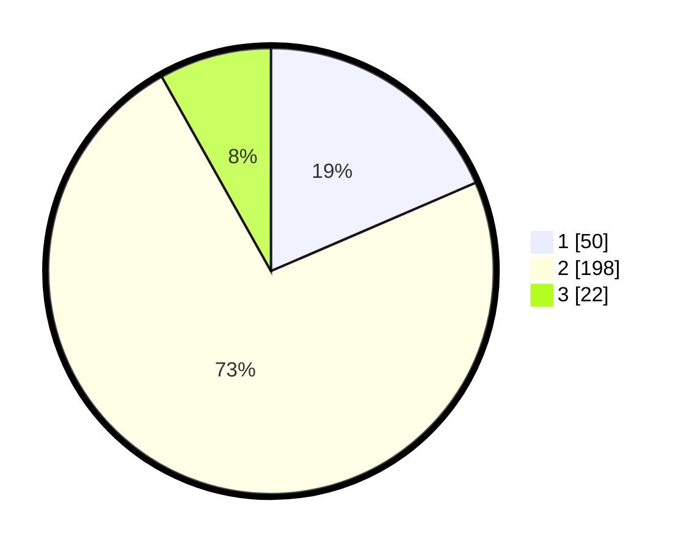

# Hasil

## Grafik

## Tabel

| No. | Nama Paslon    | Suara | Suara (raw) | Persentase |
|:--- |:-------------- | -----:| -----------:| ----------:|
| 1   | ANIES MUHAIMIN | 50    | [50][p-1]   | 18,52      |
| 2   | PRABOWO GIBRAN | 198   | [198][p-2]  | 73,33      |
| 3   | GANJAR MAHFUD  | 22    | [22][p-3]   | 8,15       |

[p-1]: https://github.com/gigit-pemilu/pemilu-2024-16-sumatera-selatan/blob/main/pilpres/hitung-suara/sub/16-sumatera-selatan/sub/03-muara-enim/sub/02-muara-enim/sub/2003-muara-lawai/sub/002-tps/sub/paslon-1.txt
[p-2]: https://github.com/gigit-pemilu/pemilu-2024-16-sumatera-selatan/blob/main/pilpres/hitung-suara/sub/16-sumatera-selatan/sub/03-muara-enim/sub/02-muara-enim/sub/2003-muara-lawai/sub/002-tps/sub/paslon-2.txt
[p-3]: https://github.com/gigit-pemilu/pemilu-2024-16-sumatera-selatan/blob/main/pilpres/hitung-suara/sub/16-sumatera-selatan/sub/03-muara-enim/sub/02-muara-enim/sub/2003-muara-lawai/sub/002-tps/sub/paslon-3.txt

## Foto C Plano

https://sirekap-obj-formc.kpu.go.id/8d3a/pemilu/ppwp/16/03/02/20/03/1603022003002-20240217-173539--cf907a6d-7278-4daa-beeb-f7c4f5116c5f.jpg

https://sirekap-obj-formc.kpu.go.id/8d3a/pemilu/ppwp/16/03/02/20/03/1603022003002-20240217-172218--37d5506c-5b37-4e94-9d29-dd918e101e44.jpg

## Metadata

| Key        | Value               |
| ---------- | ------------------- |
| Time Stamp | 2024-02-25 21:00:00 |

