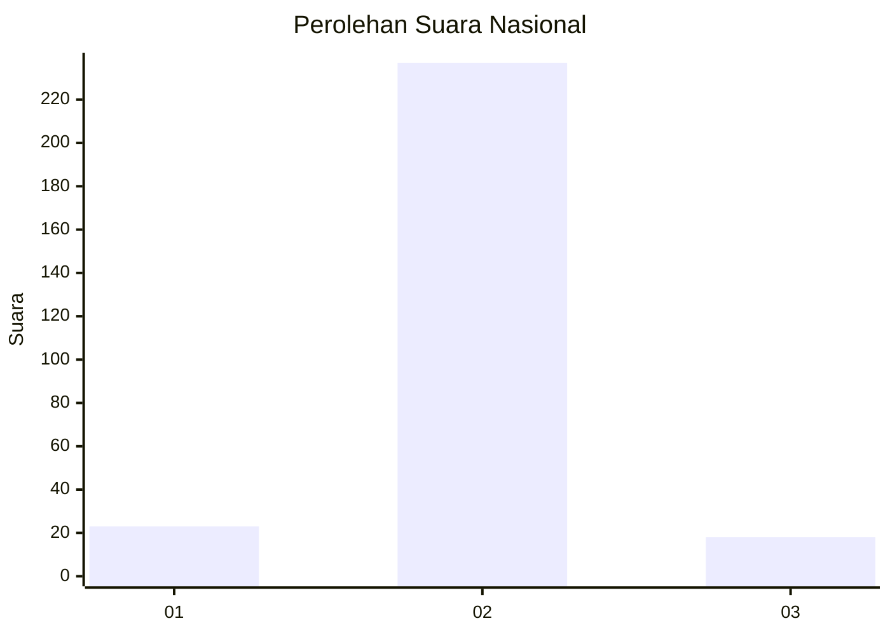
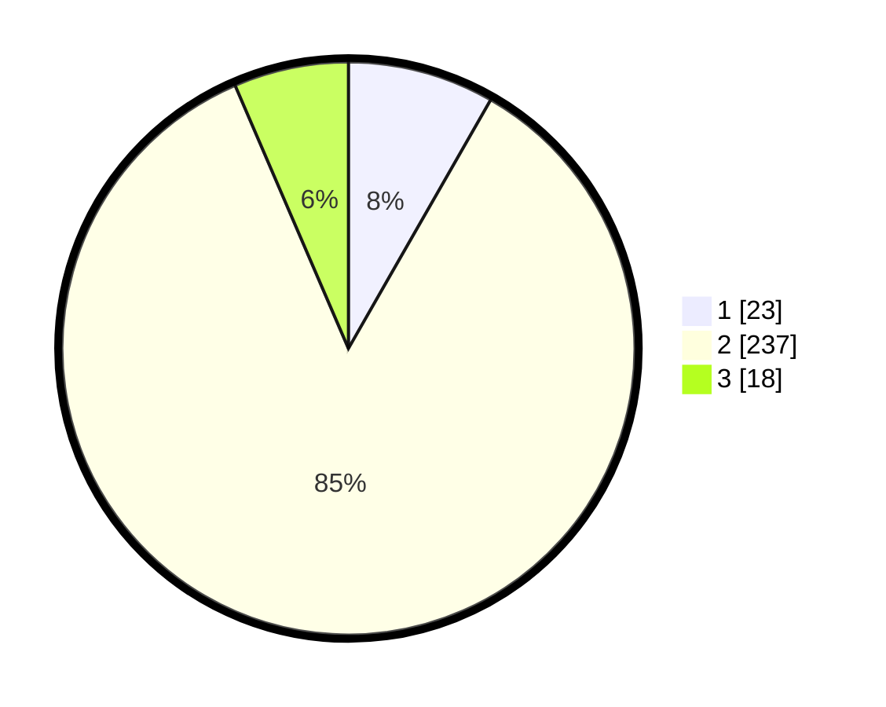

# Hasil

## Grafik

## Tabel

| No. | Nama Paslon    | Suara | Suara (raw) | Persentase |
|:--- |:-------------- | -----:| -----------:| ----------:|
| 1   | ANIES MUHAIMIN | 23    | [23][p-1]   | 8,27       |
| 2   | PRABOWO GIBRAN | 237   | [237][p-2]  | 85,25      |
| 3   | GANJAR MAHFUD  | 18    | [18][p-3]   | 6,47       |

[p-1]: https://github.com/gigit-pemilu/pemilu-2024/blob/main/pilpres/hitung-suara/sub/16-sumatera-selatan/sub/03-muara-enim/sub/02-muara-enim/sub/2003-muara-lawai/sub/005-tps/sub/paslon-1.txt
[p-2]: https://github.com/gigit-pemilu/pemilu-2024/blob/main/pilpres/hitung-suara/sub/16-sumatera-selatan/sub/03-muara-enim/sub/02-muara-enim/sub/2003-muara-lawai/sub/005-tps/sub/paslon-2.txt
[p-3]: https://github.com/gigit-pemilu/pemilu-2024/blob/main/pilpres/hitung-suara/sub/16-sumatera-selatan/sub/03-muara-enim/sub/02-muara-enim/sub/2003-muara-lawai/sub/005-tps/sub/paslon-3.txt

## Foto C Plano

https://sirekap-obj-formc.kpu.go.id/6ef5/pemilu/ppwp/16/03/02/20/03/1603022003005-20240214-195047--af5c81e4-9669-483d-b7ec-3108f3fc7ba6.jpg

https://sirekap-obj-formc.kpu.go.id/6ef5/pemilu/ppwp/16/03/02/20/03/1603022003005-20240214-200510--c2a8bf41-0bde-4bc8-8582-76edba6fe22d.jpg

https://sirekap-obj-formc.kpu.go.id/6ef5/pemilu/ppwp/16/03/02/20/03/1603022003005-20240214-200617--fa961874-cbac-4bec-b078-e1027b6a3ecc.jpg

## Metadata

| Key        | Value               |
| ---------- | ------------------- |
| Time Stamp | 2024-02-25 22:00:00 |

