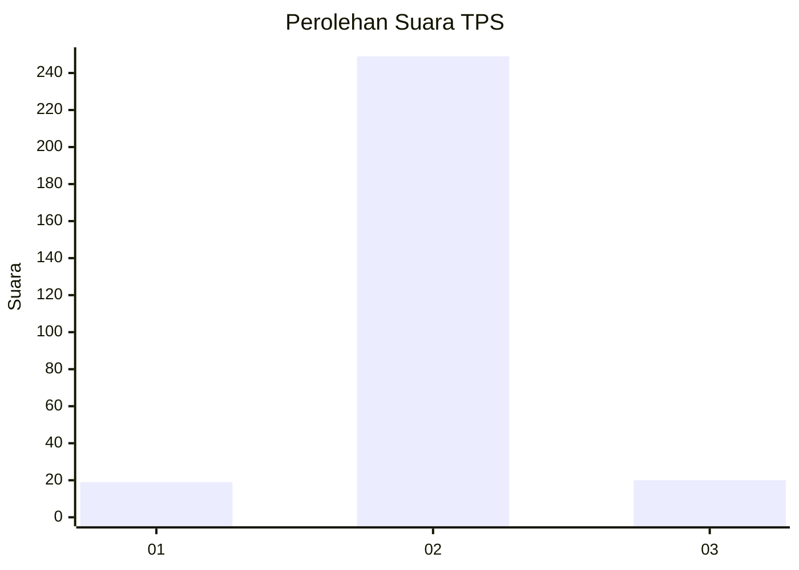
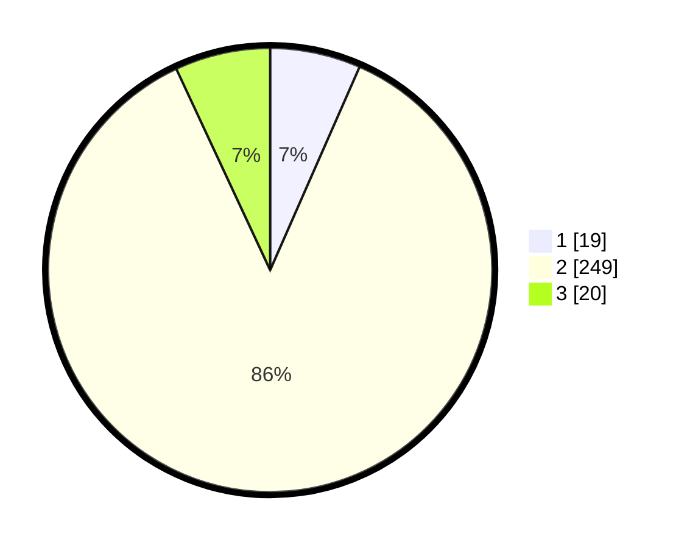

# Hasil

## Grafik

## Tabel

| No. | Nama Paslon    | Suara | Suara (raw) | Persentase |
|:--- |:-------------- | -----:| -----------:| ----------:|
| 1   | ANIES MUHAIMIN | 19    | [19][p-1]   | 6,60       |
| 2   | PRABOWO GIBRAN | 249   | [249][p-2]  | 86,46      |
| 3   | GANJAR MAHFUD  | 20    | [20][p-3]   | 6,94       |

[p-1]: https://github.com/gigit-pemilu/pemilu-2024-16-sumatera-selatan/blob/main/pilpres/hitung-suara/sub/16-sumatera-selatan/sub/03-muara-enim/sub/02-muara-enim/sub/2003-muara-lawai/sub/903-tps/sub/paslon-1.txt
[p-2]: https://github.com/gigit-pemilu/pemilu-2024-16-sumatera-selatan/blob/main/pilpres/hitung-suara/sub/16-sumatera-selatan/sub/03-muara-enim/sub/02-muara-enim/sub/2003-muara-lawai/sub/903-tps/sub/paslon-2.txt
[p-3]: https://github.com/gigit-pemilu/pemilu-2024-16-sumatera-selatan/blob/main/pilpres/hitung-suara/sub/16-sumatera-selatan/sub/03-muara-enim/sub/02-muara-enim/sub/2003-muara-lawai/sub/903-tps/sub/paslon-3.txt

## Foto C Plano

https://sirekap-obj-formc.kpu.go.id/17c8/pemilu/ppwp/16/03/02/20/03/1603022003903-20240214-222748--d1833812-3b7a-4310-9d62-78053689684a.jpg

https://sirekap-obj-formc.kpu.go.id/17c8/pemilu/ppwp/16/03/02/20/03/1603022003903-20240214-222759--b5d12330-9bf1-42da-849a-67e35ac9d4aa.jpg

https://sirekap-obj-formc.kpu.go.id/17c8/pemilu/ppwp/16/03/02/20/03/1603022003903-20240214-222818--6630cddb-86dd-4fd1-aae6-52ad38de4b7f.jpg

## Metadata

| Key        | Value               |
| ---------- | ------------------- |
| Time Stamp | 2024-02-25 01:00:00 |

