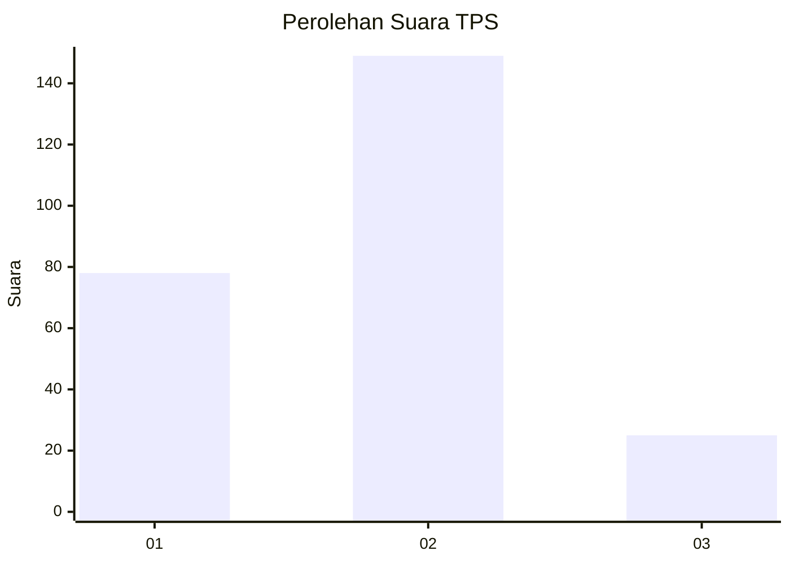
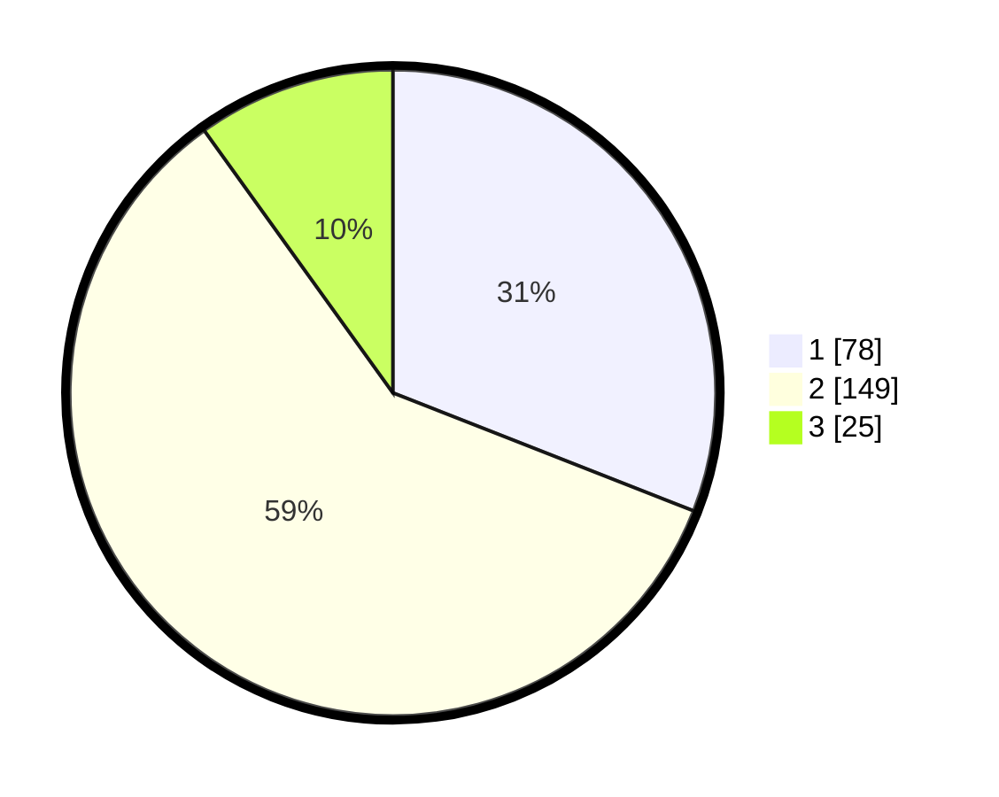

# Hasil

## Grafik

## Tabel

| No. | Nama Paslon    | Suara | Suara (raw) | Persentase |
|:--- |:-------------- | -----:| -----------:| ----------:|
| 1   | ANIES MUHAIMIN | 78    | [78][p-1]   | 30,95      |
| 2   | PRABOWO GIBRAN | 149   | [149][p-2]  | 59,13      |
| 3   | GANJAR MAHFUD  | 25    | [25][p-3]   | 9,92       |

[p-1]: https://github.com/gigit-pemilu/pemilu-2024-16-sumatera-selatan/blob/main/pilpres/hitung-suara/sub/16-sumatera-selatan/sub/03-muara-enim/sub/02-muara-enim/sub/2005-lubuk-emplas/sub/001-tps/sub/paslon-1.txt
[p-2]: https://github.com/gigit-pemilu/pemilu-2024-16-sumatera-selatan/blob/main/pilpres/hitung-suara/sub/16-sumatera-selatan/sub/03-muara-enim/sub/02-muara-enim/sub/2005-lubuk-emplas/sub/001-tps/sub/paslon-2.txt
[p-3]: https://github.com/gigit-pemilu/pemilu-2024-16-sumatera-selatan/blob/main/pilpres/hitung-suara/sub/16-sumatera-selatan/sub/03-muara-enim/sub/02-muara-enim/sub/2005-lubuk-emplas/sub/001-tps/sub/paslon-3.txt

## Foto C Plano

https://sirekap-obj-formc.kpu.go.id/efd4/pemilu/ppwp/16/03/02/20/05/1603022005001-20240215-023537--70692384-c387-4792-b3eb-e3ae941ca6cf.jpg

https://sirekap-obj-formc.kpu.go.id/efd4/pemilu/ppwp/16/03/02/20/05/1603022005001-20240215-022404--5206399e-0730-4a4e-831f-8e3dfc2af250.jpg

https://sirekap-obj-formc.kpu.go.id/efd4/pemilu/ppwp/16/03/02/20/05/1603022005001-20240215-023026--43593e7e-b50d-465b-96d9-79e0cd172b47.jpg

## Metadata

| Key        | Value               |
| ---------- | ------------------- |
| Time Stamp | 2024-02-25 20:00:00 |

