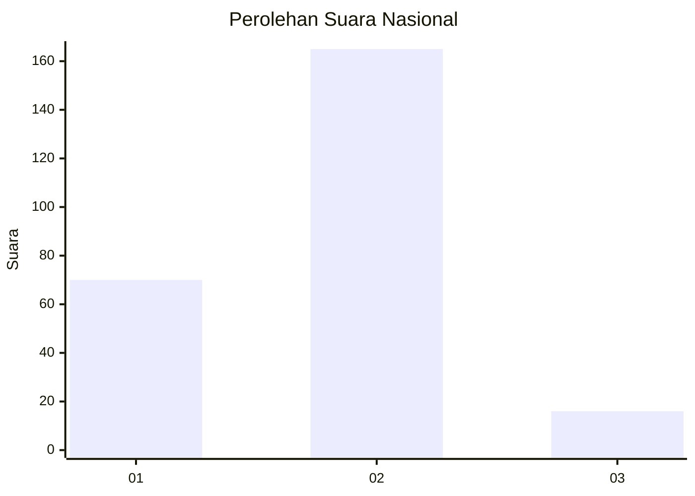
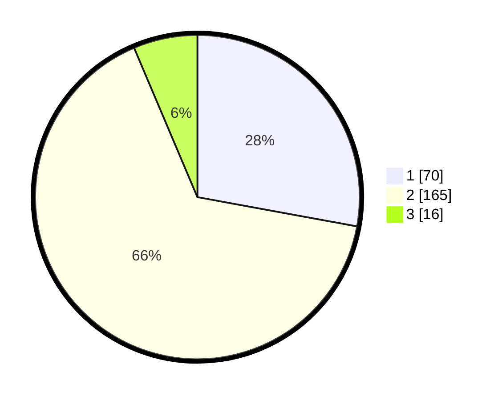

# Hasil

## Grafik

## Tabel

| No. | Nama Paslon    | Suara | Suara (raw) | Persentase |
|:--- |:-------------- | -----:| -----------:| ----------:|
| 1   | ANIES MUHAIMIN | 70    | [70][p-1]   | 27,89      |
| 2   | PRABOWO GIBRAN | 165   | [165][p-2]  | 65,74      |
| 3   | GANJAR MAHFUD  | 16    | [16][p-3]   | 6,37       |

[p-1]: https://github.com/gigit-pemilu/pemilu-2024/blob/main/pilpres/hitung-suara/sub/16-sumatera-selatan/sub/03-muara-enim/sub/02-muara-enim/sub/2005-lubuk-emplas/sub/006-tps/sub/paslon-1.txt
[p-2]: https://github.com/gigit-pemilu/pemilu-2024/blob/main/pilpres/hitung-suara/sub/16-sumatera-selatan/sub/03-muara-enim/sub/02-muara-enim/sub/2005-lubuk-emplas/sub/006-tps/sub/paslon-2.txt
[p-3]: https://github.com/gigit-pemilu/pemilu-2024/blob/main/pilpres/hitung-suara/sub/16-sumatera-selatan/sub/03-muara-enim/sub/02-muara-enim/sub/2005-lubuk-emplas/sub/006-tps/sub/paslon-3.txt

## Foto C Plano

https://sirekap-obj-formc.kpu.go.id/fcc6/pemilu/ppwp/16/03/02/20/05/1603022005006-20240214-235111--4de7962a-f1a3-4a84-bd53-7270bf07a14f.jpg

https://sirekap-obj-formc.kpu.go.id/fcc6/pemilu/ppwp/16/03/02/20/05/1603022005006-20240214-213906--e45a6b7f-926d-4ab0-b653-e4c4aae52781.jpg

https://sirekap-obj-formc.kpu.go.id/fcc6/pemilu/ppwp/16/03/02/20/05/1603022005006-20240214-215904--089498b7-3822-4115-957e-5a7794a47389.jpg

## Metadata

| Key        | Value               |
| ---------- | ------------------- |
| Time Stamp | 2024-02-26 14:00:00 |

