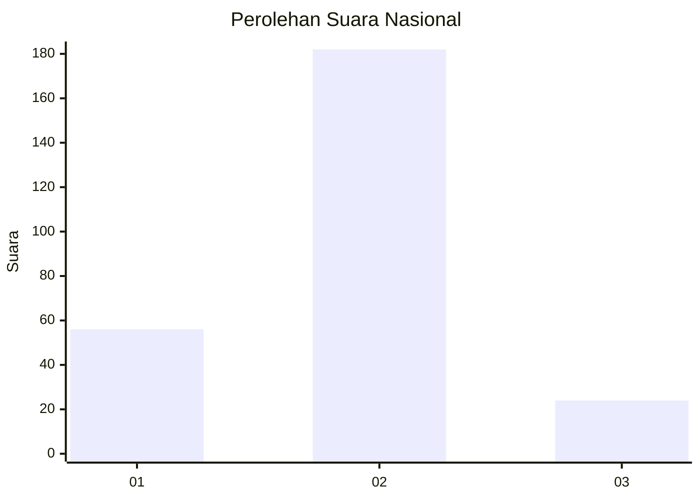

# Hasil

## Grafik

## Tabel

| No. | Nama Paslon    | Suara | Suara (raw) | Persentase |
|:--- |:-------------- | -----:| -----------:| ----------:|
| 1   | ANIES MUHAIMIN | 56    | [56][p-1]   | 21,37      |
| 2   | PRABOWO GIBRAN | 182   | [182][p-2]  | 69,47      |
| 3   | GANJAR MAHFUD  | 24    | [24][p-3]   | 9,16       |

[p-1]: https://github.com/gigit-pemilu/pemilu-2024/blob/main/pilpres/hitung-suara/sub/16-sumatera-selatan/sub/03-muara-enim/sub/02-muara-enim/sub/2011-kepur/sub/002-tps/sub/paslon-1.txt
[p-2]: https://github.com/gigit-pemilu/pemilu-2024/blob/main/pilpres/hitung-suara/sub/16-sumatera-selatan/sub/03-muara-enim/sub/02-muara-enim/sub/2011-kepur/sub/002-tps/sub/paslon-2.txt
[p-3]: https://github.com/gigit-pemilu/pemilu-2024/blob/main/pilpres/hitung-suara/sub/16-sumatera-selatan/sub/03-muara-enim/sub/02-muara-enim/sub/2011-kepur/sub/002-tps/sub/paslon-3.txt

## Foto C Plano

https://sirekap-obj-formc.kpu.go.id/da3a/pemilu/ppwp/16/03/02/20/11/1603022011002-20240214-195511--59203a8c-4bec-43e5-b392-38182886a222.jpg

https://sirekap-obj-formc.kpu.go.id/da3a/pemilu/ppwp/16/03/02/20/11/1603022011002-20240214-203843--e569d376-0546-4749-bb52-1c3bf3ffe9ae.jpg

https://sirekap-obj-formc.kpu.go.id/da3a/pemilu/ppwp/16/03/02/20/11/1603022011002-20240214-195012--2f6affa8-0a24-40c0-b9e2-4c5ab89e751e.jpg

## Metadata

| Key        | Value               |
| ---------- | ------------------- |
| Time Stamp | 2024-02-25 00:00:00 |

