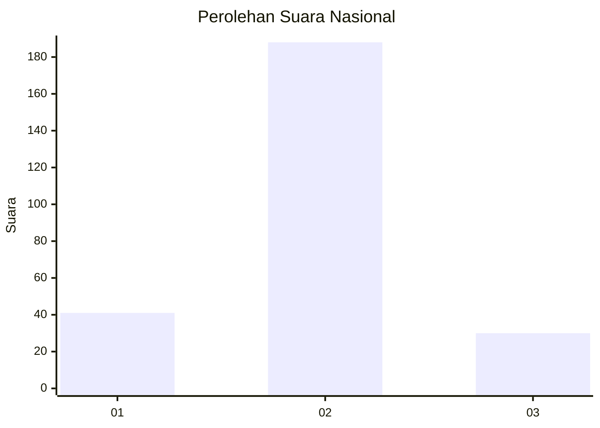
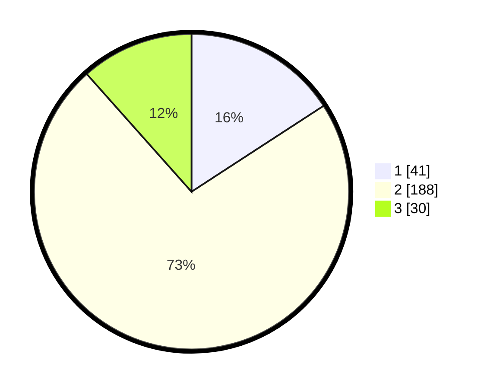

# Hasil

## Grafik

## Tabel

| No. | Nama Paslon    | Suara | Suara (raw) | Persentase |
|:--- |:-------------- | -----:| -----------:| ----------:|
| 1   | ANIES MUHAIMIN | 41    | [41][p-1]   | 15,83      |
| 2   | PRABOWO GIBRAN | 188   | [188][p-2]  | 72,59      |
| 3   | GANJAR MAHFUD  | 30    | [30][p-3]   | 11,58      |

[p-1]: https://github.com/gigit-pemilu/pemilu-2024/blob/main/pilpres/hitung-suara/sub/16-sumatera-selatan/sub/03-muara-enim/sub/02-muara-enim/sub/2012-tanjung-serian/sub/005-tps/sub/paslon-1.txt
[p-2]: https://github.com/gigit-pemilu/pemilu-2024/blob/main/pilpres/hitung-suara/sub/16-sumatera-selatan/sub/03-muara-enim/sub/02-muara-enim/sub/2012-tanjung-serian/sub/005-tps/sub/paslon-2.txt
[p-3]: https://github.com/gigit-pemilu/pemilu-2024/blob/main/pilpres/hitung-suara/sub/16-sumatera-selatan/sub/03-muara-enim/sub/02-muara-enim/sub/2012-tanjung-serian/sub/005-tps/sub/paslon-3.txt

## Foto C Plano

https://sirekap-obj-formc.kpu.go.id/314e/pemilu/ppwp/16/03/02/20/12/1603022012005-20240215-084441--39162bf9-a3ac-4b97-a5c2-8b37457c0a92.jpg

https://sirekap-obj-formc.kpu.go.id/314e/pemilu/ppwp/16/03/02/20/12/1603022012005-20240215-084508--1ec9527d-80ae-49ad-92e8-10c11197a2f8.jpg

https://sirekap-obj-formc.kpu.go.id/314e/pemilu/ppwp/16/03/02/20/12/1603022012005-20240215-084538--22f9f1f0-bd11-41ed-954c-d959131905e1.jpg

## Metadata

| Key        | Value               |
| ---------- | ------------------- |
| Time Stamp | 2024-02-25 12:00:00 |

