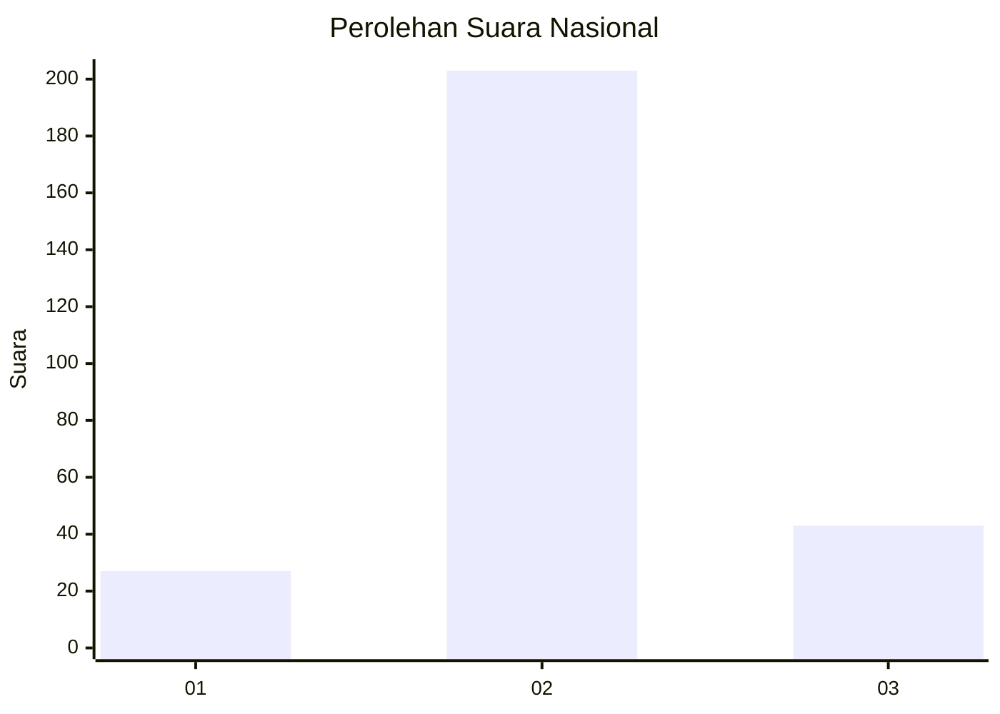
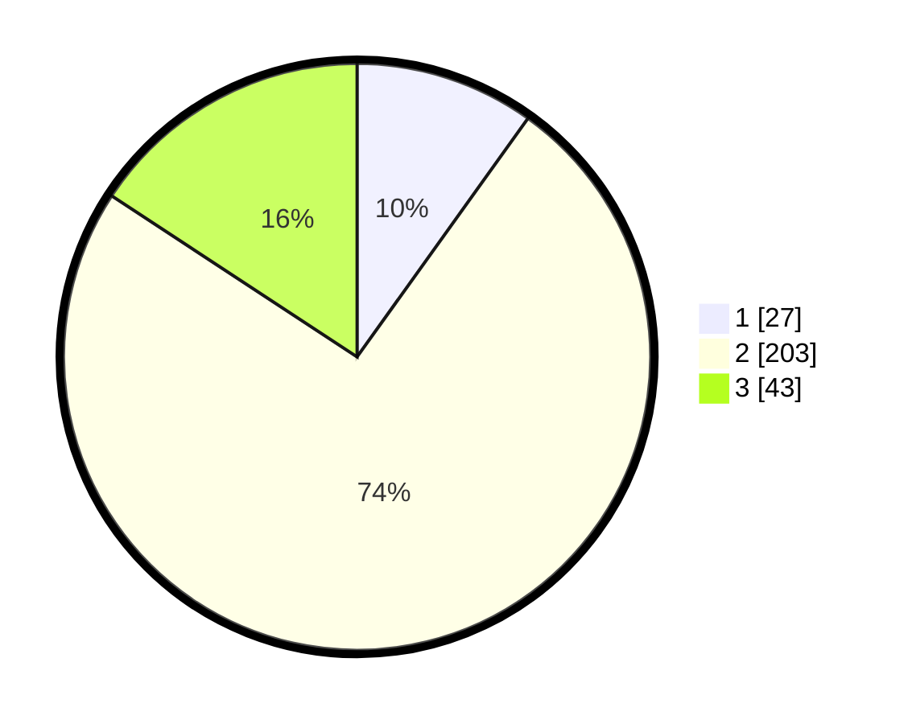

# Hasil

## Grafik

## Tabel

| No. | Nama Paslon    | Suara | Suara (raw) | Persentase |
|:--- |:-------------- | -----:| -----------:| ----------:|
| 1   | ANIES MUHAIMIN | 27    | [27][p-1]   | 9,89       |
| 2   | PRABOWO GIBRAN | 203   | [203][p-2]  | 74,36      |
| 3   | GANJAR MAHFUD  | 43    | [43][p-3]   | 15,75      |

[p-1]: https://github.com/gigit-pemilu/pemilu-2024/blob/main/pilpres/hitung-suara/sub/16-sumatera-selatan/sub/03-muara-enim/sub/02-muara-enim/sub/2014-saka-jaya/sub/004-tps/sub/paslon-1.txt
[p-2]: https://github.com/gigit-pemilu/pemilu-2024/blob/main/pilpres/hitung-suara/sub/16-sumatera-selatan/sub/03-muara-enim/sub/02-muara-enim/sub/2014-saka-jaya/sub/004-tps/sub/paslon-2.txt
[p-3]: https://github.com/gigit-pemilu/pemilu-2024/blob/main/pilpres/hitung-suara/sub/16-sumatera-selatan/sub/03-muara-enim/sub/02-muara-enim/sub/2014-saka-jaya/sub/004-tps/sub/paslon-3.txt

## Foto C Plano

https://sirekap-obj-formc.kpu.go.id/034a/pemilu/ppwp/16/03/02/20/14/1603022014004-20240215-010224--2d2c9550-9ed9-4881-855c-71796f612dbc.jpg

https://sirekap-obj-formc.kpu.go.id/034a/pemilu/ppwp/16/03/02/20/14/1603022014004-20240215-010313--58ccc56f-c390-4426-a589-a20eb18b3c25.jpg

https://sirekap-obj-formc.kpu.go.id/034a/pemilu/ppwp/16/03/02/20/14/1603022014004-20240215-010533--81ca86d4-d8b4-4e39-98e4-65db55fffd83.jpg

## Metadata

| Key        | Value               |
| ---------- | ------------------- |
| Time Stamp | 2024-02-25 00:00:00 |

