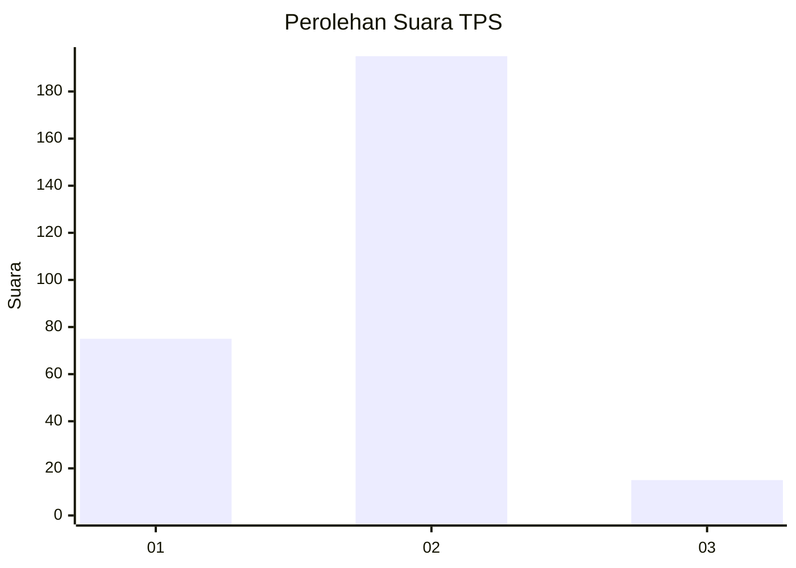
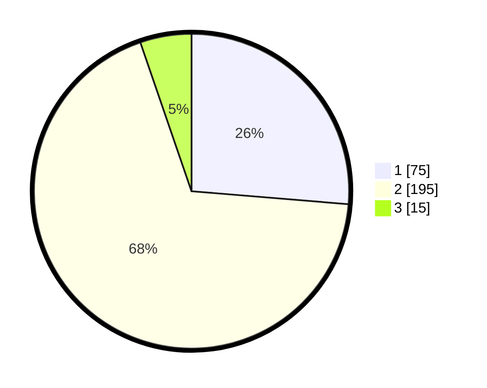

# Hasil

## Grafik

## Tabel

| No. | Nama Paslon    | Suara | Suara (raw) | Persentase |
|:--- |:-------------- | -----:| -----------:| ----------:|
| 1   | ANIES MUHAIMIN | 75    | [75][p-1]   | 26,32      |
| 2   | PRABOWO GIBRAN | 195   | [195][p-2]  | 68,42      |
| 3   | GANJAR MAHFUD  | 15    | [15][p-3]   | 5,26       |

[p-1]: https://github.com/gigit-pemilu/pemilu-2024-16-sumatera-selatan/blob/main/pilpres/hitung-suara/sub/16-sumatera-selatan/sub/03-muara-enim/sub/03-rambang-niru/sub/2002-lubuk-raman/sub/009-tps/sub/paslon-1.txt
[p-2]: https://github.com/gigit-pemilu/pemilu-2024-16-sumatera-selatan/blob/main/pilpres/hitung-suara/sub/16-sumatera-selatan/sub/03-muara-enim/sub/03-rambang-niru/sub/2002-lubuk-raman/sub/009-tps/sub/paslon-2.txt
[p-3]: https://github.com/gigit-pemilu/pemilu-2024-16-sumatera-selatan/blob/main/pilpres/hitung-suara/sub/16-sumatera-selatan/sub/03-muara-enim/sub/03-rambang-niru/sub/2002-lubuk-raman/sub/009-tps/sub/paslon-3.txt

## Foto C Plano

https://sirekap-obj-formc.kpu.go.id/6e20/pemilu/ppwp/16/03/03/20/02/1603032002009-20240219-203509--684cc499-ac12-4914-a343-f4490208562f.jpg

https://sirekap-obj-formc.kpu.go.id/6e20/pemilu/ppwp/16/03/03/20/02/1603032002009-20240219-203633--8d355d0a-0e2d-433f-930d-e308d0bf3329.jpg

https://sirekap-obj-formc.kpu.go.id/6e20/pemilu/ppwp/16/03/03/20/02/1603032002009-20240219-221616--fb230fe6-ff64-4d42-99a9-292cd14c68cb.jpg

## Metadata

| Key        | Value               |
| ---------- | ------------------- |
| Time Stamp | 2024-02-19 23:00:00 |

## DATA PEMILIH TETAP

Jumlah pemilih dalam DPT: **207**.
 * L: **156**.
 * P: **131**.

## DATA PENGGUNA HAK PILIH

Jumlah pengguna hak pilih dalam DPT: **245**.
 * L: **131**.
 * P: **118**.

Jumlah pengguna hak pilih dalam DPTb: **808**.
 * L: **88**.
 * P: **88**.

Jumlah pengguna hak pilih dalam DPK: **882**.
 * L: **1**.
 * P: **1**.

Jumlah pengguna hak pilih: **251**.
 * L: **132**.
 * P: **119**.

## JUMLAH SUARA SAH DAN TIDAK SAH

JUMLAH SELURUH SUARA SAH: **0**.

JUMLAH SUARA TIDAK SAH: **0**.

JUMLAH SELURUH SUARA SAH DAN SUARA TIDAK SAH: **0**.

