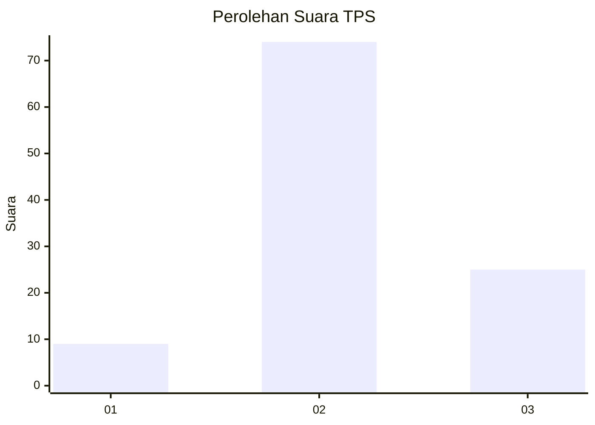
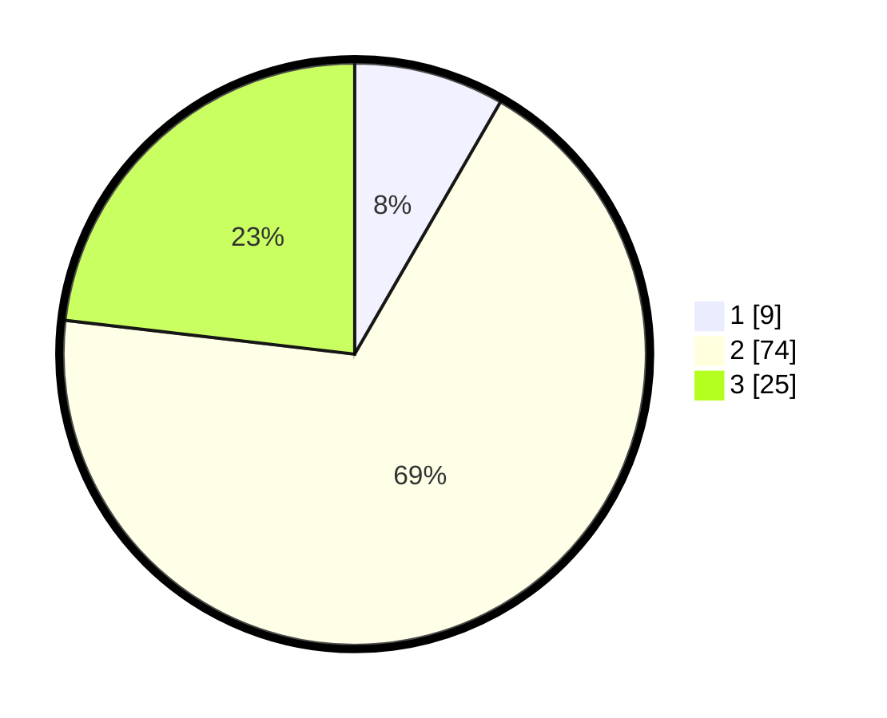

# Hasil

## Grafik

## Tabel

| No. | Nama Paslon    | Suara | Suara (raw) | Persentase |
|:--- |:-------------- | -----:| -----------:| ----------:|
| 1   | ANIES MUHAIMIN | 9     | [9][p-1]    | 8,33       |
| 2   | PRABOWO GIBRAN | 74    | [74][p-2]   | 68,52      |
| 3   | GANJAR MAHFUD  | 25    | [25][p-3]   | 23,15      |

[p-1]: https://github.com/gigit-pemilu/pemilu-2024-16-sumatera-selatan/blob/main/pilpres/hitung-suara/sub/16-sumatera-selatan/sub/03-muara-enim/sub/03-rambang-niru/sub/2004-tanjung-menang/sub/004-tps/sub/paslon-1.txt
[p-2]: https://github.com/gigit-pemilu/pemilu-2024-16-sumatera-selatan/blob/main/pilpres/hitung-suara/sub/16-sumatera-selatan/sub/03-muara-enim/sub/03-rambang-niru/sub/2004-tanjung-menang/sub/004-tps/sub/paslon-2.txt
[p-3]: https://github.com/gigit-pemilu/pemilu-2024-16-sumatera-selatan/blob/main/pilpres/hitung-suara/sub/16-sumatera-selatan/sub/03-muara-enim/sub/03-rambang-niru/sub/2004-tanjung-menang/sub/004-tps/sub/paslon-3.txt

## Foto C Plano

https://sirekap-obj-formc.kpu.go.id/fcf9/pemilu/ppwp/16/03/03/20/04/1603032004004-20240218-162653--1e397054-b7fa-4ebf-adf3-ae4d7c55b3b0.jpg

https://sirekap-obj-formc.kpu.go.id/fcf9/pemilu/ppwp/16/03/03/20/04/1603032004004-20240218-162734--5b539727-0ad4-4c46-aa40-738fc43f32e8.jpg

https://sirekap-obj-formc.kpu.go.id/fcf9/pemilu/ppwp/16/03/03/20/04/1603032004004-20240218-162828--9915ffae-9a28-4c8e-90a3-365d201b5f6d.jpg

## Metadata

| Key        | Value               |
| ---------- | ------------------- |
| Time Stamp | 2024-02-24 22:31:28 |

