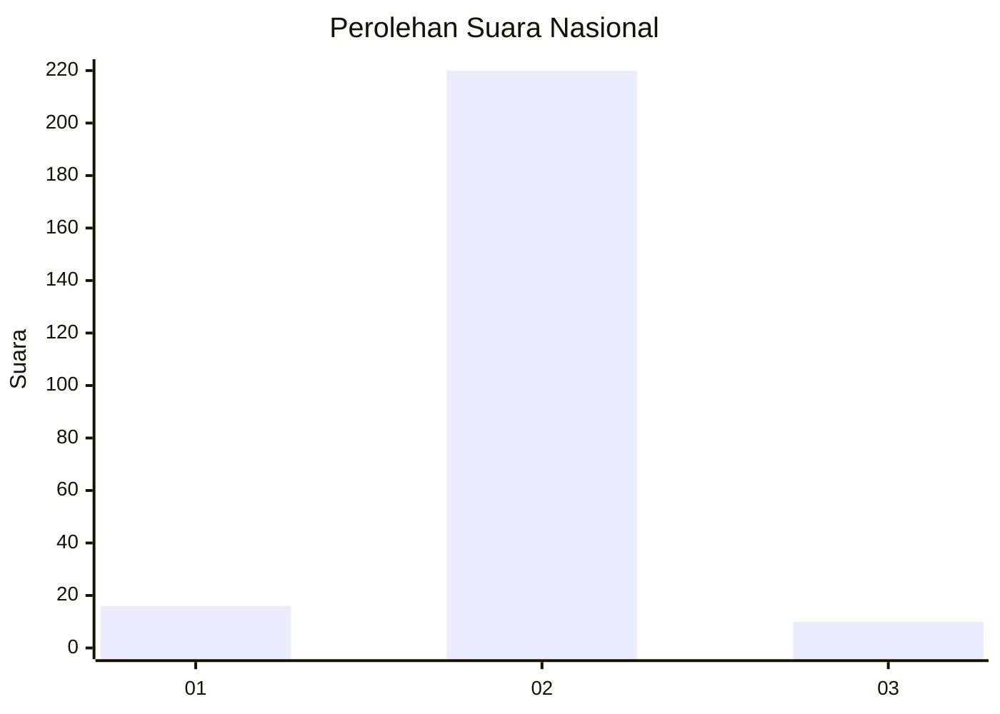
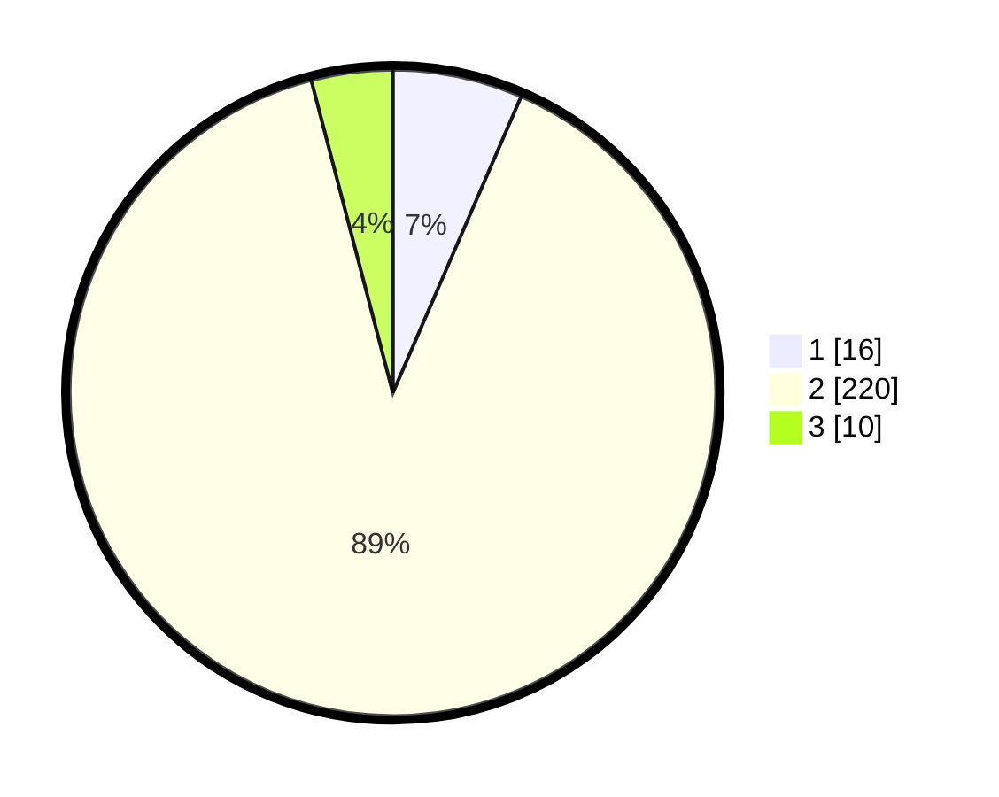

# Hasil

## Grafik

## Tabel

| No. | Nama Paslon    | Suara | Suara (raw) | Persentase |
|:--- |:-------------- | -----:| -----------:| ----------:|
| 1   | ANIES MUHAIMIN | 16    | [16][p-1]   | 6,50       |
| 2   | PRABOWO GIBRAN | 220   | [220][p-2]  | 89,43      |
| 3   | GANJAR MAHFUD  | 10    | [10][p-3]   | 4,07       |

[p-1]: https://github.com/gigit-pemilu/pemilu-2024/blob/main/pilpres/hitung-suara/sub/16-sumatera-selatan/sub/03-muara-enim/sub/03-rambang-niru/sub/2017-manunggal-jaya/sub/004-tps/sub/paslon-1.txt
[p-2]: https://github.com/gigit-pemilu/pemilu-2024/blob/main/pilpres/hitung-suara/sub/16-sumatera-selatan/sub/03-muara-enim/sub/03-rambang-niru/sub/2017-manunggal-jaya/sub/004-tps/sub/paslon-2.txt
[p-3]: https://github.com/gigit-pemilu/pemilu-2024/blob/main/pilpres/hitung-suara/sub/16-sumatera-selatan/sub/03-muara-enim/sub/03-rambang-niru/sub/2017-manunggal-jaya/sub/004-tps/sub/paslon-3.txt

## Foto C Plano

https://sirekap-obj-formc.kpu.go.id/83ba/pemilu/ppwp/16/03/03/20/17/1603032017004-20240218-163932--6bdc91b9-3be6-4a35-be4b-54b9df2cfc44.jpg

https://sirekap-obj-formc.kpu.go.id/83ba/pemilu/ppwp/16/03/03/20/17/1603032017004-20240218-164056--f93fdee8-349b-445b-8cfc-3fb93906ab9d.jpg

https://sirekap-obj-formc.kpu.go.id/83ba/pemilu/ppwp/16/03/03/20/17/1603032017004-20240218-163348--d5992902-e17d-454b-8641-6f0be4e890d3.jpg

## Metadata

| Key        | Value               |
| ---------- | ------------------- |
| Time Stamp | 2024-02-25 21:00:00 |

