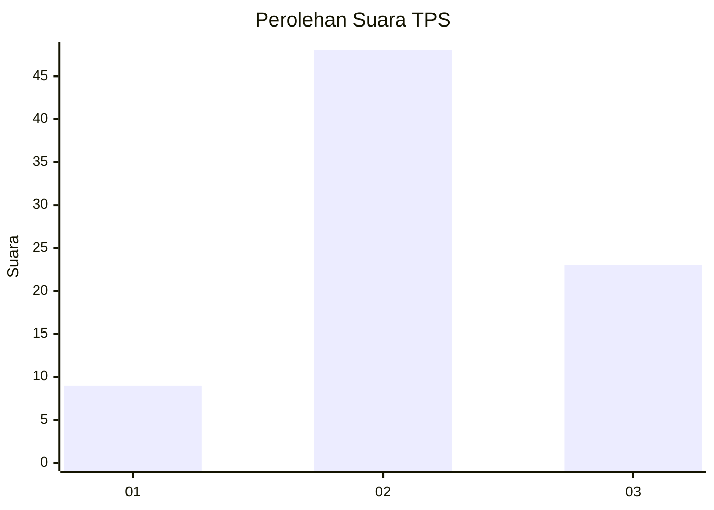
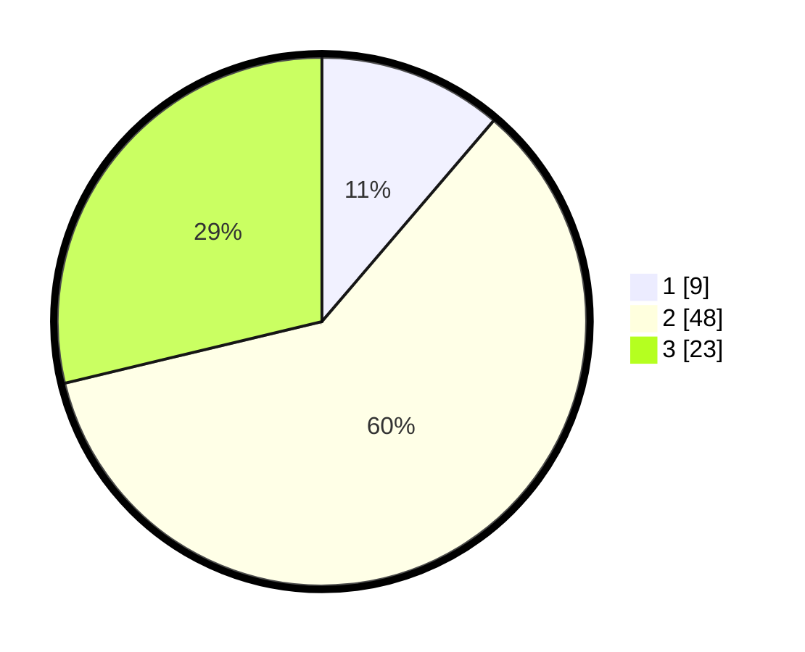

# Hasil

## Grafik

## Tabel

| No. | Nama Paslon    | Suara | Suara (raw) | Persentase |
|:--- |:-------------- | -----:| -----------:| ----------:|
| 1   | ANIES MUHAIMIN | 9     | [9][p-1]    | 11,25      |
| 2   | PRABOWO GIBRAN | 48    | [48][p-2]   | 60,00      |
| 3   | GANJAR MAHFUD  | 23    | [23][p-3]   | 28,75      |

[p-1]: https://github.com/gigit-pemilu/pemilu-2024-16-sumatera-selatan/blob/main/pilpres/hitung-suara/sub/16-sumatera-selatan/sub/03-muara-enim/sub/03-rambang-niru/sub/2020-manunggal-makmur/sub/004-tps/sub/paslon-1.txt
[p-2]: https://github.com/gigit-pemilu/pemilu-2024-16-sumatera-selatan/blob/main/pilpres/hitung-suara/sub/16-sumatera-selatan/sub/03-muara-enim/sub/03-rambang-niru/sub/2020-manunggal-makmur/sub/004-tps/sub/paslon-2.txt
[p-3]: https://github.com/gigit-pemilu/pemilu-2024-16-sumatera-selatan/blob/main/pilpres/hitung-suara/sub/16-sumatera-selatan/sub/03-muara-enim/sub/03-rambang-niru/sub/2020-manunggal-makmur/sub/004-tps/sub/paslon-3.txt

## Foto C Plano

https://sirekap-obj-formc.kpu.go.id/13b3/pemilu/ppwp/16/03/03/20/20/1603032020004-20240223-213942--96495289-1109-4674-a526-273c2ac9ce9f.jpg

https://sirekap-obj-formc.kpu.go.id/13b3/pemilu/ppwp/16/03/03/20/20/1603032020004-20240223-214013--35116ee4-f343-4aac-83cd-080cda7c49fa.jpg

https://sirekap-obj-formc.kpu.go.id/13b3/pemilu/ppwp/16/03/03/20/20/1603032020004-20240223-214046--085d4a07-de3f-401f-9226-12806bd582af.jpg

## Metadata

| Key        | Value               |
| ---------- | ------------------- |
| Time Stamp | 2024-02-24 22:31:28 |

## DATA PEMILIH TETAP

Jumlah pemilih dalam DPT: **251**.
 * L: **145**.
 * P: **636**.

## DATA PENGGUNA HAK PILIH

Jumlah pengguna hak pilih dalam DPT: **221**.
 * L: **600**.
 * P: **621**.

Jumlah pengguna hak pilih dalam DPTb: **2**.
 * L: **2**.
 * P: **1**.

Jumlah pengguna hak pilih dalam DPK: **2**.
 * L: **8**.
 * P: **6**.

Jumlah pengguna hak pilih: **225**.
 * L: **102**.
 * P: **623**.

## JUMLAH SUARA SAH DAN TIDAK SAH

JUMLAH SELURUH SUARA SAH: **220**.

JUMLAH SUARA TIDAK SAH: **5**.

JUMLAH SELURUH SUARA SAH DAN SUARA TIDAK SAH: **225**.

