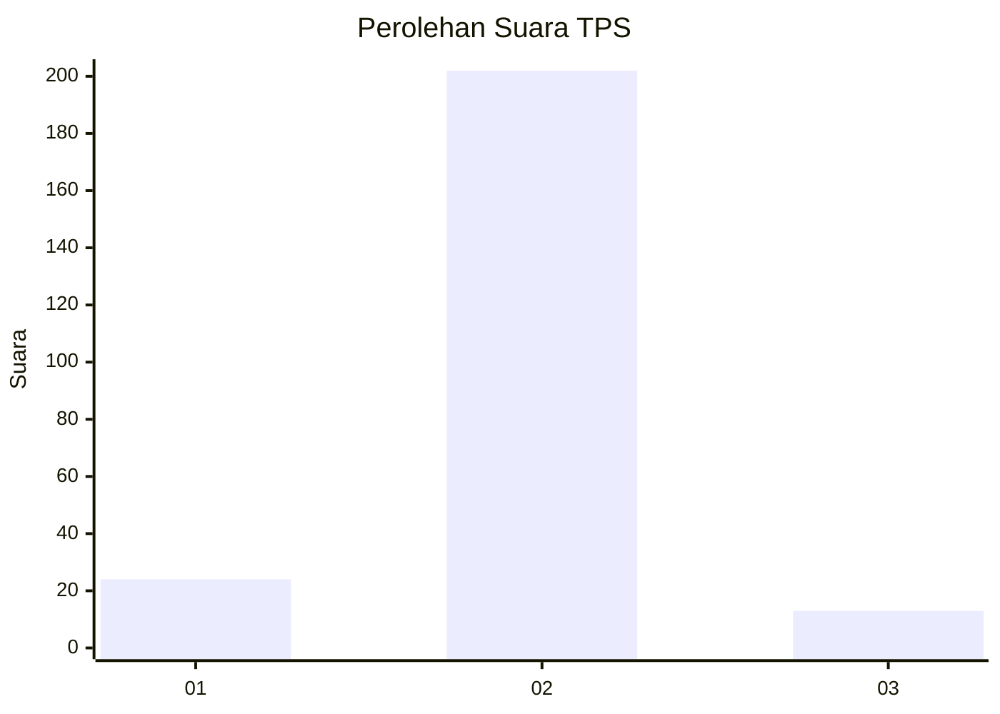
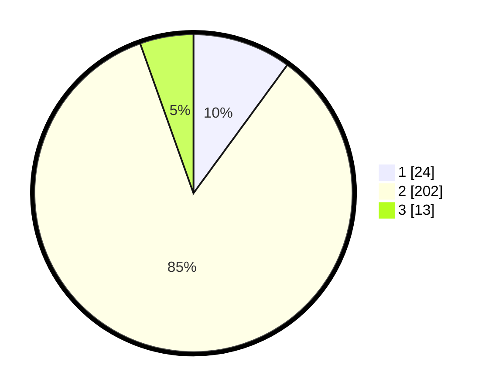

# Hasil

## Grafik

## Tabel

| No. | Nama Paslon    | Suara | Suara (raw) | Persentase |
|:--- |:-------------- | -----:| -----------:| ----------:|
| 1   | ANIES MUHAIMIN | 24    | [24][p-1]   | 10,04      |
| 2   | PRABOWO GIBRAN | 202   | [202][p-2]  | 84,52      |
| 3   | GANJAR MAHFUD  | 13    | [13][p-3]   | 5,44       |

[p-1]: https://github.com/gigit-pemilu/pemilu-2024-16-sumatera-selatan/blob/main/pilpres/hitung-suara/sub/16-sumatera-selatan/sub/03-muara-enim/sub/04-gunung-megang/sub/2001-penanggiran/sub/010-tps/sub/paslon-1.txt
[p-2]: https://github.com/gigit-pemilu/pemilu-2024-16-sumatera-selatan/blob/main/pilpres/hitung-suara/sub/16-sumatera-selatan/sub/03-muara-enim/sub/04-gunung-megang/sub/2001-penanggiran/sub/010-tps/sub/paslon-2.txt
[p-3]: https://github.com/gigit-pemilu/pemilu-2024-16-sumatera-selatan/blob/main/pilpres/hitung-suara/sub/16-sumatera-selatan/sub/03-muara-enim/sub/04-gunung-megang/sub/2001-penanggiran/sub/010-tps/sub/paslon-3.txt

## Foto C Plano

https://sirekap-obj-formc.kpu.go.id/bf71/pemilu/ppwp/16/03/04/20/01/1603042001010-20240215-004756--dab9e4ff-740d-4868-85b9-054427986345.jpg

https://sirekap-obj-formc.kpu.go.id/bf71/pemilu/ppwp/16/03/04/20/01/1603042001010-20240215-005113--5f14eba1-cde4-4e4e-9d7b-a58e131854bb.jpg

https://sirekap-obj-formc.kpu.go.id/bf71/pemilu/ppwp/16/03/04/20/01/1603042001010-20240215-005315--0027d65f-4443-4b25-bad9-ad0447d528ae.jpg

## Metadata

| Key        | Value               |
| ---------- | ------------------- |
| Time Stamp | 2024-02-25 14:00:00 |

