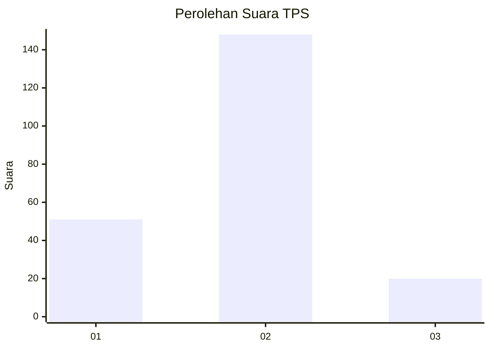

# Hasil

## Grafik

## Tabel

| No. | Nama Paslon    | Suara | Suara (raw) | Persentase |
|:--- |:-------------- | -----:| -----------:| ----------:|
| 1   | ANIES MUHAIMIN | 51    | [51][p-1]   | 23,29      |
| 2   | PRABOWO GIBRAN | 148   | [148][p-2]  | 67,58      |
| 3   | GANJAR MAHFUD  | 20    | [20][p-3]   | 9,13       |

[p-1]: https://github.com/gigit-pemilu/pemilu-2024-16-sumatera-selatan/blob/main/pilpres/hitung-suara/sub/16-sumatera-selatan/sub/03-muara-enim/sub/04-gunung-megang/sub/2002-gunung-megang-luar/sub/005-tps/sub/paslon-1.txt
[p-2]: https://github.com/gigit-pemilu/pemilu-2024-16-sumatera-selatan/blob/main/pilpres/hitung-suara/sub/16-sumatera-selatan/sub/03-muara-enim/sub/04-gunung-megang/sub/2002-gunung-megang-luar/sub/005-tps/sub/paslon-2.txt
[p-3]: https://github.com/gigit-pemilu/pemilu-2024-16-sumatera-selatan/blob/main/pilpres/hitung-suara/sub/16-sumatera-selatan/sub/03-muara-enim/sub/04-gunung-megang/sub/2002-gunung-megang-luar/sub/005-tps/sub/paslon-3.txt

## Foto C Plano

https://sirekap-obj-formc.kpu.go.id/1507/pemilu/ppwp/16/03/04/20/02/1603042002005-20240215-065425--abb0b9d0-9e84-4970-99fe-2560a7589db8.jpg

https://sirekap-obj-formc.kpu.go.id/1507/pemilu/ppwp/16/03/04/20/02/1603042002005-20240215-065528--67c78a0e-99a7-47dd-88e9-20c39e9fd0b4.jpg

https://sirekap-obj-formc.kpu.go.id/1507/pemilu/ppwp/16/03/04/20/02/1603042002005-20240215-065605--1549186f-fd13-4147-9ccb-965bd8144d2f.jpg

## Metadata

| Key        | Value               |
| ---------- | ------------------- |
| Time Stamp | 2024-02-24 22:31:28 |

