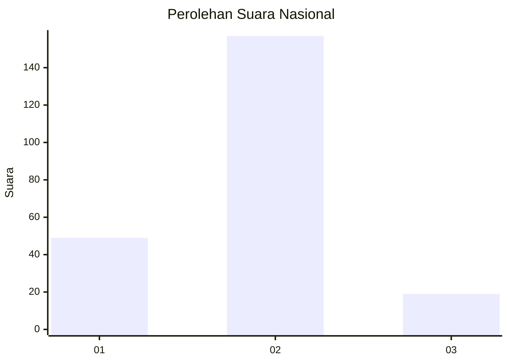
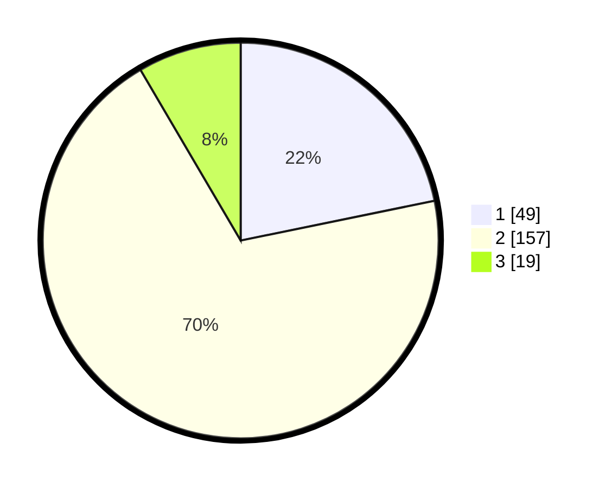

# Hasil

## Grafik

## Tabel

| No. | Nama Paslon    | Suara | Suara (raw) | Persentase |
|:--- |:-------------- | -----:| -----------:| ----------:|
| 1   | ANIES MUHAIMIN | 49    | [49][p-1]   | 21,78      |
| 2   | PRABOWO GIBRAN | 157   | [157][p-2]  | 69,78      |
| 3   | GANJAR MAHFUD  | 19    | [19][p-3]   | 8,44       |

[p-1]: https://github.com/gigit-pemilu/pemilu-2024/blob/main/pilpres/hitung-suara/sub/16-sumatera-selatan/sub/03-muara-enim/sub/04-gunung-megang/sub/2003-gunung-megang-dalam/sub/006-tps/sub/paslon-1.txt
[p-2]: https://github.com/gigit-pemilu/pemilu-2024/blob/main/pilpres/hitung-suara/sub/16-sumatera-selatan/sub/03-muara-enim/sub/04-gunung-megang/sub/2003-gunung-megang-dalam/sub/006-tps/sub/paslon-2.txt
[p-3]: https://github.com/gigit-pemilu/pemilu-2024/blob/main/pilpres/hitung-suara/sub/16-sumatera-selatan/sub/03-muara-enim/sub/04-gunung-megang/sub/2003-gunung-megang-dalam/sub/006-tps/sub/paslon-3.txt

## Foto C Plano

https://sirekap-obj-formc.kpu.go.id/9d3e/pemilu/ppwp/16/03/04/20/03/1603042003006-20240215-021201--0f61b063-1ed0-427c-a34e-fa89f0d6837c.jpg

https://sirekap-obj-formc.kpu.go.id/9d3e/pemilu/ppwp/16/03/04/20/03/1603042003006-20240214-203609--946cac86-660c-4fb4-9036-33c4af30584e.jpg

https://sirekap-obj-formc.kpu.go.id/9d3e/pemilu/ppwp/16/03/04/20/03/1603042003006-20240214-203617--b0d5aa5b-bb35-4209-b59b-48dd237b9f34.jpg

## Metadata

| Key        | Value               |
| ---------- | ------------------- |
| Time Stamp | 2024-02-15 23:29:50 |

