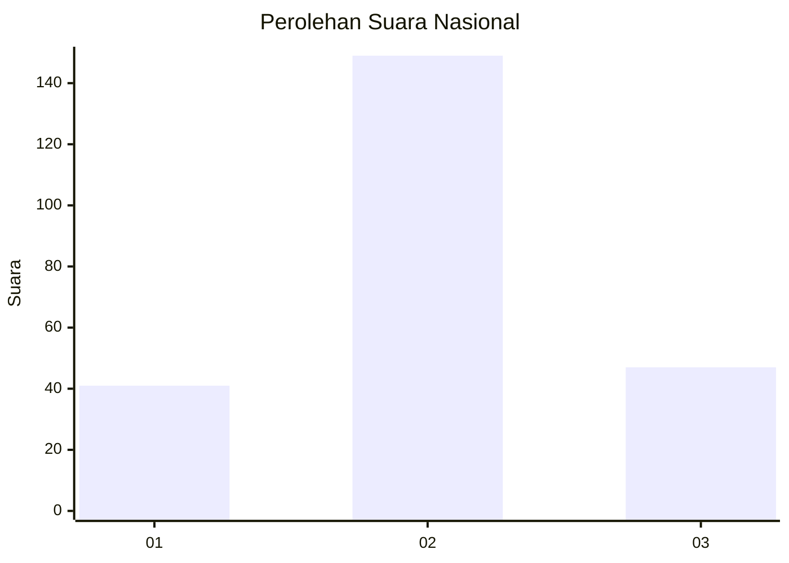
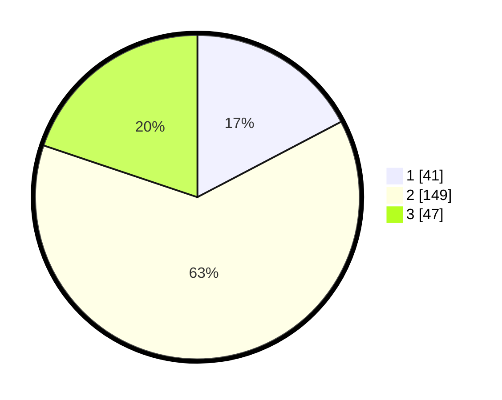

# Hasil

## Grafik

## Tabel

| No. | Nama Paslon    | Suara | Suara (raw) | Persentase |
|:--- |:-------------- | -----:| -----------:| ----------:|
| 1   | ANIES MUHAIMIN | 41    | [41][p-1]   | 17,30      |
| 2   | PRABOWO GIBRAN | 149   | [149][p-2]  | 62,87      |
| 3   | GANJAR MAHFUD  | 47    | [47][p-3]   | 19,83      |

[p-1]: https://github.com/gigit-pemilu/pemilu-2024/blob/main/pilpres/hitung-suara/sub/16-sumatera-selatan/sub/03-muara-enim/sub/04-gunung-megang/sub/2003-gunung-megang-dalam/sub/008-tps/sub/paslon-1.txt
[p-2]: https://github.com/gigit-pemilu/pemilu-2024/blob/main/pilpres/hitung-suara/sub/16-sumatera-selatan/sub/03-muara-enim/sub/04-gunung-megang/sub/2003-gunung-megang-dalam/sub/008-tps/sub/paslon-2.txt
[p-3]: https://github.com/gigit-pemilu/pemilu-2024/blob/main/pilpres/hitung-suara/sub/16-sumatera-selatan/sub/03-muara-enim/sub/04-gunung-megang/sub/2003-gunung-megang-dalam/sub/008-tps/sub/paslon-3.txt

## Foto C Plano

https://sirekap-obj-formc.kpu.go.id/2d4d/pemilu/ppwp/16/03/04/20/03/1603042003008-20240216-060146--e9bfe3a5-8c52-45c5-a85b-0dfcc0495c65.jpg

https://sirekap-obj-formc.kpu.go.id/2d4d/pemilu/ppwp/16/03/04/20/03/1603042003008-20240216-060304--46ad6377-23e0-4b86-854e-5a0dbde46e61.jpg

https://sirekap-obj-formc.kpu.go.id/2d4d/pemilu/ppwp/16/03/04/20/03/1603042003008-20240216-060314--2567fdf3-1475-4ec0-b4c5-507505402839.jpg

## Metadata

| Key        | Value               |
| ---------- | ------------------- |
| Time Stamp | 2024-02-25 14:00:00 |

