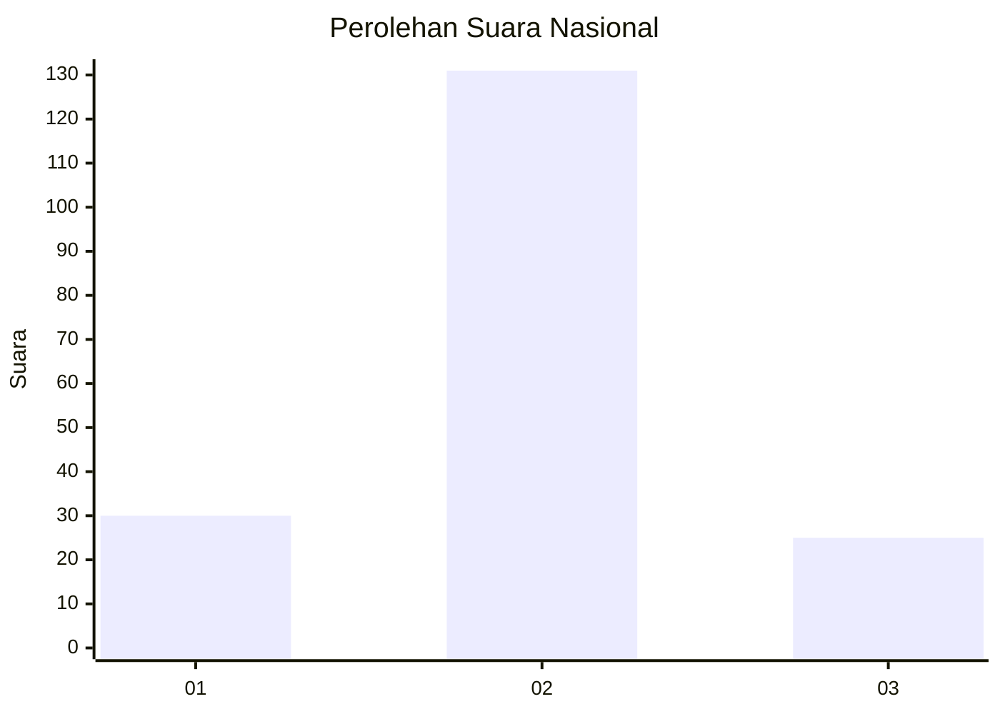
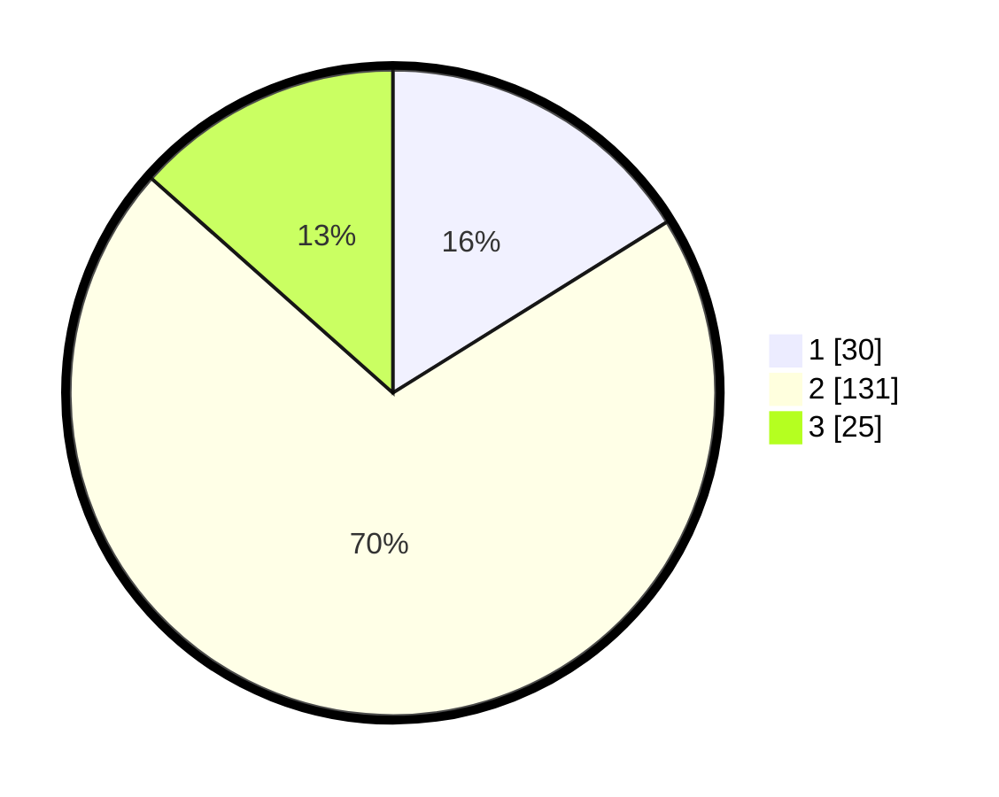

# Hasil

## Grafik

## Tabel

| No. | Nama Paslon    | Suara | Suara (raw) | Persentase |
|:--- |:-------------- | -----:| -----------:| ----------:|
| 1   | ANIES MUHAIMIN | 30    | [30][p-1]   | 16,13      |
| 2   | PRABOWO GIBRAN | 131   | [131][p-2]  | 70,43      |
| 3   | GANJAR MAHFUD  | 25    | [25][p-3]   | 13,44      |

[p-1]: https://github.com/gigit-pemilu/pemilu-2024/blob/main/pilpres/hitung-suara/sub/16-sumatera-selatan/sub/03-muara-enim/sub/06-gelumbang/sub/1010-gelumbang/sub/002-tps/sub/paslon-1.txt
[p-2]: https://github.com/gigit-pemilu/pemilu-2024/blob/main/pilpres/hitung-suara/sub/16-sumatera-selatan/sub/03-muara-enim/sub/06-gelumbang/sub/1010-gelumbang/sub/002-tps/sub/paslon-2.txt
[p-3]: https://github.com/gigit-pemilu/pemilu-2024/blob/main/pilpres/hitung-suara/sub/16-sumatera-selatan/sub/03-muara-enim/sub/06-gelumbang/sub/1010-gelumbang/sub/002-tps/sub/paslon-3.txt

## Foto C Plano

https://sirekap-obj-formc.kpu.go.id/9ad9/pemilu/ppwp/16/03/06/10/10/1603061010002-20240214-155329--77f27df4-e81d-4987-896e-49ebac0e4b57.jpg

https://sirekap-obj-formc.kpu.go.id/9ad9/pemilu/ppwp/16/03/06/10/10/1603061010002-20240214-155133--ac1ddab8-bf40-4efc-9238-5cd432caf3a6.jpg

https://sirekap-obj-formc.kpu.go.id/9ad9/pemilu/ppwp/16/03/06/10/10/1603061010002-20240214-155549--1c973b68-184c-4e12-9c04-a82314ca8fa2.jpg

## Metadata

| Key        | Value               |
| ---------- | ------------------- |
| Time Stamp | 2024-02-25 12:00:00 |

