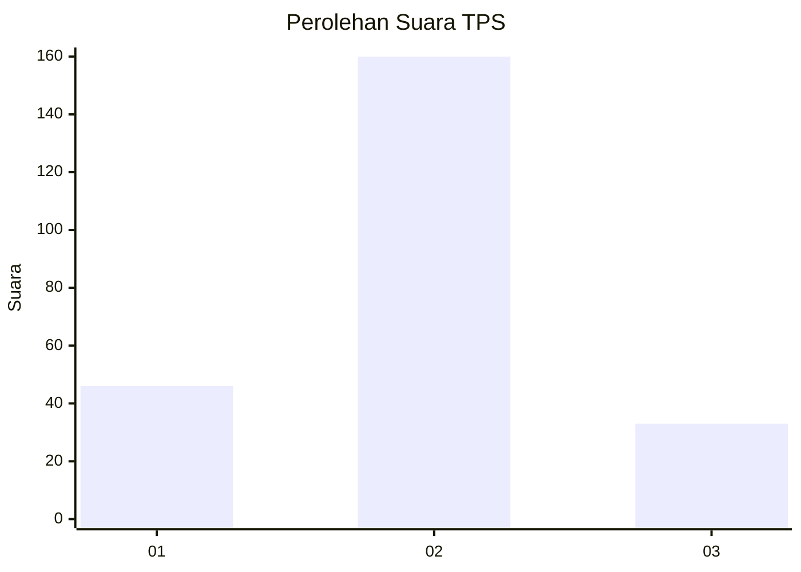
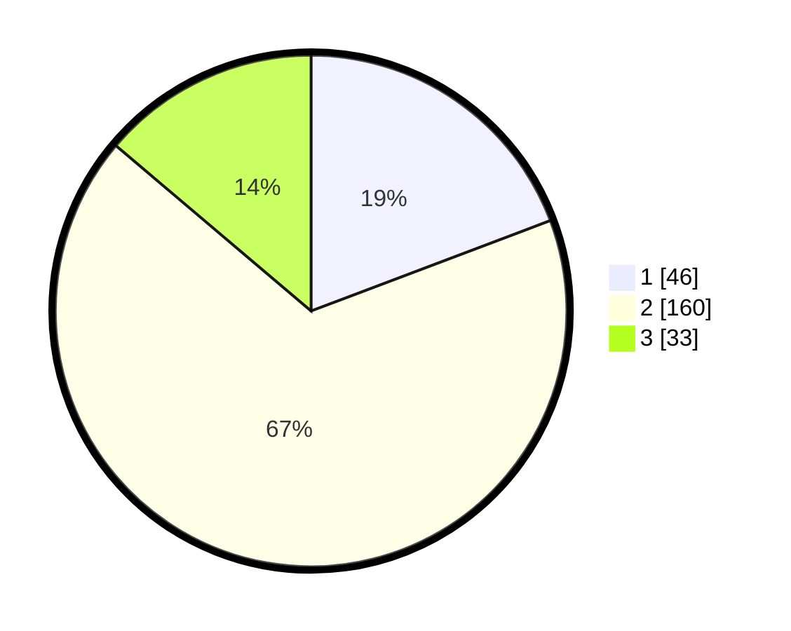

# Hasil

## Grafik

## Tabel

| No. | Nama Paslon    | Suara | Suara (raw) | Persentase |
|:--- |:-------------- | -----:| -----------:| ----------:|
| 1   | ANIES MUHAIMIN | 46    | [46][p-1]   | 19,25      |
| 2   | PRABOWO GIBRAN | 160   | [160][p-2]  | 66,95      |
| 3   | GANJAR MAHFUD  | 33    | [33][p-3]   | 13,81      |

[p-1]: https://github.com/gigit-pemilu/pemilu-2024-16-sumatera-selatan/blob/main/pilpres/hitung-suara/sub/16-sumatera-selatan/sub/03-muara-enim/sub/06-gelumbang/sub/1010-gelumbang/sub/010-tps/sub/paslon-1.txt
[p-2]: https://github.com/gigit-pemilu/pemilu-2024-16-sumatera-selatan/blob/main/pilpres/hitung-suara/sub/16-sumatera-selatan/sub/03-muara-enim/sub/06-gelumbang/sub/1010-gelumbang/sub/010-tps/sub/paslon-2.txt
[p-3]: https://github.com/gigit-pemilu/pemilu-2024-16-sumatera-selatan/blob/main/pilpres/hitung-suara/sub/16-sumatera-selatan/sub/03-muara-enim/sub/06-gelumbang/sub/1010-gelumbang/sub/010-tps/sub/paslon-3.txt

## Foto C Plano

https://sirekap-obj-formc.kpu.go.id/16cb/pemilu/ppwp/16/03/06/10/10/1603061010010-20240215-041200--0f87d5b2-c55d-41ba-bb79-28b73333a324.jpg

https://sirekap-obj-formc.kpu.go.id/16cb/pemilu/ppwp/16/03/06/10/10/1603061010010-20240215-041845--5a5ef791-3744-4689-8d6a-79008fa959b9.jpg

https://sirekap-obj-formc.kpu.go.id/16cb/pemilu/ppwp/16/03/06/10/10/1603061010010-20240215-084503--9f9f5894-7c16-4f8d-a0ee-4079267dea3a.jpg

## Metadata

| Key        | Value               |
| ---------- | ------------------- |
| Time Stamp | 2024-02-25 18:00:00 |

