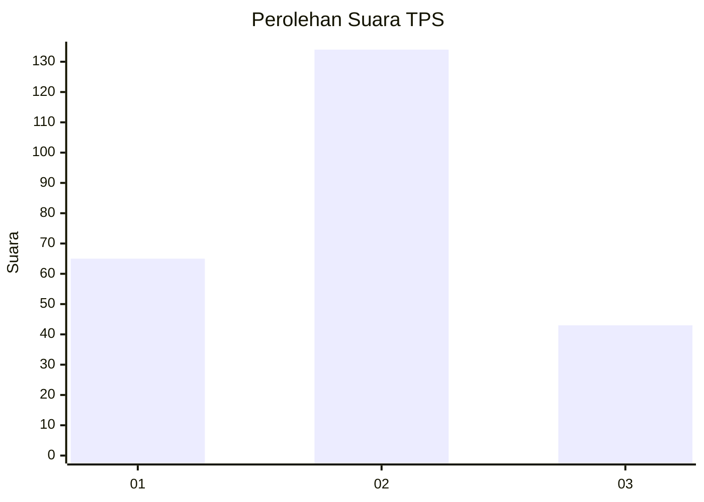
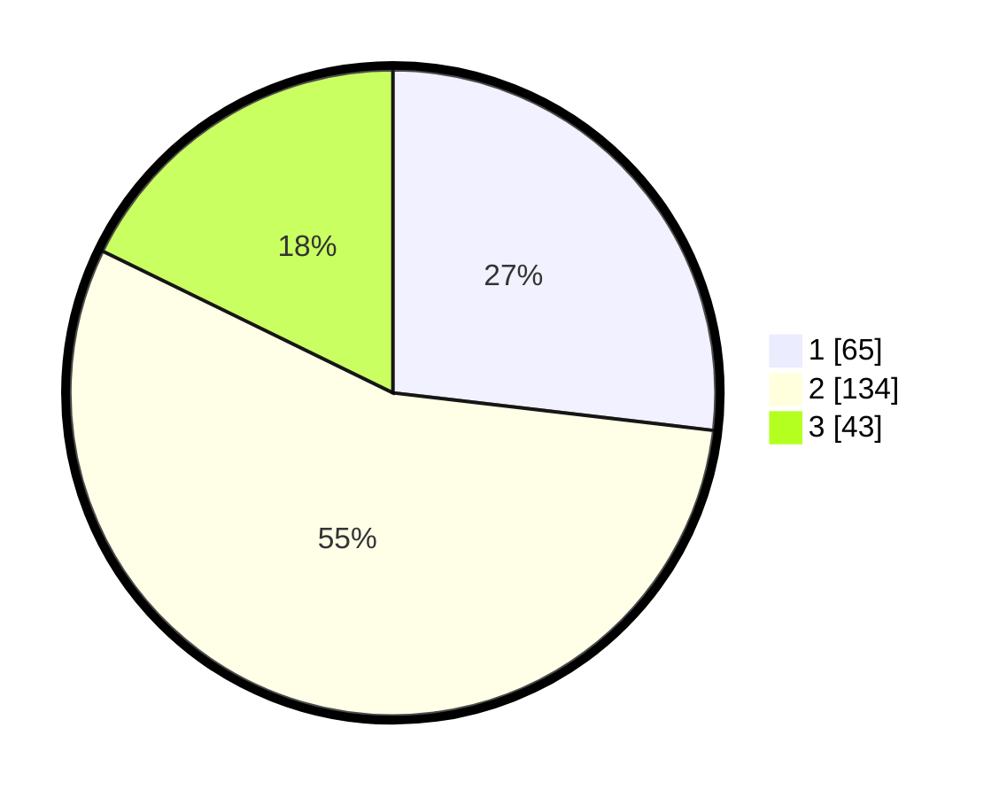

# Hasil

## Grafik

## Tabel

| No. | Nama Paslon    | Suara | Suara (raw) | Persentase |
|:--- |:-------------- | -----:| -----------:| ----------:|
| 1   | ANIES MUHAIMIN | 65    | [65][p-1]   | 26,86      |
| 2   | PRABOWO GIBRAN | 134   | [134][p-2]  | 55,37      |
| 3   | GANJAR MAHFUD  | 43    | [43][p-3]   | 17,77      |

[p-1]: https://github.com/gigit-pemilu/pemilu-2024-16-sumatera-selatan/blob/main/pilpres/hitung-suara/sub/16-sumatera-selatan/sub/03-muara-enim/sub/06-gelumbang/sub/1010-gelumbang/sub/011-tps/sub/paslon-1.txt
[p-2]: https://github.com/gigit-pemilu/pemilu-2024-16-sumatera-selatan/blob/main/pilpres/hitung-suara/sub/16-sumatera-selatan/sub/03-muara-enim/sub/06-gelumbang/sub/1010-gelumbang/sub/011-tps/sub/paslon-2.txt
[p-3]: https://github.com/gigit-pemilu/pemilu-2024-16-sumatera-selatan/blob/main/pilpres/hitung-suara/sub/16-sumatera-selatan/sub/03-muara-enim/sub/06-gelumbang/sub/1010-gelumbang/sub/011-tps/sub/paslon-3.txt

## Foto C Plano

https://sirekap-obj-formc.kpu.go.id/9366/pemilu/ppwp/16/03/06/10/10/1603061010011-20240215-015511--606fef8d-b37b-4828-8bff-ab2e5a61755a.jpg

https://sirekap-obj-formc.kpu.go.id/9366/pemilu/ppwp/16/03/06/10/10/1603061010011-20240215-015545--81561cc4-22c1-42e3-b2b9-21c812db0b73.jpg

https://sirekap-obj-formc.kpu.go.id/9366/pemilu/ppwp/16/03/06/10/10/1603061010011-20240215-015608--d90f9307-c90d-4f94-a208-0524bb7b1f27.jpg

## Metadata

| Key        | Value               |
| ---------- | ------------------- |
| Time Stamp | 2024-02-24 23:00:00 |

