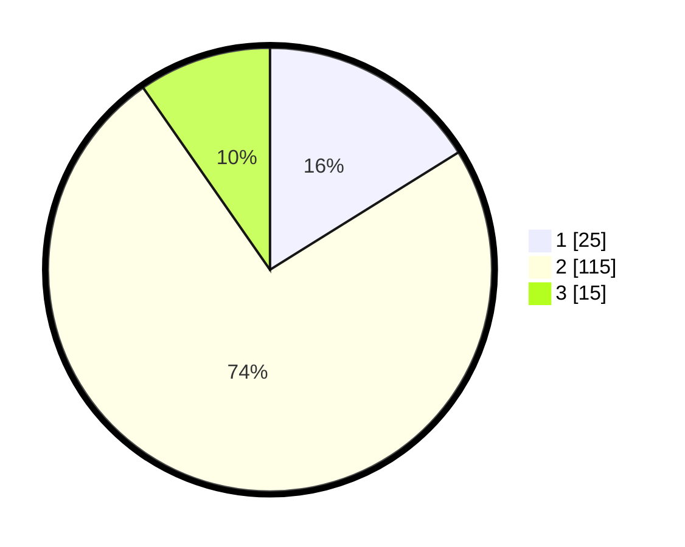

# Hasil

## Grafik

## Tabel

| No. | Nama Paslon    | Suara | Suara (raw) | Persentase |
|:--- |:-------------- | -----:| -----------:| ----------:|
| 1   | ANIES MUHAIMIN | 25    | [25][p-1]   | 16,13      |
| 2   | PRABOWO GIBRAN | 115   | [115][p-2]  | 74,19      |
| 3   | GANJAR MAHFUD  | 15    | [15][p-3]   | 9,68       |

[p-1]: https://github.com/gigit-pemilu/pemilu-2024-16-sumatera-selatan/blob/main/pilpres/hitung-suara/sub/16-sumatera-selatan/sub/03-muara-enim/sub/06-gelumbang/sub/1010-gelumbang/sub/020-tps/sub/paslon-1.txt
[p-2]: https://github.com/gigit-pemilu/pemilu-2024-16-sumatera-selatan/blob/main/pilpres/hitung-suara/sub/16-sumatera-selatan/sub/03-muara-enim/sub/06-gelumbang/sub/1010-gelumbang/sub/020-tps/sub/paslon-2.txt
[p-3]: https://github.com/gigit-pemilu/pemilu-2024-16-sumatera-selatan/blob/main/pilpres/hitung-suara/sub/16-sumatera-selatan/sub/03-muara-enim/sub/06-gelumbang/sub/1010-gelumbang/sub/020-tps/sub/paslon-3.txt

## Foto C Plano

https://sirekap-obj-formc.kpu.go.id/6411/pemilu/ppwp/16/03/06/10/10/1603061010020-20240215-040357--ba160cf4-bf83-49a5-ae50-4782196e0ef8.jpg

https://sirekap-obj-formc.kpu.go.id/6411/pemilu/ppwp/16/03/06/10/10/1603061010020-20240214-155903--832d9aa7-2590-4f3b-abc0-fa2dd095425c.jpg

https://sirekap-obj-formc.kpu.go.id/6411/pemilu/ppwp/16/03/06/10/10/1603061010020-20240215-015735--272ed577-d9d9-44b0-89cd-e073563b5e80.jpg

## Metadata

| Key        | Value               |
| ---------- | ------------------- |
| Time Stamp | 2024-02-22 14:00:00 |

