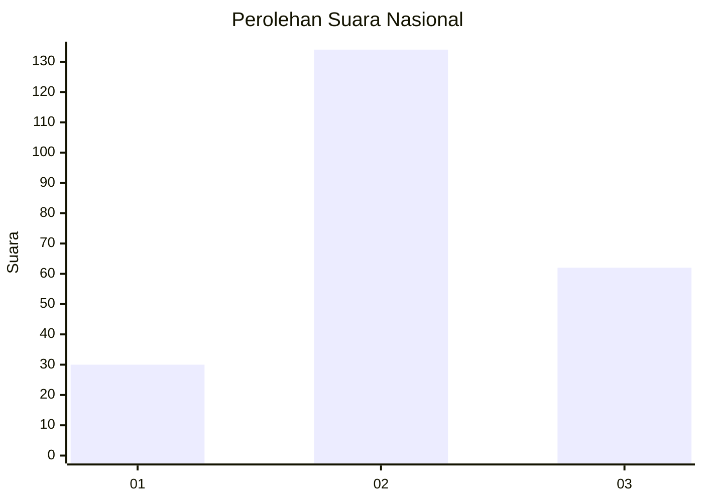
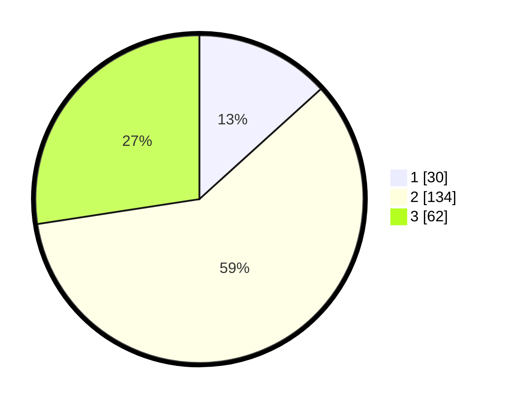

# Hasil

## Grafik

## Tabel

| No. | Nama Paslon    | Suara | Suara (raw) | Persentase |
|:--- |:-------------- | -----:| -----------:| ----------:|
| 1   | ANIES MUHAIMIN | 30    | [30][p-1]   | 13,27      |
| 2   | PRABOWO GIBRAN | 134   | [134][p-2]  | 59,29      |
| 3   | GANJAR MAHFUD  | 62    | [62][p-3]   | 27,43      |

[p-1]: https://github.com/gigit-pemilu/pemilu-2024/blob/main/pilpres/hitung-suara/sub/16-sumatera-selatan/sub/03-muara-enim/sub/06-gelumbang/sub/2009-tambangan-kelekar/sub/005-tps/sub/paslon-1.txt
[p-2]: https://github.com/gigit-pemilu/pemilu-2024/blob/main/pilpres/hitung-suara/sub/16-sumatera-selatan/sub/03-muara-enim/sub/06-gelumbang/sub/2009-tambangan-kelekar/sub/005-tps/sub/paslon-2.txt
[p-3]: https://github.com/gigit-pemilu/pemilu-2024/blob/main/pilpres/hitung-suara/sub/16-sumatera-selatan/sub/03-muara-enim/sub/06-gelumbang/sub/2009-tambangan-kelekar/sub/005-tps/sub/paslon-3.txt

## Foto C Plano

https://sirekap-obj-formc.kpu.go.id/4fed/pemilu/ppwp/16/03/06/20/09/1603062009005-20240215-033047--35c5ae86-e107-4ee4-84f4-94afb124376c.jpg

https://sirekap-obj-formc.kpu.go.id/4fed/pemilu/ppwp/16/03/06/20/09/1603062009005-20240215-033416--c2fc131b-410a-4c19-a796-2d765f4a65fa.jpg

https://sirekap-obj-formc.kpu.go.id/4fed/pemilu/ppwp/16/03/06/20/09/1603062009005-20240215-033517--cc04ebd0-6491-4c91-ab72-3c50e19d65ec.jpg

## Metadata

| Key        | Value               |
| ---------- | ------------------- |
| Time Stamp | 2024-02-24 22:31:28 |

