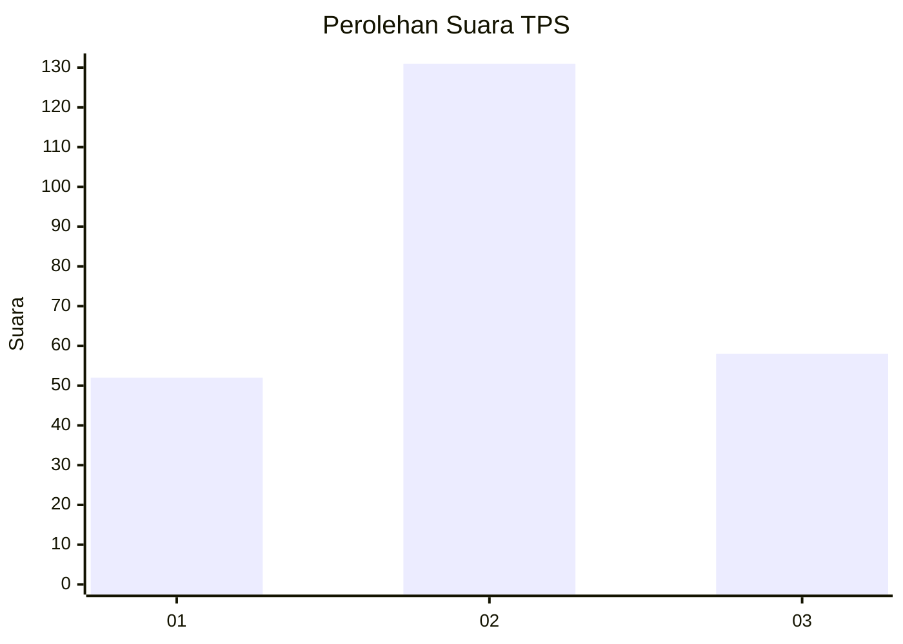
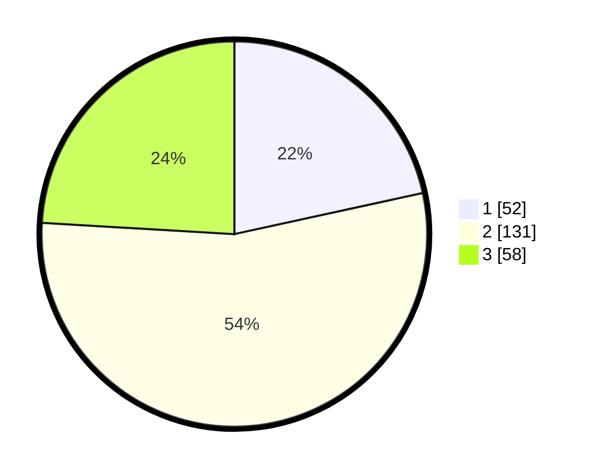

# Hasil

## Grafik

## Tabel

| No. | Nama Paslon    | Suara | Suara (raw) | Persentase |
|:--- |:-------------- | -----:| -----------:| ----------:|
| 1   | ANIES MUHAIMIN | 52    | [52][p-1]   | 21,58      |
| 2   | PRABOWO GIBRAN | 131   | [131][p-2]  | 54,36      |
| 3   | GANJAR MAHFUD  | 58    | [58][p-3]   | 24,07      |

[p-1]: https://github.com/gigit-pemilu/pemilu-2024-16-sumatera-selatan/blob/main/pilpres/hitung-suara/sub/16-sumatera-selatan/sub/03-muara-enim/sub/06-gelumbang/sub/2009-tambangan-kelekar/sub/007-tps/sub/paslon-1.txt
[p-2]: https://github.com/gigit-pemilu/pemilu-2024-16-sumatera-selatan/blob/main/pilpres/hitung-suara/sub/16-sumatera-selatan/sub/03-muara-enim/sub/06-gelumbang/sub/2009-tambangan-kelekar/sub/007-tps/sub/paslon-2.txt
[p-3]: https://github.com/gigit-pemilu/pemilu-2024-16-sumatera-selatan/blob/main/pilpres/hitung-suara/sub/16-sumatera-selatan/sub/03-muara-enim/sub/06-gelumbang/sub/2009-tambangan-kelekar/sub/007-tps/sub/paslon-3.txt

## Foto C Plano

https://sirekap-obj-formc.kpu.go.id/6e85/pemilu/ppwp/16/03/06/20/09/1603062009007-20240215-043713--6d148fee-7a15-49dd-b74e-efd2c202f20e.jpg

https://sirekap-obj-formc.kpu.go.id/6e85/pemilu/ppwp/16/03/06/20/09/1603062009007-20240215-043802--c796085a-a517-425b-a235-7cce19b13034.jpg

https://sirekap-obj-formc.kpu.go.id/6e85/pemilu/ppwp/16/03/06/20/09/1603062009007-20240215-043844--98b7ce9e-b80d-41ed-8078-e322c47c31a9.jpg

## Metadata

| Key        | Value               |
| ---------- | ------------------- |
| Time Stamp | 2024-02-15 23:29:50 |

