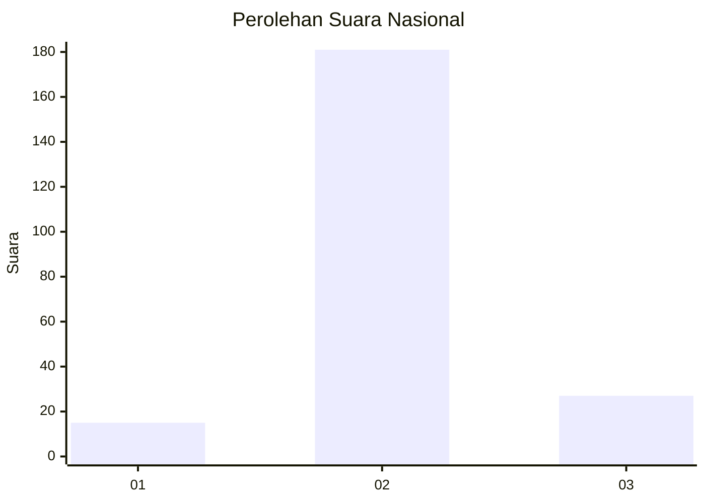
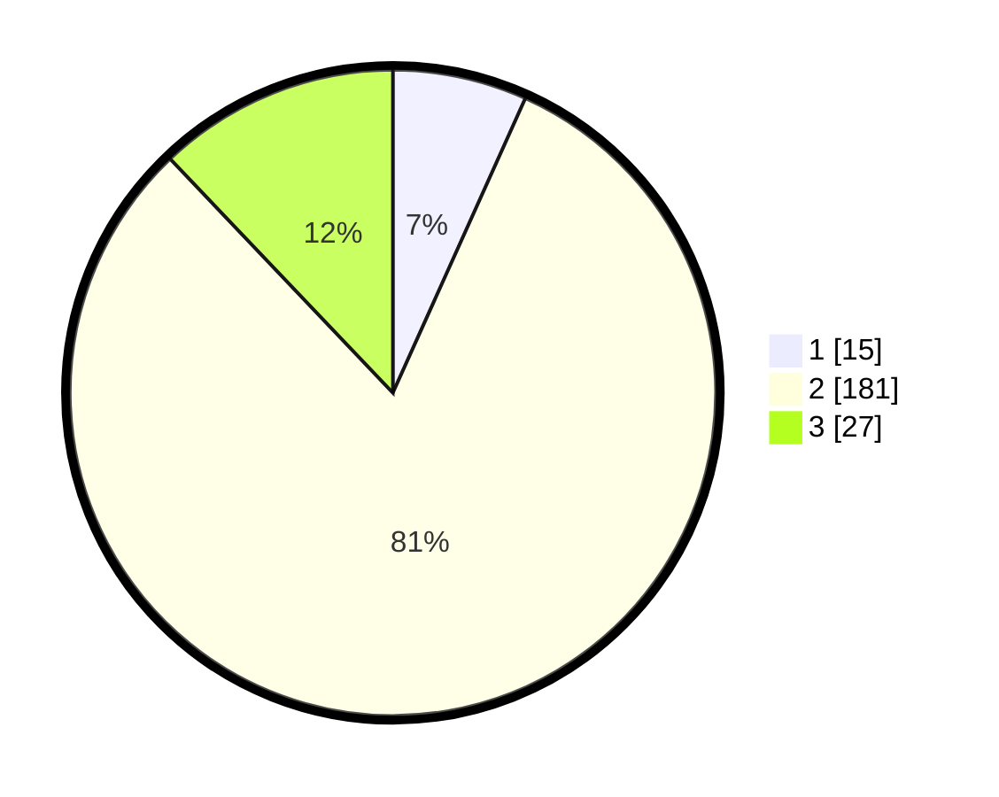

# Hasil

## Grafik

## Tabel

| No. | Nama Paslon    | Suara | Suara (raw) | Persentase |
|:--- |:-------------- | -----:| -----------:| ----------:|
| 1   | ANIES MUHAIMIN | 15    | [15][p-1]   | 6,73       |
| 2   | PRABOWO GIBRAN | 181   | [181][p-2]  | 81,17      |
| 3   | GANJAR MAHFUD  | 27    | [27][p-3]   | 12,11      |

[p-1]: https://github.com/gigit-pemilu/pemilu-2024/blob/main/pilpres/hitung-suara/sub/16-sumatera-selatan/sub/03-muara-enim/sub/06-gelumbang/sub/2014-jambu/sub/001-tps/sub/paslon-1.txt
[p-2]: https://github.com/gigit-pemilu/pemilu-2024/blob/main/pilpres/hitung-suara/sub/16-sumatera-selatan/sub/03-muara-enim/sub/06-gelumbang/sub/2014-jambu/sub/001-tps/sub/paslon-2.txt
[p-3]: https://github.com/gigit-pemilu/pemilu-2024/blob/main/pilpres/hitung-suara/sub/16-sumatera-selatan/sub/03-muara-enim/sub/06-gelumbang/sub/2014-jambu/sub/001-tps/sub/paslon-3.txt

## Foto C Plano

https://sirekap-obj-formc.kpu.go.id/3cb2/pemilu/ppwp/16/03/06/20/14/1603062014001-20240215-073210--6ee050e9-32f0-4777-9ea7-d07ff9fc8e88.jpg

https://sirekap-obj-formc.kpu.go.id/3cb2/pemilu/ppwp/16/03/06/20/14/1603062014001-20240215-073235--a29c60e9-2797-4f2a-9289-36ca85b71918.jpg

https://sirekap-obj-formc.kpu.go.id/3cb2/pemilu/ppwp/16/03/06/20/14/1603062014001-20240215-073252--c4349970-e0bd-4221-8815-401d994f7059.jpg

## Metadata

| Key        | Value               |
| ---------- | ------------------- |
| Time Stamp | 2024-02-25 21:00:00 |

