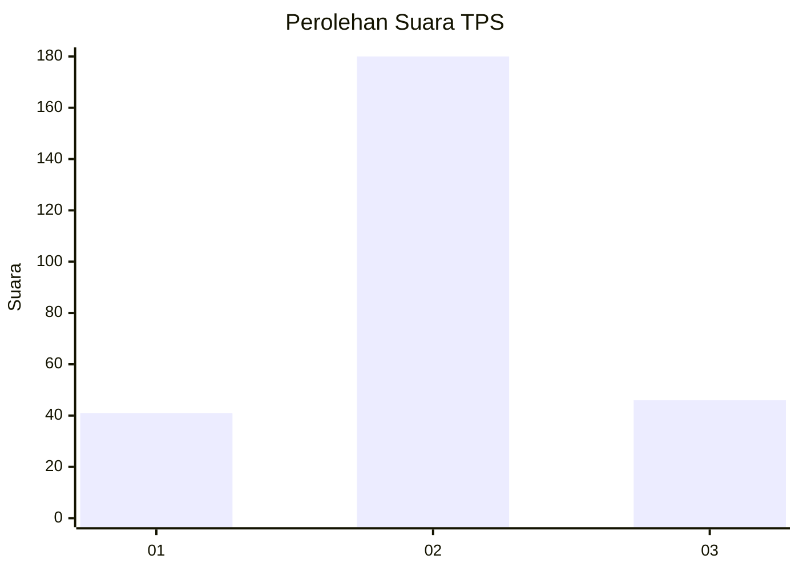
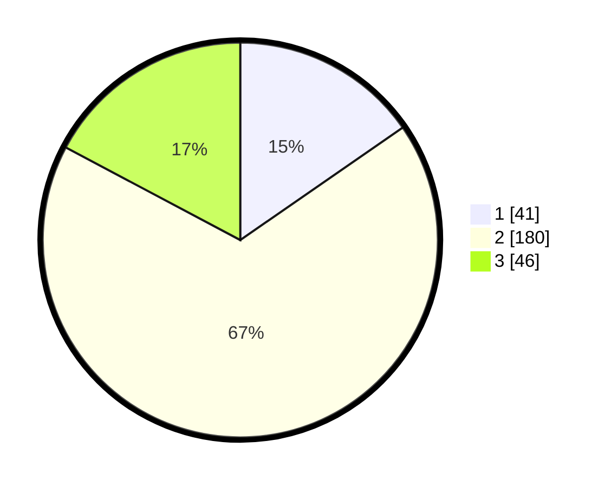

# Hasil

## Grafik

## Tabel

| No. | Nama Paslon    | Suara | Suara (raw) | Persentase |
|:--- |:-------------- | -----:| -----------:| ----------:|
| 1   | ANIES MUHAIMIN | 41    | [41][p-1]   | 15,36      |
| 2   | PRABOWO GIBRAN | 180   | [180][p-2]  | 67,42      |
| 3   | GANJAR MAHFUD  | 46    | [46][p-3]   | 17,23      |

[p-1]: https://github.com/gigit-pemilu/pemilu-2024-16-sumatera-selatan/blob/main/pilpres/hitung-suara/sub/16-sumatera-selatan/sub/03-muara-enim/sub/06-gelumbang/sub/2021-sigam/sub/004-tps/sub/paslon-1.txt
[p-2]: https://github.com/gigit-pemilu/pemilu-2024-16-sumatera-selatan/blob/main/pilpres/hitung-suara/sub/16-sumatera-selatan/sub/03-muara-enim/sub/06-gelumbang/sub/2021-sigam/sub/004-tps/sub/paslon-2.txt
[p-3]: https://github.com/gigit-pemilu/pemilu-2024-16-sumatera-selatan/blob/main/pilpres/hitung-suara/sub/16-sumatera-selatan/sub/03-muara-enim/sub/06-gelumbang/sub/2021-sigam/sub/004-tps/sub/paslon-3.txt

## Foto C Plano

https://sirekap-obj-formc.kpu.go.id/b3ed/pemilu/ppwp/16/03/06/20/21/1603062021004-20240215-095959--b43221ff-cf73-434b-90da-1486d524fcd6.jpg

https://sirekap-obj-formc.kpu.go.id/b3ed/pemilu/ppwp/16/03/06/20/21/1603062021004-20240215-100322--f0fc24de-4130-48a0-9934-79b2fb6b7fcb.jpg

https://sirekap-obj-formc.kpu.go.id/b3ed/pemilu/ppwp/16/03/06/20/21/1603062021004-20240215-100358--903e8698-8db5-43b8-9d5d-9e650ef9a9c7.jpg

## Metadata

| Key        | Value               |
| ---------- | ------------------- |
| Time Stamp | 2024-02-24 22:31:28 |

