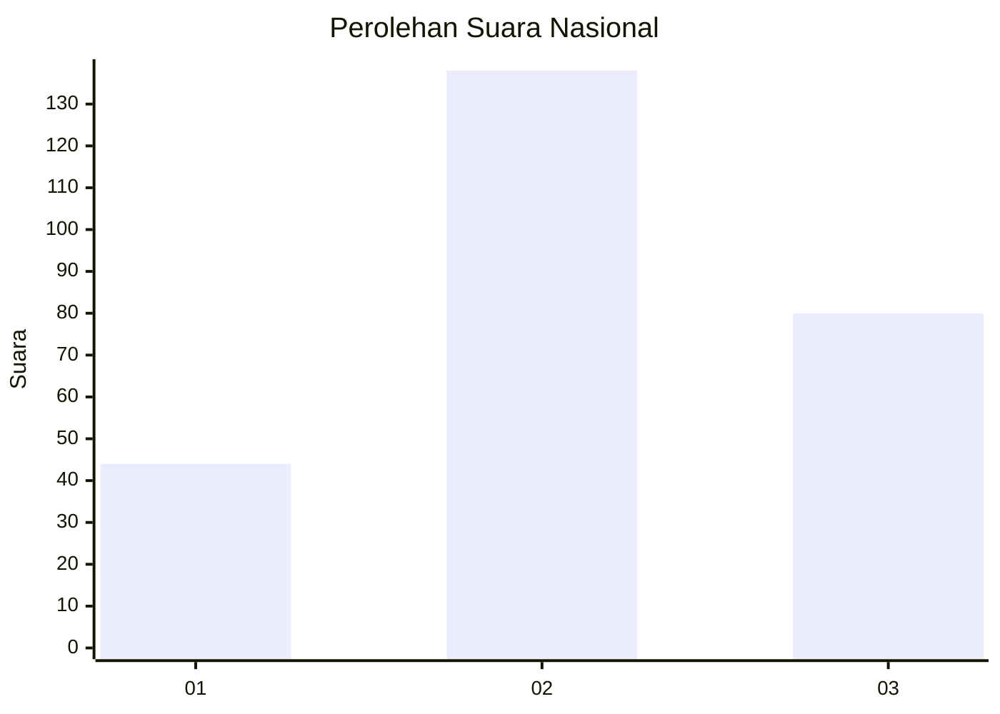
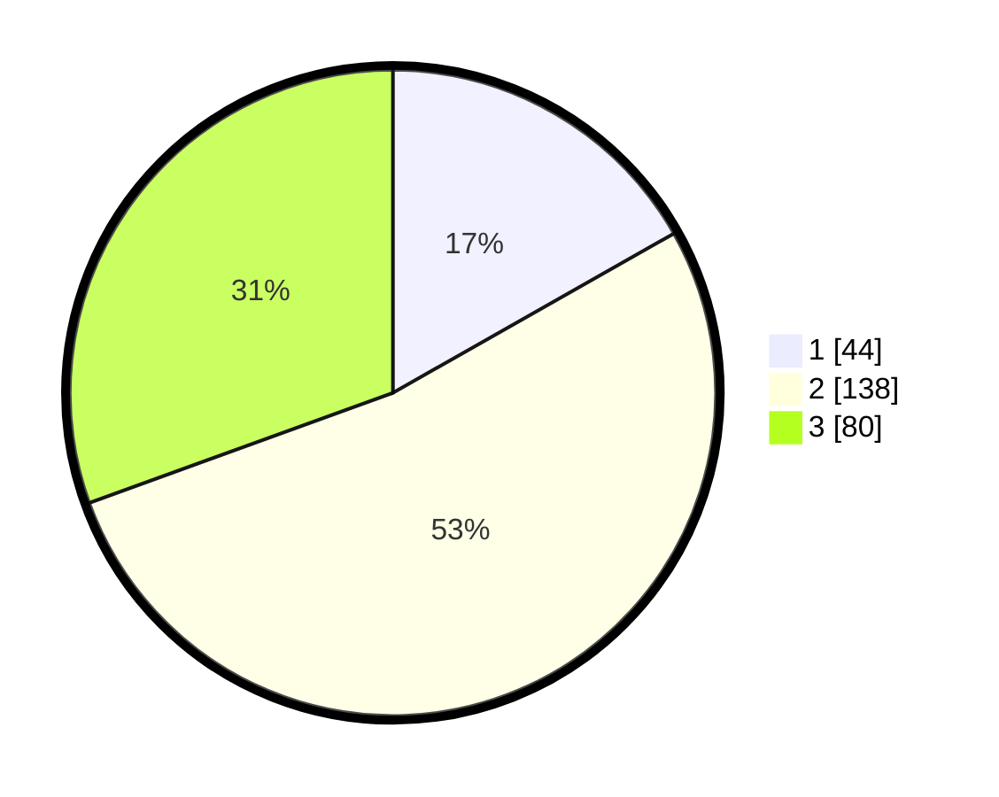

# Hasil

## Grafik

## Tabel

| No. | Nama Paslon    | Suara | Suara (raw) | Persentase |
|:--- |:-------------- | -----:| -----------:| ----------:|
| 1   | ANIES MUHAIMIN | 44    | [44][p-1]   | 16,79      |
| 2   | PRABOWO GIBRAN | 138   | [138][p-2]  | 52,67      |
| 3   | GANJAR MAHFUD  | 80    | [80][p-3]   | 30,53      |

[p-1]: https://github.com/gigit-pemilu/pemilu-2024/blob/main/pilpres/hitung-suara/sub/16-sumatera-selatan/sub/03-muara-enim/sub/06-gelumbang/sub/2026-talang-taling/sub/006-tps/sub/paslon-1.txt
[p-2]: https://github.com/gigit-pemilu/pemilu-2024/blob/main/pilpres/hitung-suara/sub/16-sumatera-selatan/sub/03-muara-enim/sub/06-gelumbang/sub/2026-talang-taling/sub/006-tps/sub/paslon-2.txt
[p-3]: https://github.com/gigit-pemilu/pemilu-2024/blob/main/pilpres/hitung-suara/sub/16-sumatera-selatan/sub/03-muara-enim/sub/06-gelumbang/sub/2026-talang-taling/sub/006-tps/sub/paslon-3.txt

## Foto C Plano

https://sirekap-obj-formc.kpu.go.id/32d3/pemilu/ppwp/16/03/06/20/26/1603062026006-20240215-005945--c5cca1e8-16fe-4ea5-9090-fdd0c4a0a1a0.jpg

https://sirekap-obj-formc.kpu.go.id/32d3/pemilu/ppwp/16/03/06/20/26/1603062026006-20240215-010100--caba2226-2ee1-4f32-b5bb-d2331c5f4aff.jpg

https://sirekap-obj-formc.kpu.go.id/32d3/pemilu/ppwp/16/03/06/20/26/1603062026006-20240215-010201--cf914e4c-b70a-4cac-bd5b-a203f86e3143.jpg

## Metadata

| Key        | Value               |
| ---------- | ------------------- |
| Time Stamp | 2024-02-21 22:00:00 |

