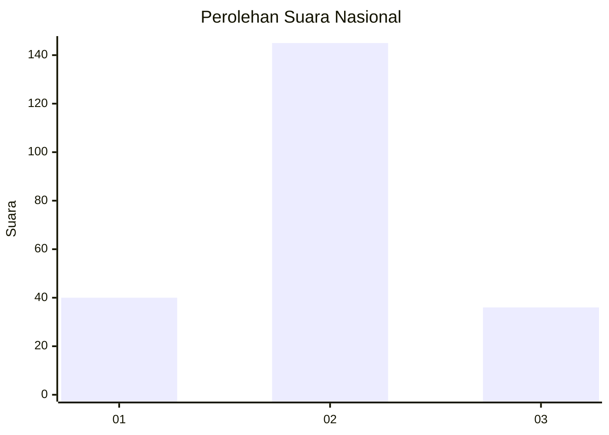
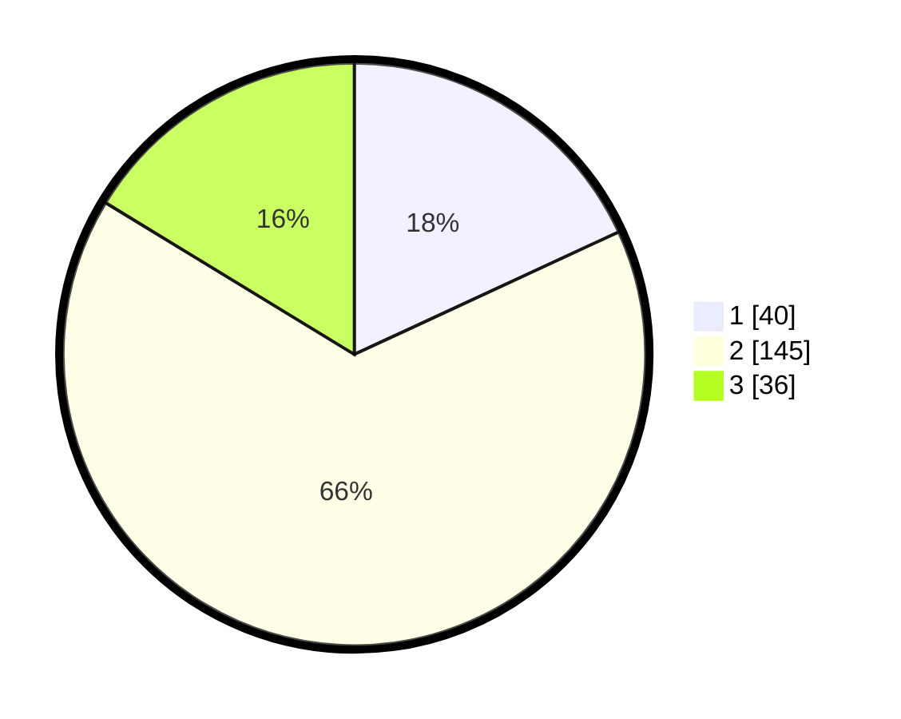

# Hasil

## Grafik

## Tabel

| No. | Nama Paslon    | Suara | Suara (raw) | Persentase |
|:--- |:-------------- | -----:| -----------:| ----------:|
| 1   | ANIES MUHAIMIN | 40    | [40][p-1]   | 18,10      |
| 2   | PRABOWO GIBRAN | 145   | [145][p-2]  | 65,61      |
| 3   | GANJAR MAHFUD  | 36    | [36][p-3]   | 16,29      |

[p-1]: https://github.com/gigit-pemilu/pemilu-2024/blob/main/pilpres/hitung-suara/sub/16-sumatera-selatan/sub/03-muara-enim/sub/07-lawang-kidul/sub/1001-tanjung-enim/sub/002-tps/sub/paslon-1.txt
[p-2]: https://github.com/gigit-pemilu/pemilu-2024/blob/main/pilpres/hitung-suara/sub/16-sumatera-selatan/sub/03-muara-enim/sub/07-lawang-kidul/sub/1001-tanjung-enim/sub/002-tps/sub/paslon-2.txt
[p-3]: https://github.com/gigit-pemilu/pemilu-2024/blob/main/pilpres/hitung-suara/sub/16-sumatera-selatan/sub/03-muara-enim/sub/07-lawang-kidul/sub/1001-tanjung-enim/sub/002-tps/sub/paslon-3.txt

## Foto C Plano

https://sirekap-obj-formc.kpu.go.id/46d4/pemilu/ppwp/16/03/07/10/01/1603071001002-20240215-024502--48fb12e7-69eb-4df6-8bef-b29c1f7e9535.jpg

https://sirekap-obj-formc.kpu.go.id/46d4/pemilu/ppwp/16/03/07/10/01/1603071001002-20240215-015427--344a82e3-f011-4def-ac63-1f85a5b1efba.jpg

https://sirekap-obj-formc.kpu.go.id/46d4/pemilu/ppwp/16/03/07/10/01/1603071001002-20240215-020706--73477709-1d14-48d8-af12-8db693ff02cc.jpg

## Metadata

| Key        | Value               |
| ---------- | ------------------- |
| Time Stamp | 2024-02-25 12:00:00 |

