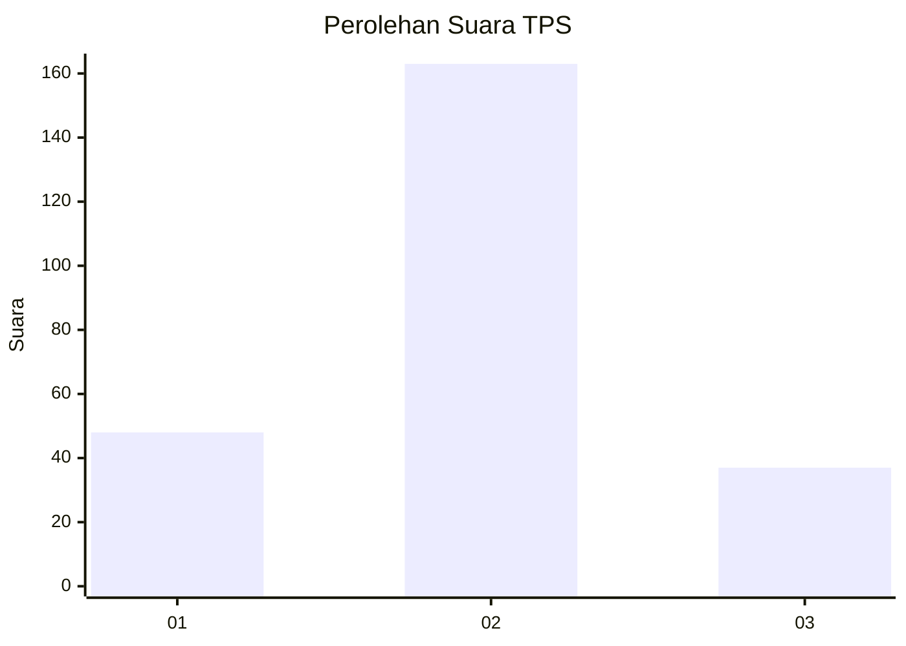
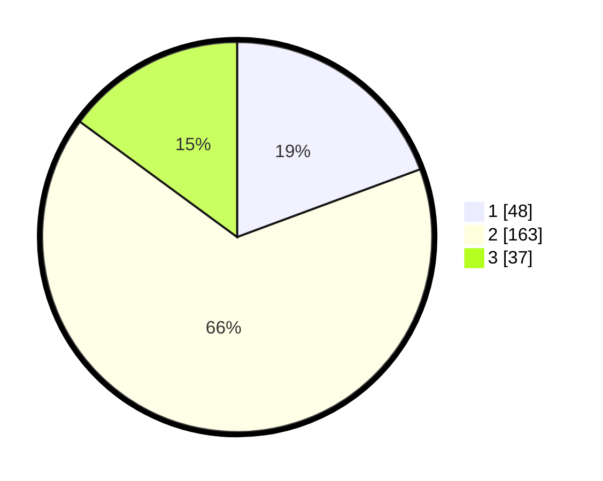

# Hasil

## Grafik

## Tabel

| No. | Nama Paslon    | Suara | Suara (raw) | Persentase |
|:--- |:-------------- | -----:| -----------:| ----------:|
| 1   | ANIES MUHAIMIN | 48    | [48][p-1]   | 19,35      |
| 2   | PRABOWO GIBRAN | 163   | [163][p-2]  | 65,73      |
| 3   | GANJAR MAHFUD  | 37    | [37][p-3]   | 14,92      |

[p-1]: https://github.com/gigit-pemilu/pemilu-2024-16-sumatera-selatan/blob/main/pilpres/hitung-suara/sub/16-sumatera-selatan/sub/03-muara-enim/sub/07-lawang-kidul/sub/1001-tanjung-enim/sub/004-tps/sub/paslon-1.txt
[p-2]: https://github.com/gigit-pemilu/pemilu-2024-16-sumatera-selatan/blob/main/pilpres/hitung-suara/sub/16-sumatera-selatan/sub/03-muara-enim/sub/07-lawang-kidul/sub/1001-tanjung-enim/sub/004-tps/sub/paslon-2.txt
[p-3]: https://github.com/gigit-pemilu/pemilu-2024-16-sumatera-selatan/blob/main/pilpres/hitung-suara/sub/16-sumatera-selatan/sub/03-muara-enim/sub/07-lawang-kidul/sub/1001-tanjung-enim/sub/004-tps/sub/paslon-3.txt

## Foto C Plano

https://sirekap-obj-formc.kpu.go.id/f6ec/pemilu/ppwp/16/03/07/10/01/1603071001004-20240215-035551--2e8ed452-e793-434c-ae34-c3c5d70501c2.jpg

https://sirekap-obj-formc.kpu.go.id/f6ec/pemilu/ppwp/16/03/07/10/01/1603071001004-20240214-205413--f75a499c-dbf5-4516-b5f6-ad8b144d247f.jpg

https://sirekap-obj-formc.kpu.go.id/f6ec/pemilu/ppwp/16/03/07/10/01/1603071001004-20240215-040152--5d90902a-c7c3-4c4d-8679-ed92af952b27.jpg

## Metadata

| Key        | Value               |
| ---------- | ------------------- |
| Time Stamp | 2024-02-24 23:00:00 |

