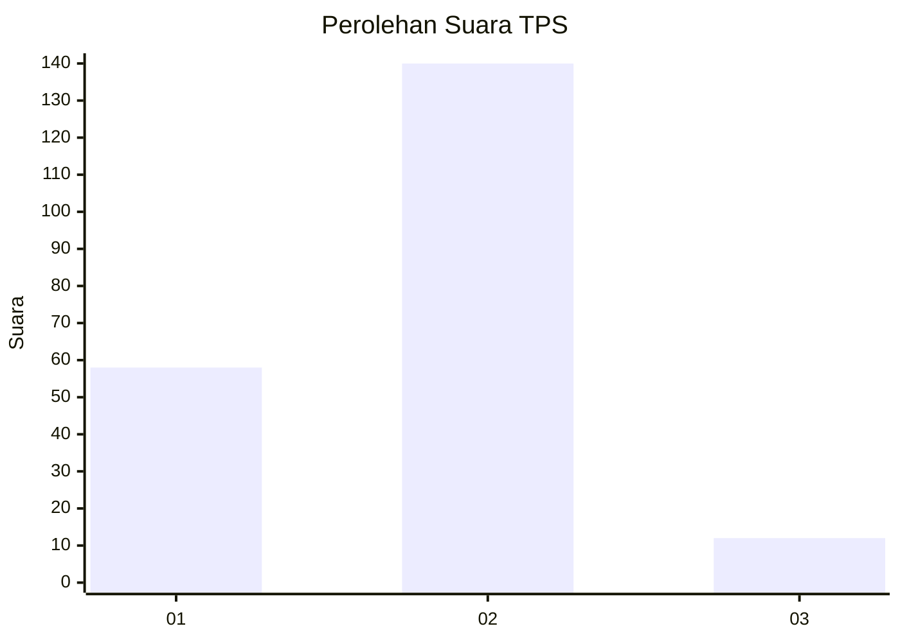
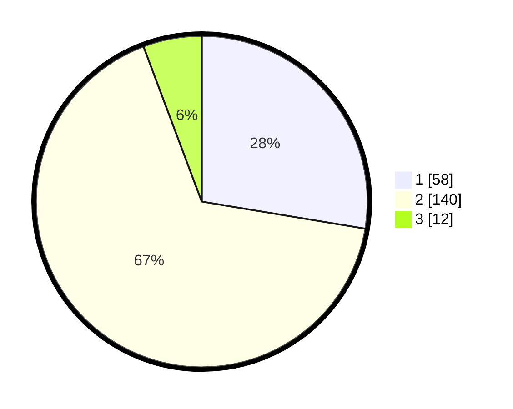

# Hasil

## Grafik

## Tabel

| No. | Nama Paslon    | Suara | Suara (raw) | Persentase |
|:--- |:-------------- | -----:| -----------:| ----------:|
| 1   | ANIES MUHAIMIN | 58    | [58][p-1]   | 27,62      |
| 2   | PRABOWO GIBRAN | 140   | [140][p-2]  | 66,67      |
| 3   | GANJAR MAHFUD  | 12    | [12][p-3]   | 5,71       |

[p-1]: https://github.com/gigit-pemilu/pemilu-2024-16-sumatera-selatan/blob/main/pilpres/hitung-suara/sub/16-sumatera-selatan/sub/03-muara-enim/sub/07-lawang-kidul/sub/1002-pasar-tanjung-enim/sub/002-tps/sub/paslon-1.txt
[p-2]: https://github.com/gigit-pemilu/pemilu-2024-16-sumatera-selatan/blob/main/pilpres/hitung-suara/sub/16-sumatera-selatan/sub/03-muara-enim/sub/07-lawang-kidul/sub/1002-pasar-tanjung-enim/sub/002-tps/sub/paslon-2.txt
[p-3]: https://github.com/gigit-pemilu/pemilu-2024-16-sumatera-selatan/blob/main/pilpres/hitung-suara/sub/16-sumatera-selatan/sub/03-muara-enim/sub/07-lawang-kidul/sub/1002-pasar-tanjung-enim/sub/002-tps/sub/paslon-3.txt

## Foto C Plano

https://sirekap-obj-formc.kpu.go.id/5b58/pemilu/ppwp/16/03/07/10/02/1603071002002-20240215-023214--78f21da4-b2db-4193-8b2b-a51fffda3ce2.jpg

https://sirekap-obj-formc.kpu.go.id/5b58/pemilu/ppwp/16/03/07/10/02/1603071002002-20240215-023356--8bf4dfc3-3772-4fe2-949b-c1cffcac136b.jpg

https://sirekap-obj-formc.kpu.go.id/5b58/pemilu/ppwp/16/03/07/10/02/1603071002002-20240215-023516--2b4ebb46-5f66-4619-b7cd-c77c0eb4f4ad.jpg

## Metadata

| Key        | Value               |
| ---------- | ------------------- |
| Time Stamp | 2024-02-24 22:31:28 |

