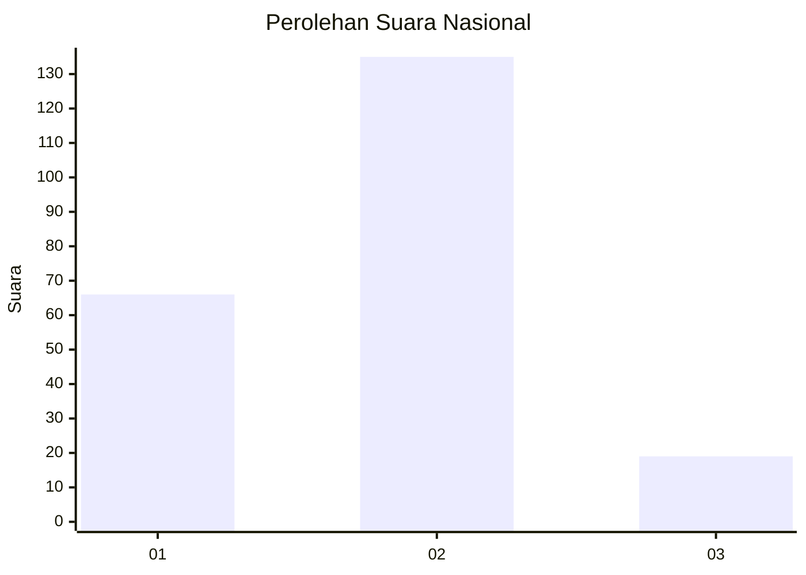
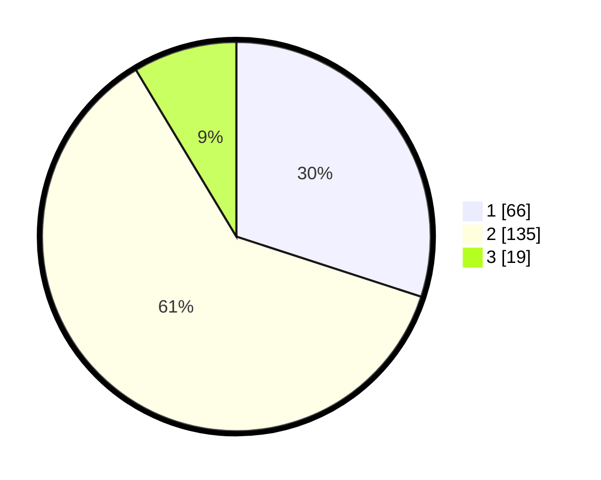

# Hasil

## Grafik

## Tabel

| No. | Nama Paslon    | Suara | Suara (raw) | Persentase |
|:--- |:-------------- | -----:| -----------:| ----------:|
| 1   | ANIES MUHAIMIN | 66    | [66][p-1]   | 30,00      |
| 2   | PRABOWO GIBRAN | 135   | [135][p-2]  | 61,36      |
| 3   | GANJAR MAHFUD  | 19    | [19][p-3]   | 8,64       |

[p-1]: https://github.com/gigit-pemilu/pemilu-2024/blob/main/pilpres/hitung-suara/sub/16-sumatera-selatan/sub/03-muara-enim/sub/07-lawang-kidul/sub/1003-tanjung-enim-selatan/sub/003-tps/sub/paslon-1.txt
[p-2]: https://github.com/gigit-pemilu/pemilu-2024/blob/main/pilpres/hitung-suara/sub/16-sumatera-selatan/sub/03-muara-enim/sub/07-lawang-kidul/sub/1003-tanjung-enim-selatan/sub/003-tps/sub/paslon-2.txt
[p-3]: https://github.com/gigit-pemilu/pemilu-2024/blob/main/pilpres/hitung-suara/sub/16-sumatera-selatan/sub/03-muara-enim/sub/07-lawang-kidul/sub/1003-tanjung-enim-selatan/sub/003-tps/sub/paslon-3.txt

## Foto C Plano

https://sirekap-obj-formc.kpu.go.id/118b/pemilu/ppwp/16/03/07/10/03/1603071003003-20240215-000814--1a295fe5-8db1-4c65-a7aa-eb1a3b0070b3.jpg

https://sirekap-obj-formc.kpu.go.id/118b/pemilu/ppwp/16/03/07/10/03/1603071003003-20240215-000932--474ac10d-f901-4a18-a3c6-1590668bb2b0.jpg

https://sirekap-obj-formc.kpu.go.id/118b/pemilu/ppwp/16/03/07/10/03/1603071003003-20240215-001215--a86abcd6-8620-4f0c-a7fb-d03005783938.jpg

## Metadata

| Key        | Value               |
| ---------- | ------------------- |
| Time Stamp | 2024-02-26 16:00:00 |

