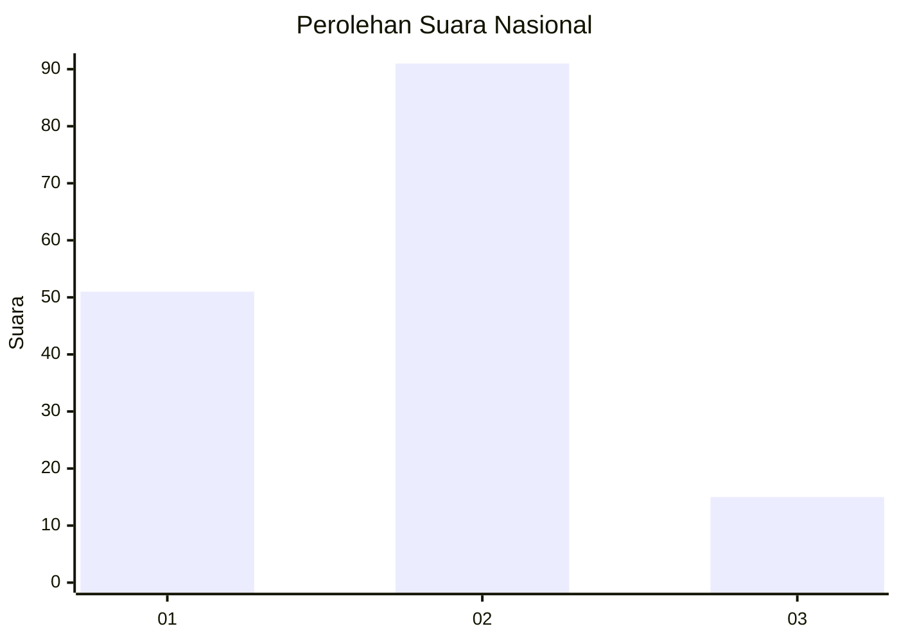
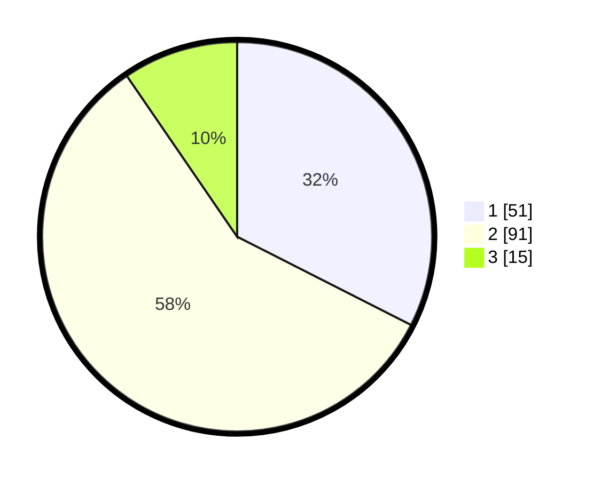

# Hasil

## Grafik

## Tabel

| No. | Nama Paslon    | Suara | Suara (raw) | Persentase |
|:--- |:-------------- | -----:| -----------:| ----------:|
| 1   | ANIES MUHAIMIN | 51    | [51][p-1]   | 32,48      |
| 2   | PRABOWO GIBRAN | 91    | [91][p-2]   | 57,96      |
| 3   | GANJAR MAHFUD  | 15    | [15][p-3]   | 9,55       |

[p-1]: https://github.com/gigit-pemilu/pemilu-2024/blob/main/pilpres/hitung-suara/sub/16-sumatera-selatan/sub/03-muara-enim/sub/07-lawang-kidul/sub/2005-lingga/sub/006-tps/sub/paslon-1.txt
[p-2]: https://github.com/gigit-pemilu/pemilu-2024/blob/main/pilpres/hitung-suara/sub/16-sumatera-selatan/sub/03-muara-enim/sub/07-lawang-kidul/sub/2005-lingga/sub/006-tps/sub/paslon-2.txt
[p-3]: https://github.com/gigit-pemilu/pemilu-2024/blob/main/pilpres/hitung-suara/sub/16-sumatera-selatan/sub/03-muara-enim/sub/07-lawang-kidul/sub/2005-lingga/sub/006-tps/sub/paslon-3.txt

## Foto C Plano

https://sirekap-obj-formc.kpu.go.id/6f8f/pemilu/ppwp/16/03/07/20/05/1603072005006-20240214-234734--0aa935c1-0ddd-4efd-841b-86ce7976afba.jpg

https://sirekap-obj-formc.kpu.go.id/6f8f/pemilu/ppwp/16/03/07/20/05/1603072005006-20240214-234204--1e941f46-5169-44ed-a1f2-4fc9390582eb.jpg

https://sirekap-obj-formc.kpu.go.id/6f8f/pemilu/ppwp/16/03/07/20/05/1603072005006-20240214-234529--1e257ea2-e2c9-4b4e-8eb3-b1441f03920a.jpg

## Metadata

| Key        | Value               |
| ---------- | ------------------- |
| Time Stamp | 2024-02-25 17:00:00 |

