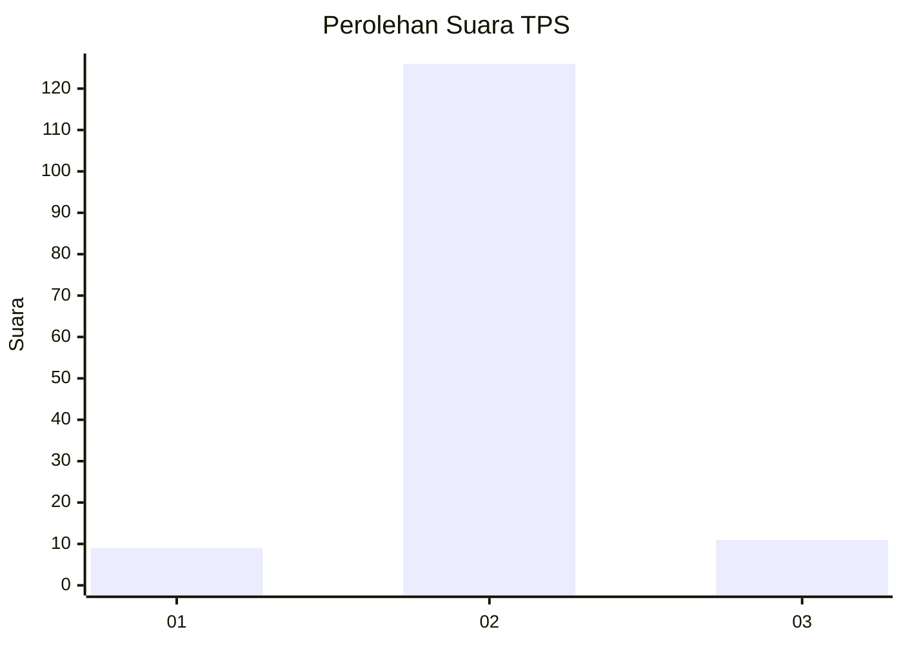
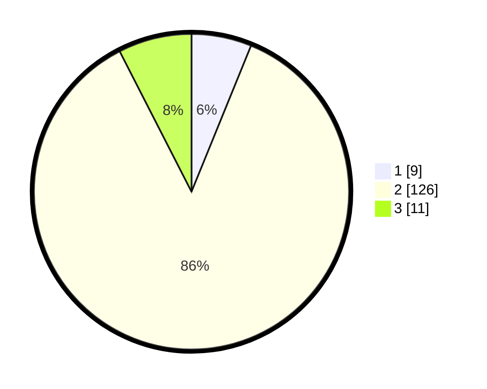

# Hasil

## Grafik

## Tabel

| No. | Nama Paslon    | Suara | Suara (raw) | Persentase |
|:--- |:-------------- | -----:| -----------:| ----------:|
| 1   | ANIES MUHAIMIN | 9     | [9][p-1]    | 6,16       |
| 2   | PRABOWO GIBRAN | 126   | [126][p-2]  | 86,30      |
| 3   | GANJAR MAHFUD  | 11    | [11][p-3]   | 7,53       |

[p-1]: https://github.com/gigit-pemilu/pemilu-2024-16-sumatera-selatan/blob/main/pilpres/hitung-suara/sub/16-sumatera-selatan/sub/03-muara-enim/sub/07-lawang-kidul/sub/2007-darmo/sub/011-tps/sub/paslon-1.txt
[p-2]: https://github.com/gigit-pemilu/pemilu-2024-16-sumatera-selatan/blob/main/pilpres/hitung-suara/sub/16-sumatera-selatan/sub/03-muara-enim/sub/07-lawang-kidul/sub/2007-darmo/sub/011-tps/sub/paslon-2.txt
[p-3]: https://github.com/gigit-pemilu/pemilu-2024-16-sumatera-selatan/blob/main/pilpres/hitung-suara/sub/16-sumatera-selatan/sub/03-muara-enim/sub/07-lawang-kidul/sub/2007-darmo/sub/011-tps/sub/paslon-3.txt

## Foto C Plano

https://sirekap-obj-formc.kpu.go.id/b2ba/pemilu/ppwp/16/03/07/20/07/1603072007011-20240215-053838--8b5af962-a6d2-4502-8421-1deaf790f568.jpg

https://sirekap-obj-formc.kpu.go.id/b2ba/pemilu/ppwp/16/03/07/20/07/1603072007011-20240215-053950--221eb5a8-6776-44c0-98e6-76df302559c3.jpg

https://sirekap-obj-formc.kpu.go.id/b2ba/pemilu/ppwp/16/03/07/20/07/1603072007011-20240215-054032--f3d908fa-f671-45e2-a9d7-b057d96743f0.jpg

## Metadata

| Key        | Value               |
| ---------- | ------------------- |
| Time Stamp | 2024-02-25 16:00:00 |

