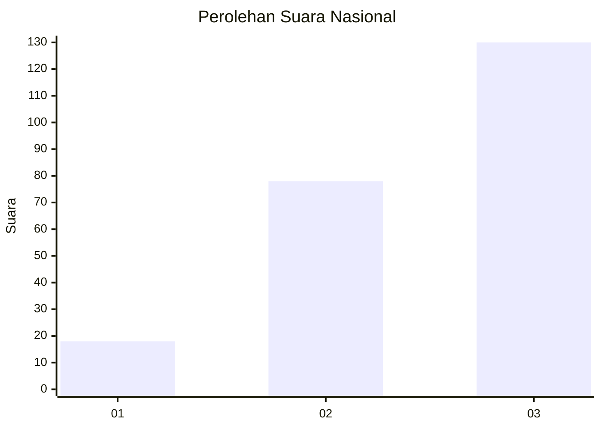
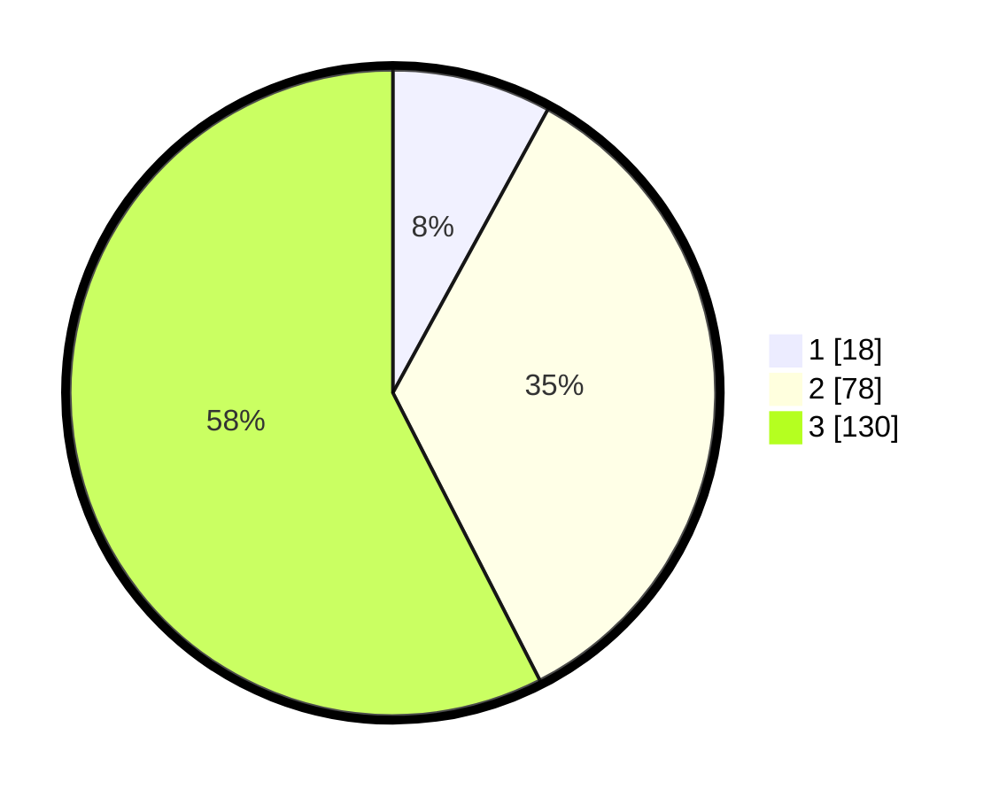

# Hasil

## Grafik

## Tabel

| No. | Nama Paslon    | Suara | Suara (raw) | Persentase |
|:--- |:-------------- | -----:| -----------:| ----------:|
| 1   | ANIES MUHAIMIN | 18    | [18][p-1]   | 7,96       |
| 2   | PRABOWO GIBRAN | 78    | [78][p-2]   | 34,51      |
| 3   | GANJAR MAHFUD  | 130   | [130][p-3]  | 57,52      |

[p-1]: https://github.com/gigit-pemilu/pemilu-2024/blob/main/pilpres/hitung-suara/sub/16-sumatera-selatan/sub/03-muara-enim/sub/08-semende-darat-laut/sub/2002-babatan/sub/007-tps/sub/paslon-1.txt
[p-2]: https://github.com/gigit-pemilu/pemilu-2024/blob/main/pilpres/hitung-suara/sub/16-sumatera-selatan/sub/03-muara-enim/sub/08-semende-darat-laut/sub/2002-babatan/sub/007-tps/sub/paslon-2.txt
[p-3]: https://github.com/gigit-pemilu/pemilu-2024/blob/main/pilpres/hitung-suara/sub/16-sumatera-selatan/sub/03-muara-enim/sub/08-semende-darat-laut/sub/2002-babatan/sub/007-tps/sub/paslon-3.txt

## Foto C Plano

https://sirekap-obj-formc.kpu.go.id/dd1e/pemilu/ppwp/16/03/08/20/02/1603082002007-20240215-081804--01745859-e887-42f2-8955-7dcb7e9eacfe.jpg

https://sirekap-obj-formc.kpu.go.id/dd1e/pemilu/ppwp/16/03/08/20/02/1603082002007-20240215-023233--68c8acbc-9e0d-4fbd-84da-c589c3aabef0.jpg

https://sirekap-obj-formc.kpu.go.id/dd1e/pemilu/ppwp/16/03/08/20/02/1603082002007-20240215-084531--2ee6e829-4576-4fd2-bbc6-c1177791326f.jpg

## Metadata

| Key        | Value               |
| ---------- | ------------------- |
| Time Stamp | 2024-02-25 23:00:00 |

