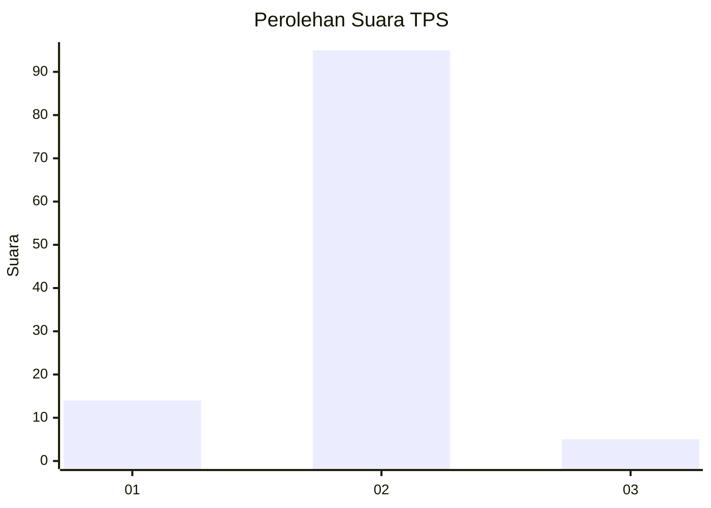
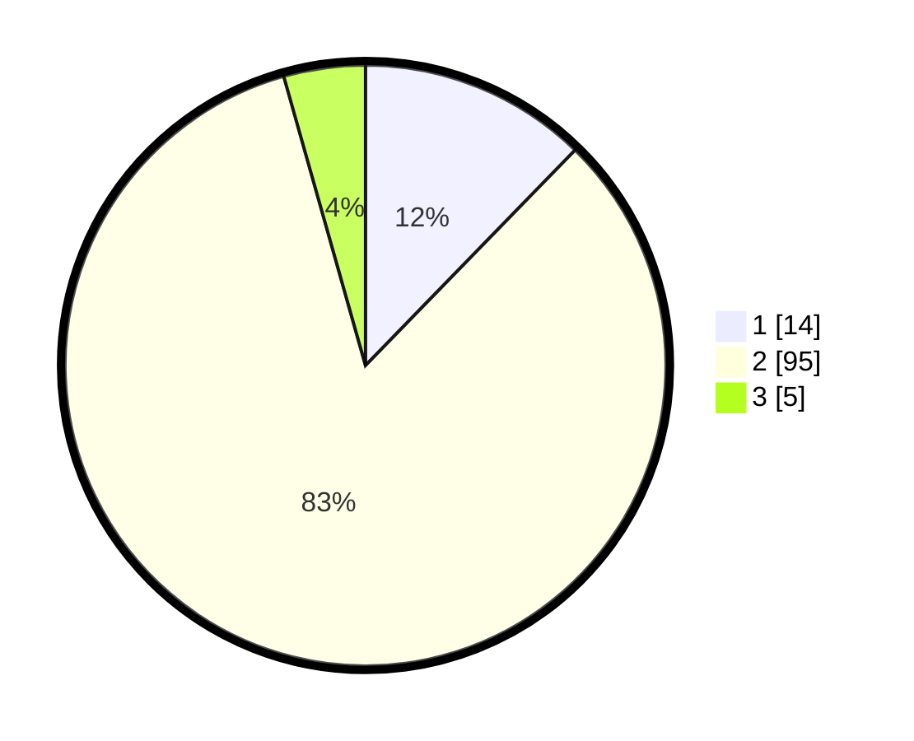

# Hasil

## Grafik

## Tabel

| No. | Nama Paslon    | Suara | Suara (raw) | Persentase |
|:--- |:-------------- | -----:| -----------:| ----------:|
| 1   | ANIES MUHAIMIN | 14    | [14][p-1]   | 12,28      |
| 2   | PRABOWO GIBRAN | 95    | [95][p-2]   | 83,33      |
| 3   | GANJAR MAHFUD  | 5     | [5][p-3]    | 4,39       |

[p-1]: https://github.com/gigit-pemilu/pemilu-2024-16-sumatera-selatan/blob/main/pilpres/hitung-suara/sub/16-sumatera-selatan/sub/03-muara-enim/sub/09-semende-darat-tengah/sub/2007-tanjung-raya/sub/004-tps/sub/paslon-1.txt
[p-2]: https://github.com/gigit-pemilu/pemilu-2024-16-sumatera-selatan/blob/main/pilpres/hitung-suara/sub/16-sumatera-selatan/sub/03-muara-enim/sub/09-semende-darat-tengah/sub/2007-tanjung-raya/sub/004-tps/sub/paslon-2.txt
[p-3]: https://github.com/gigit-pemilu/pemilu-2024-16-sumatera-selatan/blob/main/pilpres/hitung-suara/sub/16-sumatera-selatan/sub/03-muara-enim/sub/09-semende-darat-tengah/sub/2007-tanjung-raya/sub/004-tps/sub/paslon-3.txt

## Foto C Plano

https://sirekap-obj-formc.kpu.go.id/7c78/pemilu/ppwp/16/03/09/20/07/1603092007004-20240215-083819--87f65810-4ef5-4a8d-a92c-c3f9e85fc0fd.jpg

https://sirekap-obj-formc.kpu.go.id/7c78/pemilu/ppwp/16/03/09/20/07/1603092007004-20240222-100610--b225d52a-de89-4f7b-bbc6-5a4a348963cf.jpg

https://sirekap-obj-formc.kpu.go.id/7c78/pemilu/ppwp/16/03/09/20/07/1603092007004-20240215-083628--e49800ad-e906-46f0-8a0e-f5ad7880ff33.jpg

## Metadata

| Key        | Value               |
| ---------- | ------------------- |
| Time Stamp | 2024-02-25 18:00:00 |

