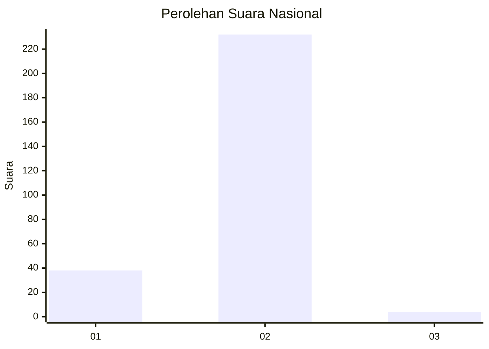
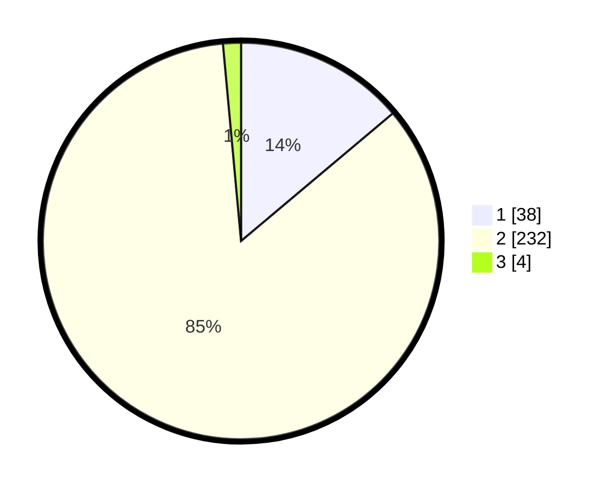

# Hasil

## Grafik

## Tabel

| No. | Nama Paslon    | Suara | Suara (raw) | Persentase |
|:--- |:-------------- | -----:| -----------:| ----------:|
| 1   | ANIES MUHAIMIN | 38    | [38][p-1]   | 13,87      |
| 2   | PRABOWO GIBRAN | 232   | [232][p-2]  | 84,67      |
| 3   | GANJAR MAHFUD  | 4     | [4][p-3]    | 1,46       |

[p-1]: https://github.com/gigit-pemilu/pemilu-2024/blob/main/pilpres/hitung-suara/sub/16-sumatera-selatan/sub/03-muara-enim/sub/10-semende-darat-ulu/sub/2001-tanjung-tiga/sub/001-tps/sub/paslon-1.txt
[p-2]: https://github.com/gigit-pemilu/pemilu-2024/blob/main/pilpres/hitung-suara/sub/16-sumatera-selatan/sub/03-muara-enim/sub/10-semende-darat-ulu/sub/2001-tanjung-tiga/sub/001-tps/sub/paslon-2.txt
[p-3]: https://github.com/gigit-pemilu/pemilu-2024/blob/main/pilpres/hitung-suara/sub/16-sumatera-selatan/sub/03-muara-enim/sub/10-semende-darat-ulu/sub/2001-tanjung-tiga/sub/001-tps/sub/paslon-3.txt

## Foto C Plano

https://sirekap-obj-formc.kpu.go.id/d277/pemilu/ppwp/16/03/10/20/01/1603102001001-20240215-150447--3db96fe3-0100-4540-9733-fe7ddcffcf63.jpg

https://sirekap-obj-formc.kpu.go.id/d277/pemilu/ppwp/16/03/10/20/01/1603102001001-20240215-165031--0d26af7b-6fd9-4706-9a5a-59441e3521a6.jpg

## Metadata

| Key        | Value               |
| ---------- | ------------------- |
| Time Stamp | 2024-02-24 22:31:28 |

