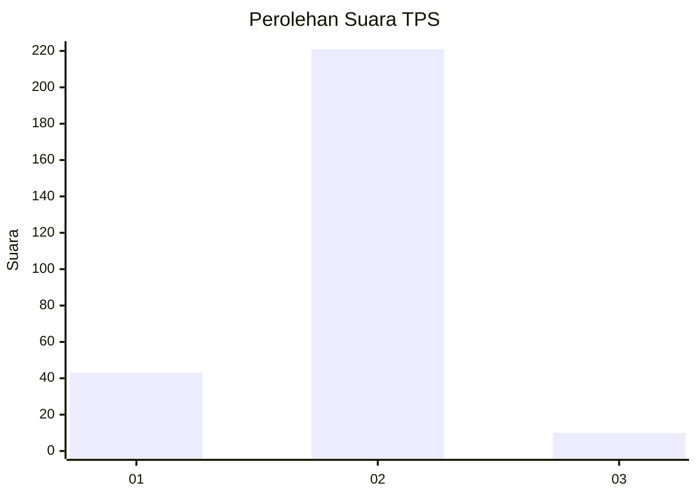
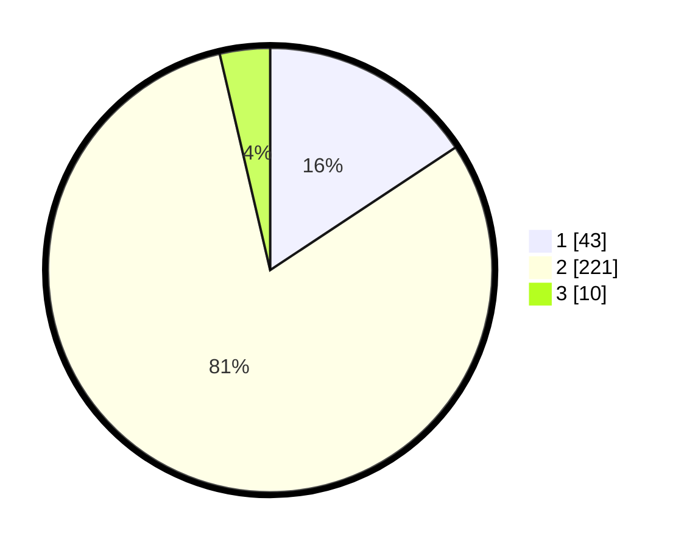

# Hasil

## Grafik

## Tabel

| No. | Nama Paslon    | Suara | Suara (raw) | Persentase |
|:--- |:-------------- | -----:| -----------:| ----------:|
| 1   | ANIES MUHAIMIN | 43    | [43][p-1]   | 15,69      |
| 2   | PRABOWO GIBRAN | 221   | [221][p-2]  | 80,66      |
| 3   | GANJAR MAHFUD  | 10    | [10][p-3]   | 3,65       |

[p-1]: https://github.com/gigit-pemilu/pemilu-2024-16-sumatera-selatan/blob/main/pilpres/hitung-suara/sub/16-sumatera-selatan/sub/03-muara-enim/sub/10-semende-darat-ulu/sub/2001-tanjung-tiga/sub/002-tps/sub/paslon-1.txt
[p-2]: https://github.com/gigit-pemilu/pemilu-2024-16-sumatera-selatan/blob/main/pilpres/hitung-suara/sub/16-sumatera-selatan/sub/03-muara-enim/sub/10-semende-darat-ulu/sub/2001-tanjung-tiga/sub/002-tps/sub/paslon-2.txt
[p-3]: https://github.com/gigit-pemilu/pemilu-2024-16-sumatera-selatan/blob/main/pilpres/hitung-suara/sub/16-sumatera-selatan/sub/03-muara-enim/sub/10-semende-darat-ulu/sub/2001-tanjung-tiga/sub/002-tps/sub/paslon-3.txt

## Foto C Plano

https://sirekap-obj-formc.kpu.go.id/988e/pemilu/ppwp/16/03/10/20/01/1603102001002-20240215-134424--7c864e51-1b51-4841-8d83-2df824a517f9.jpg

https://sirekap-obj-formc.kpu.go.id/988e/pemilu/ppwp/16/03/10/20/01/1603102001002-20240217-220720--820389cb-32cb-467d-abf5-504f872069a0.jpg

https://sirekap-obj-formc.kpu.go.id/988e/pemilu/ppwp/16/03/10/20/01/1603102001002-20240215-134225--612cb2c3-4d9e-4f83-8493-eb3ee0498f93.jpg

## Metadata

| Key        | Value               |
| ---------- | ------------------- |
| Time Stamp | 2024-02-26 16:00:00 |

## DATA PEMILIH TETAP

Jumlah pemilih dalam DPT: **270**.
 * L: **140**.
 * P: **130**.

## DATA PENGGUNA HAK PILIH

Jumlah pengguna hak pilih dalam DPT: **270**.
 * L: **140**.
 * P: **130**.

Jumlah pengguna hak pilih dalam DPTb: **1**.
 * L: **1**.
 * P: **0**.

Jumlah pengguna hak pilih dalam DPK: **5**.
 * L: **5**.
 * P: **0**.

Jumlah pengguna hak pilih: **276**.
 * L: **146**.
 * P: **130**.

## JUMLAH SUARA SAH DAN TIDAK SAH

JUMLAH SELURUH SUARA SAH: **274**.

JUMLAH SUARA TIDAK SAH: **2**.

JUMLAH SELURUH SUARA SAH DAN SUARA TIDAK SAH: **276**.

