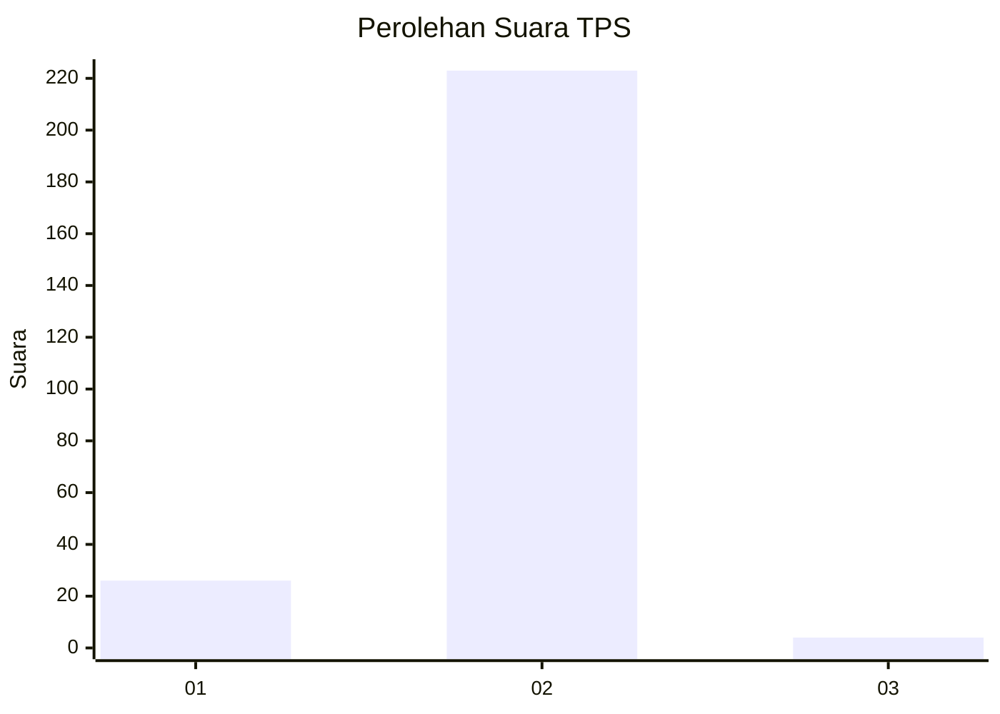
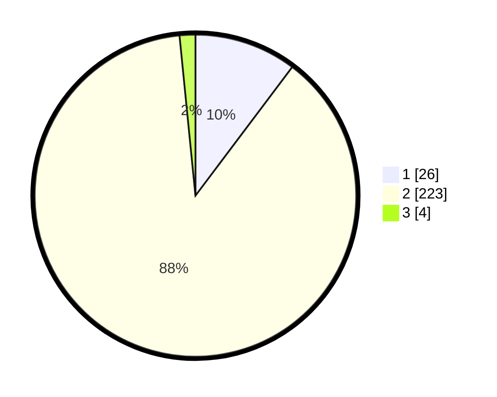

# Hasil

## Grafik

## Tabel

| No. | Nama Paslon    | Suara | Suara (raw) | Persentase |
|:--- |:-------------- | -----:| -----------:| ----------:|
| 1   | ANIES MUHAIMIN | 26    | [26][p-1]   | 10,28      |
| 2   | PRABOWO GIBRAN | 223   | [223][p-2]  | 88,14      |
| 3   | GANJAR MAHFUD  | 4     | [4][p-3]    | 1,58       |

[p-1]: https://github.com/gigit-pemilu/pemilu-2024-16-sumatera-selatan/blob/main/pilpres/hitung-suara/sub/16-sumatera-selatan/sub/03-muara-enim/sub/10-semende-darat-ulu/sub/2001-tanjung-tiga/sub/004-tps/sub/paslon-1.txt
[p-2]: https://github.com/gigit-pemilu/pemilu-2024-16-sumatera-selatan/blob/main/pilpres/hitung-suara/sub/16-sumatera-selatan/sub/03-muara-enim/sub/10-semende-darat-ulu/sub/2001-tanjung-tiga/sub/004-tps/sub/paslon-2.txt
[p-3]: https://github.com/gigit-pemilu/pemilu-2024-16-sumatera-selatan/blob/main/pilpres/hitung-suara/sub/16-sumatera-selatan/sub/03-muara-enim/sub/10-semende-darat-ulu/sub/2001-tanjung-tiga/sub/004-tps/sub/paslon-3.txt

## Foto C Plano

https://sirekap-obj-formc.kpu.go.id/bc45/pemilu/ppwp/16/03/10/20/01/1603102001004-20240215-184929--34219402-bd78-4b20-90f6-2b586a8745eb.jpg

https://sirekap-obj-formc.kpu.go.id/bc45/pemilu/ppwp/16/03/10/20/01/1603102001004-20240215-190414--6df5beed-08fa-45ab-9402-e27dbc0e75d7.jpg

https://sirekap-obj-formc.kpu.go.id/bc45/pemilu/ppwp/16/03/10/20/01/1603102001004-20240215-191138--80505637-25f5-409e-b262-9486ad1d686f.jpg

## Metadata

| Key        | Value               |
| ---------- | ------------------- |
| Time Stamp | 2024-02-15 22:00:27 |

