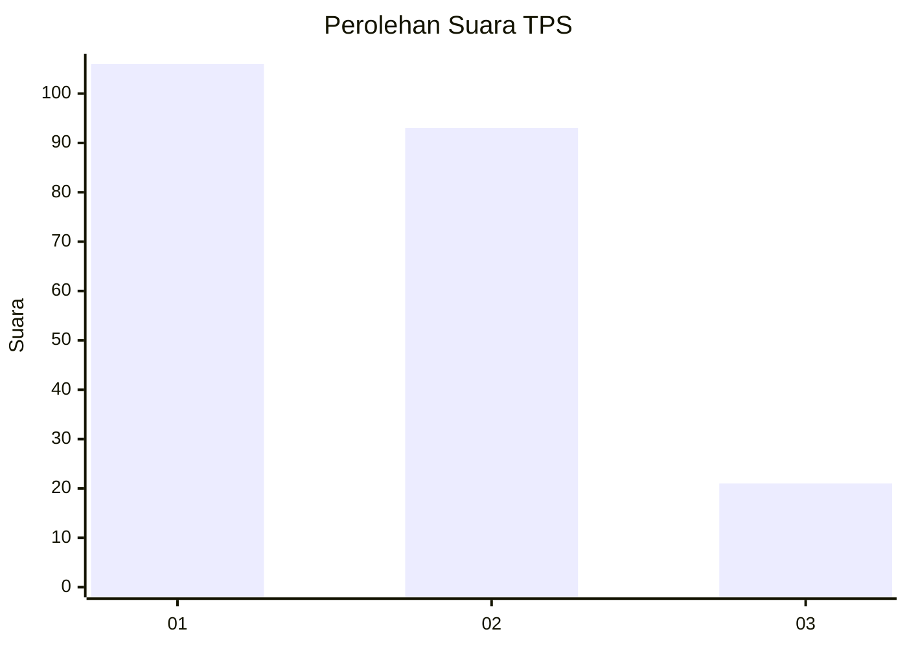
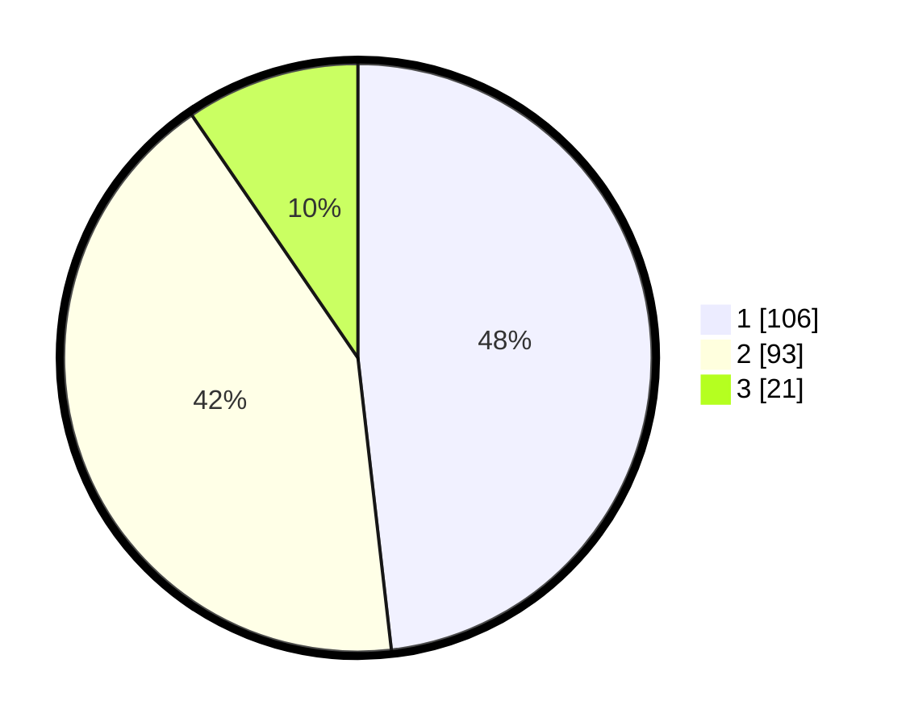

# Hasil

## Grafik

## Tabel

| No. | Nama Paslon    | Suara | Suara (raw) | Persentase |
|:--- |:-------------- | -----:| -----------:| ----------:|
| 1   | ANIES MUHAIMIN | 106   | [106][p-1]  | 48,18      |
| 2   | PRABOWO GIBRAN | 93    | [93][p-2]   | 42,27      |
| 3   | GANJAR MAHFUD  | 21    | [21][p-3]   | 9,55       |

[p-1]: https://github.com/gigit-pemilu/pemilu-2024-16-sumatera-selatan/blob/main/pilpres/hitung-suara/sub/16-sumatera-selatan/sub/03-muara-enim/sub/10-semende-darat-ulu/sub/2003-datar-lebar/sub/001-tps/sub/paslon-1.txt
[p-2]: https://github.com/gigit-pemilu/pemilu-2024-16-sumatera-selatan/blob/main/pilpres/hitung-suara/sub/16-sumatera-selatan/sub/03-muara-enim/sub/10-semende-darat-ulu/sub/2003-datar-lebar/sub/001-tps/sub/paslon-2.txt
[p-3]: https://github.com/gigit-pemilu/pemilu-2024-16-sumatera-selatan/blob/main/pilpres/hitung-suara/sub/16-sumatera-selatan/sub/03-muara-enim/sub/10-semende-darat-ulu/sub/2003-datar-lebar/sub/001-tps/sub/paslon-3.txt

## Foto C Plano

https://sirekap-obj-formc.kpu.go.id/88d6/pemilu/ppwp/16/03/10/20/03/1603102003001-20240215-090847--7fe580dd-db5d-4adc-8ad0-b3cc964e2ab8.jpg

https://sirekap-obj-formc.kpu.go.id/88d6/pemilu/ppwp/16/03/10/20/03/1603102003001-20240215-090902--806bb721-0f36-46f7-8eb0-5062dfdee8ba.jpg

https://sirekap-obj-formc.kpu.go.id/88d6/pemilu/ppwp/16/03/10/20/03/1603102003001-20240215-090932--b1aa6449-89bc-46a7-9c13-5b18530c11c0.jpg

## Metadata

| Key        | Value               |
| ---------- | ------------------- |
| Time Stamp | 2024-02-25 12:00:00 |

