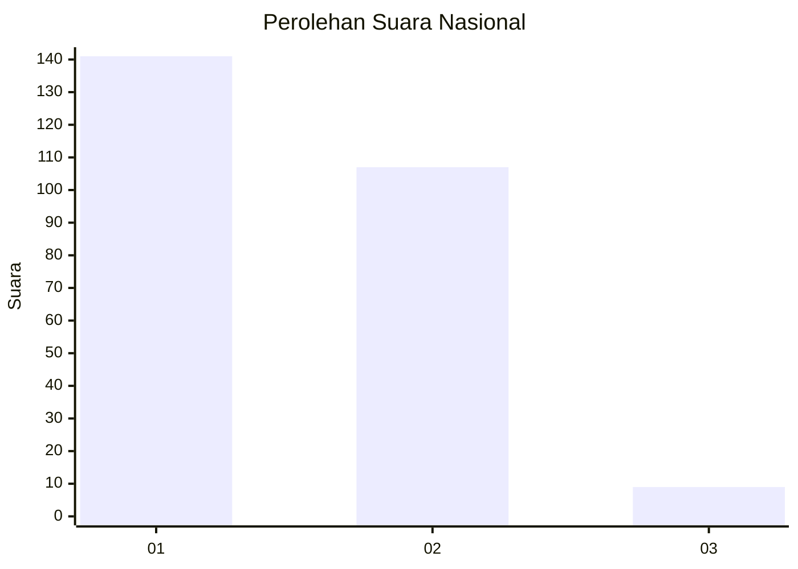
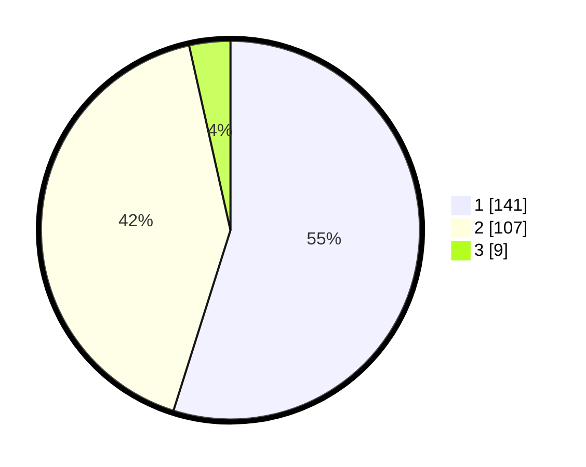

# Hasil

## Grafik

## Tabel

| No. | Nama Paslon    | Suara | Suara (raw) | Persentase |
|:--- |:-------------- | -----:| -----------:| ----------:|
| 1   | ANIES MUHAIMIN | 141   | [141][p-1]  | 54,86      |
| 2   | PRABOWO GIBRAN | 107   | [107][p-2]  | 41,63      |
| 3   | GANJAR MAHFUD  | 9     | [9][p-3]    | 3,50       |

[p-1]: https://github.com/gigit-pemilu/pemilu-2024/blob/main/pilpres/hitung-suara/sub/16-sumatera-selatan/sub/03-muara-enim/sub/10-semende-darat-ulu/sub/2004-segamit/sub/001-tps/sub/paslon-1.txt
[p-2]: https://github.com/gigit-pemilu/pemilu-2024/blob/main/pilpres/hitung-suara/sub/16-sumatera-selatan/sub/03-muara-enim/sub/10-semende-darat-ulu/sub/2004-segamit/sub/001-tps/sub/paslon-2.txt
[p-3]: https://github.com/gigit-pemilu/pemilu-2024/blob/main/pilpres/hitung-suara/sub/16-sumatera-selatan/sub/03-muara-enim/sub/10-semende-darat-ulu/sub/2004-segamit/sub/001-tps/sub/paslon-3.txt

## Foto C Plano

https://sirekap-obj-formc.kpu.go.id/17e9/pemilu/ppwp/16/03/10/20/04/1603102004001-20240219-082429--cccd8679-08a8-4315-857d-96085230ed22.jpg

https://sirekap-obj-formc.kpu.go.id/17e9/pemilu/ppwp/16/03/10/20/04/1603102004001-20240219-082512--31bfa8e7-586c-42b2-8e24-177703ba7dd6.jpg

https://sirekap-obj-formc.kpu.go.id/17e9/pemilu/ppwp/16/03/10/20/04/1603102004001-20240219-082602--bad87512-5c54-4f81-993a-784b921756f6.jpg

## Metadata

| Key        | Value               |
| ---------- | ------------------- |
| Time Stamp | 2024-02-26 14:00:00 |

