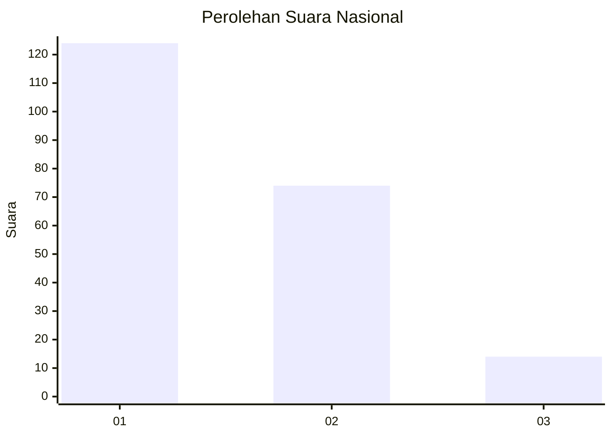
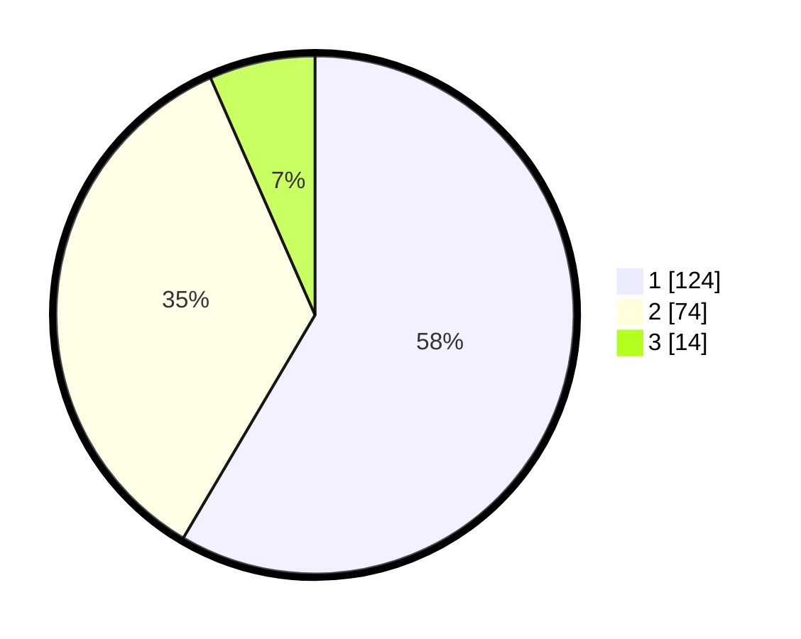

# Hasil

## Grafik

## Tabel

| No. | Nama Paslon    | Suara | Suara (raw) | Persentase |
|:--- |:-------------- | -----:| -----------:| ----------:|
| 1   | ANIES MUHAIMIN | 124   | [124][p-1]  | 58,49      |
| 2   | PRABOWO GIBRAN | 74    | [74][p-2]   | 34,91      |
| 3   | GANJAR MAHFUD  | 14    | [14][p-3]   | 6,60       |

[p-1]: https://github.com/gigit-pemilu/pemilu-2024/blob/main/pilpres/hitung-suara/sub/16-sumatera-selatan/sub/03-muara-enim/sub/10-semende-darat-ulu/sub/2004-segamit/sub/009-tps/sub/paslon-1.txt
[p-2]: https://github.com/gigit-pemilu/pemilu-2024/blob/main/pilpres/hitung-suara/sub/16-sumatera-selatan/sub/03-muara-enim/sub/10-semende-darat-ulu/sub/2004-segamit/sub/009-tps/sub/paslon-2.txt
[p-3]: https://github.com/gigit-pemilu/pemilu-2024/blob/main/pilpres/hitung-suara/sub/16-sumatera-selatan/sub/03-muara-enim/sub/10-semende-darat-ulu/sub/2004-segamit/sub/009-tps/sub/paslon-3.txt

## Foto C Plano

https://sirekap-obj-formc.kpu.go.id/5d19/pemilu/ppwp/16/03/10/20/04/1603102004009-20240219-174519--d44aa4c6-22ee-427c-9650-591f18e60a1d.jpg

https://sirekap-obj-formc.kpu.go.id/5d19/pemilu/ppwp/16/03/10/20/04/1603102004009-20240219-174543--4a84376d-ef0c-4063-947b-ca9468bf590b.jpg

https://sirekap-obj-formc.kpu.go.id/5d19/pemilu/ppwp/16/03/10/20/04/1603102004009-20240219-174620--17c1b618-9f85-44cd-bdaa-1fc3d2338d4e.jpg

## Metadata

| Key        | Value               |
| ---------- | ------------------- |
| Time Stamp | 2024-02-25 09:00:00 |

